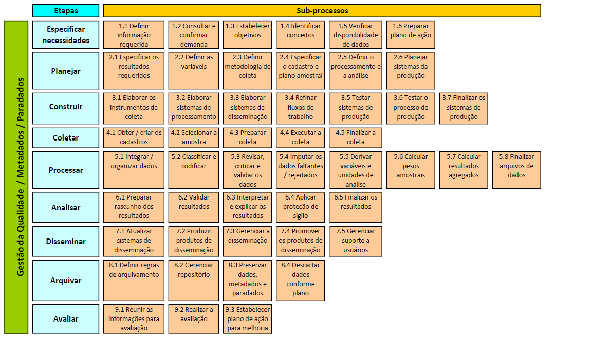
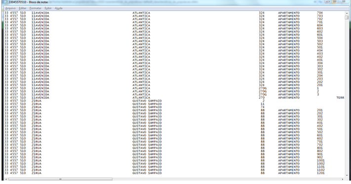

# Conceitos e Cadastros

## Fontes de Dados e Tipos de Pesquisas

Uma importante decisão em qualquer estudo ou projeto de pesquisa diz respeito ao levantamento das *fontes de dados* com potencial para atender às necessidades de informações de interesse. Um primeiro critério de classificação distingue as *fontes primárias*, cujos dados ainda não foram coletados, das *fontes secundárias*, cujos dados já foram coletados, possivelmente com outro(s) propósito(s), e estão disponíveis ou poderiam ser obtidos.   

No caso da *fonte primária*, a obtenção dos dados pode ser feita através de um *estudo de caso*, de uma *pesquisa* (*survey*) ou de um *experimento*. Para uma discussão mais extensa a esse respeito, veja por exemplo o excelente capítulo 1 de [@Wild2004]. Neste livro, nosso foco será sobre fontes primárias do tipo *pesquisa*.

Por definição, *pesquisa* é uma *operação estatística* de coleta de informações sobre características de interesse de unidades de uma população, usando conceitos, métodos e procedimentos bem definidos, de modo que permita a compilação dessas informações numa forma resumida útil.

Dependendo da amplitude da coleta dos dados, há dois tipos de *pesquisa*: censos e pesquisas amostrais. Um *censo* é uma pesquisa baseada numa enumeração exaustiva das unidades componentes de uma população, realizada com o propósito de coletar informações sobre aspectos relevantes dessa população. Num *censo*, a intenção é ter dados referentes a todas as unidades da população. Alternativamente, quando as informações vão ser coletadas somente para um subconjunto selecionado das unidades da população, quando então se diz que a *pesquisa* é *por amostragem* ou *amostral*.  
De acordo com [@Thompson1992] tem-se a seguinte definição: "*Amostragem* consiste em selecionar parte de uma população para observar, de modo que seja possível estimar alguma coisa sobre toda a população.”

Neste livro, o principal tipo de pesquisa a ser considerado é a *Pesquisa Amostral*, que busca conhecer a população com base numa amostra. Mas algumas vezes faremos referência a censos que poderiam, teoricamente, ser conduzidos nas mesmas populações das quais trataremos de tirar amostras para fazer inferência.

## Alguns Conceitos Fundamentais

Antes de avançar na apresentação da teoria relevante para *pesquisas por amostragem*, vamos introduzir vários conceitos relevantes e necessários para sustentar a discussão posterior.

*Unidade* é um único indivíduo, entidade ou objeto a ser medido ou observado na pesquisa.

*População* é o conjunto de todas as unidades para as quais queremos obter informações / fazer inferência.

*População alvo* é a população para a qual se gostaria de obter informação.

*População de pesquisa* é a população a ser efetivamente coberta pela pesquisa. 

Quando ocorrer diferença entre a *População alvo* e a *População de pesquisa* o pesquisador responsável deve procurar medir essa diferença e tratar de revelar com clareza que partes da população alvo ficaram de fora da população de pesquisa, de modo a permitir aos usuários dos resultados da pesquisa avaliar a relevância e aderência dos resultados da pesquisa aos seus objetivos.
 
*Amostra* é o conjunto de unidades que selecionamos da população para medir / observar através da pesquisa.

*Amostra efetiva* é o conjunto de unidades que selecionamos da população e para as quais conseguimos de fato obter / medir / observar as variáveis de interesse através da pesquisa.

*Cadastro* é uma lista de unidades de onde a amostra é selecionada. Algumas pesquisas podem utilizar mais de um cadastro para selecionar a amostra. 

*Unidade de referência* ou *unidade de investigação* ou *unidade de observação* é uma unidade (componente da população) sobre a qual são obtidas as informações de interesse da pesquisa.

*Unidade informante* ou *unidade de informação* é uma unidade que fornece a informação de interesse sobre as unidades de referência.

*Unidade de análise* é uma unidade à qual a análise e inferência são dirigidas.

*Unidade de amostragem* é uma unidade sendo selecionada para a amostra numa das etapas do processo de amostragem.

*Domínio de análise / interesse* é um conjunto de unidades de análise especificado como de interesse para fins de sumarização de dados, tabulação, inferência e análise.

Para dar concretude aos vários conceitos aqui introduzidos, vamos considerar alguns exemplos de situações de pesquisa, buscando destacar, em cada uma delas, a aplicação de alguns dos conceitos apresentados.

**Exemplo 2.1:** Pesquisa Nacional por Amostra de Domicílios Contínua (PNAD Contínua)

A PNAD Contínua é hoje a principal pesquisa domiciliar realizada pelo IBGE para acompanhamento das condições de vida da população brasileira. Conforme o IBGE "O principal objetivo é produzir informações contínuas sobre a inserção da população no mercado de trabalho e de características tais como idade, sexo e nível de instrução, bem como permitir o estudo do desenvolvimento socioeconômico do País através da produção de dados anuais sobre outras formas de trabalho, trabalho infantil, migração, entre outros temas." Maiores informações sobre a pesquisa e seus métodos podem ser encontradas no endereço:
(https://www.ibge.gov.br/estatisticas-novoportal/sociais/populacao/9173-pesquisa-nacional-por-amostra-de-domicilios-continua-trimestral.html?edicao=20106&t=conceitos-e-metodos).

A *população alvo* da pesquisa é "... a população constituída por todas as pessoas moradoras em domicílios particulares permanentes da área de abrangência da pesquisa." A área de abrangência é descrita como "nacional". Não há na documentação da pesquisa indicação de que a *população de pesquisa* é distinta da *população alvo*.

Nessa pesquisa, ficam de fora da *população alvo* moradores institucionalizados, isto é, moradores em instituições tais como hotéis e pensões, abrigos e asilos, instalações militares, hospitais, presídios, etc. Também ficam de fora moradores em domicílios improvisados (por exemplo, acampamentos ou áreas de ocupação precária) e pessoas em situação de rua, isto é, que não residem em domicílios de qualquer tipo ou em instituições. Fosse o conjunto da população residente no Brasil declarado como *população alvo*, a *população de pesquisa* da PNAD Contínua teria um déficit de cobertura devido à exclusão destas partes da população.

Nessa pesquisa, as pessoas são definidas como *unidades de referência*, *unidades informantes* e *unidades de análise*. Apesar disso, há duas perguntas no questionário da pesquisa que se referem à habitação (domicílio) - uma é a condição de ocupação do domicílio, e para os domicílios alugados, é levantado o valor do aluguel mensal pago. Logo seria correto identificar que os domicílios também são *unidades de referência*. Além disso, os domicílios são *unidades de amostragem* pois são objeto de sorteio na última etapa do plano amostral empregado na pesquisa, e também são *unidades de análise* pois são construídas variáveis em nível de domicílio que fazem parte da tabulação da pesquisa, tais como o rendimento domiciliar per capita. Seria também necessário definir uma *população de pesquisa* correspondente a esse conjunto de unidades adicionais, que poderia ser por exemplo caracterizada como "o conjunto de todos os domicílios particulares permanentes da área de abrangência da pesquisa."

Os níveis de divulgação da pesquisa (*domínios de interesse*) incluem os seguintes grupos definidos em função da localização geográfica dos domicílios: Brasil (1); Grandes Regiões (5); Unidades da Federação (27); Regiões Metropolitanas que contêm Municípios das Capitais (20)); Municípios das Capitais (27); e a Região Integrada de Desenvolvimento da Grande Teresina (1). Os números entre parênteses se referem à contagem de domínios definidos em cada uma das situações. Como se pode verificar, ao todo há 81 domínios de interesse definidos com base na localização geográfica que precisam ser contemplados na apresentação de resultados da PNAD Contínua. 

A definição destes *domínios de interesse* foi uma das etapas cruciais para o planejamento da pesquisa, pois condicionou de forma importante a determinação do tamanho e também a distribuição espacial da amostra, entre outros aspectos da metodologia. Conforme [@IBGE2014], "o tamanho da amostra da PNAD Contínua foi calculado como o necessário para estimar o total de pessoas desocupadas de 14 anos ou mais de idade ... com um nível de precisão pré-determinado ... para cada uma das Unidades da Federação, por ciclo de acumulação trimestral". Ao final, a amostra total resultante deveria ser de cerca de 211.000 domicílios distribuídos em cerca de 15.100 setores censitários, a cada trimestre.

Verifica-se então da descrição acima que a determinação dos tamanhos de amostra privilegiou os domínios de interesse definidos pelas Unidades da Federação, não tendo sido estabelecidos tamanhos de amostra capazes de dar precisão controlada para indicadores dos domínios que sejam áreas menores (as capitais ou as regiões metropolitanas, quando consideradas individualmente, etc.).

**Exemplo 2.2:** Objetivos para a Pesquisa de Orçamentos Familiares (POF) 2008/2009

Segundo o IBGE, a *população alvo* da pesquisa é composta por "Domicílios particulares permanentes ocupados e seus moradores, na área de abrangência da pesquisa nas situações urbana e rural. Foram excuídas as áreas definidas pelo IBGE como sendo quartéis, bases militares, alojamentos, acampamentos, embarcações, penitenciárias, colônias penais, presídios, cadeias, asilos, orfanatos, conventos e hospitais." Veja detalhes no link: https://www.ibge.gov.br/estatisticas-novoportal/sociais/rendimento-despesa-e-consumo/9050-pesquisa-de-orcamentos-familiares.html?=&t=conceitos-e-metodos

Ainda segundo o IBGE, "A Pesquisa de Orçamentos Familiares 2008-2009 teve por objetivo fornecer informações sobre a composição dos orçamentos domésticos, a partir da investigação dos hábitos de consumo, da alocação de gastos e da distribuição dos rendimentos, segundo as características dos domicílios e das pessoas. A POF investigou, também, a autopercepção da qualidade de vida e as características do perfil nutricional da população brasileira."

O plano amostral empregado na pesquisa é descrito como "... conglomerado em dois estágios de seleção, com estratificação geográfica e estatística das unidades de primeiro estágio. Os setores correspondem às unidades do primeiro estágio de seleção e os domicílios particulares permanentes, às unidades do segundo estágio." Sendo assim, a pesquisa identificou duas *unidades de amostragem*: setores censitários (selecionados na primeira etapa de amostragem), e domicílios (selecionados na segunda etapa de amostragem). Note que as pessoas moradoras não são unidades de amostragem, pois não participam de qualquer etapa de sorteio. Uma vez que um domicílio era selecionado para a amostra na segunda etapa, todos os moradores do mesmo deviam ser pesquisados.

Para fins do dimensionamento da amostra, "Foram fixados diferentes coeficientes de variação para estimar com a precisão desejada o total da renda dos responsáveis pelos domicílios, segundo os diferentes domínios de estimação."
"Para estimar o total nas Unidades da Federação da Região Norte, foram fixados coeficientes de variação que variaram de 10% a 15%."... Veja os detalhes em:
http://www.ibge.gov.br/home/estatistica/populacao/condicaodevida/pof/2008_2009/POFnotastecnicas.pdf

**Exemplo 2.3:** Objetivos para a *Canadian Labour Force Survey* 

A citação a esta pesquisa é útil porque contém uma explicitação mais complexa dos objetivos que devem ser cumpridos em termos da qualidade com que certas estimativas deveriam ser produzidas. O motivo é que há conjuntos de *domínios de interesse* mais ricos. Assim os objetivos especificados para guiar o dimensionamento da amostra incluíram: "Estimar mensalmente o número de desempregados: para o Canadá, com CV inferior a 2%; por província, com CV entre 4% e 7%; e estimar trimestralmente o número de desempregados por área econômica, com CV menor que 15%."

**Exemplo 2.4:** Pesquisa Nacional por Amostra de Domicílios (PNAD) 2003

*População alvo* - População residente no Brasil numa data de referência especificada.

*População de pesquisa* - População residente no Brasil numa data de referência especificada, excluídos os habitantes de setores rurais da região Norte (menos os do estado do Tocantins). 

Verifica-se então a partir das definições acima que havia uma diferença entre a população alvo e a população de pesquisa consideradas nas PNADs anteriores ao ano de 2004. Nas pesquisas mais antigas, a população residente nos setores rurais da Região Norte (exceção do Tocantins) era excluída. O déficit de cobertura era modesto (estima-se que cerca de apenas 2% da população brasileira residia nos setores excluídos). Entretanto, analistas interessados em comparar resultados de PNADs anteriores a 2004 com os de PNADs mais recentes devem avaliar com cuidado se seria ou não necessário excluir das PNADs mais recentes os dados das partes que eram excluídas das PNADs mais antigas.

Para maiores detalhes, consulte, por exemplo, [@IBGE2004].

Na série de pesquisas PNAD, os domínios de análise (principais) eram as Unidades da Federação (27), as Regiões Metropolitanas (9) situadas em torno de capitais, o total do país (1), e os totais das áreas urbana e rural (2).

**Exemplo 2.5:** População de pesquisa para a Pesquisa de Economia Informal Urbana (ECINF)

Segundo [IBGE2003], trata-se de “Pesquisa por amostragem de domicílios situados em áreas urbanas, onde se busca identificar os trabalhadores por conta própria e empregadores com até 5 empregados que desenvolvam atividades não agrícolas.” Além disso, “... pertencem ao informal todas as unidades econômicas de propriedade de trabalhadores por conta própria e de empregadores com até 5 empregados, moradores de áreas urbanas, sejam elas a atividade principal de seus proprietários ou atividades secundárias.” Ver [@IBGE2004] p. 16.

**Exemplo 2.6:** Para melhor ilustrar o conceito da definição da população de pesquisa, o Quadro 2.1 apresenta diversos exemplos de definição para a *População de Pesquisa* com as seguintes especificações: as unidades a serem pesquisadas; características definidoras das unidades; localização espacial das unidades; e período de referência considerado.


```{r, numset, echo=FALSE}
quadro1_1 <- data.frame (
X1 = c("Pessoas", "Empresas do comércio varejista", "Pessoas", "Alunos", "Estabelecimentos agropecuários"),
X2 = c("Habitando domicílios particulares permanentes", "Classificados como supermercados", "Maiores de 5 anos de idade", "Do curso de mestrado da ENCE", "Produtores de café"),
X3 = c("Em Macaé", "Em Recife", "Que visitaram o Museu Nacional", "No Rio de Janeiro", "No Paraná"),
X4 = c("Durante a semana da pesquisa", "Em 1996", "Entre 1 de junho e 30 de setembro de 1996", "Primeiro semestre de 2002", "No ano de 1998"))

names(quadro1_1) <- c("Unidades", "Características Definidoras", "Localização",
                      "Período de referência")

knitr::kable(quadro1_1, booktabs = TRUE, align= "llll",
             format.args= list(big.mark = '.'),
  caption = "Quadro 2.1 - Exemplos de definições de populações de pesquisa"
  )
```


## Abordagens alternativas para pesquisas por amostragem 

Pesquisas por amostragem dependem criticamente da qualidade da amostra selecionada para coleta ou obtenção dos dados. Para cumprir bem seu papel na pesquisa, são características desejáveis da amostra: 

a) **permitir generalizar estimativas dela derivadas para o conjunto da população de referência;**

b) **'imparcialidade';**

c) **fornecer estimativas com o menor erro amostral possível, dados os recursos disponíveis (financeiros, tempo, pessoal e outros) e considerando as restrições operacionais; e**

d) **assegurar a capacidade de medir a precisão das estimativas dela provenientes.**

A base para o processo de amostragem e de inferência que consideramos neste livro não é dada por um modelo que se utiliza para representar distribuições geradoras dos valores da população, mas sim por um *modelo de aleatorização* que decorre da imposição de um método imparcial (ao acaso, por sorteio) de escolha das unidades da amostra. Este modelo depende de três condições simples de satisfazer, em grande número de aplicações: 

1) **Cada unidade da população de pesquisa deve ter uma probabilidade positiva, conhecida ou calculável, de ser incluída na amostra;** 

2) **A seleção da amostra é feita por mecanismo aleatório que assegure a condição 1) e que permita conhecer ou calcular as probabilidades de inclusão de todas as unidades selecionadas;** e

3) **As probabilidades de inclusão das unidades selecionadas são levadas em consideração ao fazer inferência para os parâmetros da população, juntamente com outros aspectos da estrutura do método usado para seleção da amostra.**

Procedimentos de amostragem que satisfazem as condições 1) a 3) formam a base da abordagem denominada de *Amostragem Probabilística*, que é a mais usada para a amostragem de populações finitas e para a elaboração de estatísticas oficiais e públicas ao redor do mundo. Essa abordagem fornece as condições para fazer inferências seguras, com margem de erro conhecida e controlada, para os parâmetros da população. 

Até este ponto do livro, o termo amostragem vinha sendo usado num sentido amplo. Deve ficar claro, porém, que é a *Amostragem Probabilística*, com suas regras objetivas e precisas para a escolha da amostra baseadas na teoria das probabilidades, que torna possível estimar os parâmetros desejados e avaliar a margem de erro dessas estimativas com base no *modelo de aleatorização*. Sob esse modelo, os valores de variáveis de interesse observados para unidades da população são considerados fixos embora desconhecidos, exceto para as unidades que forem selecionadas para a amostra. Toda a incerteza (fonte de variação estocástica) é introduzida pelo processo de seleção da amostra, usando um mecanismo probabilístico bem especificado. Fica entendido, então, que o termo *Amostragem* será doravante usado com o significado implícito de *Amostragem Probabilística*, exceto quando se explicitar outro significado num contexto ou exemplo específico.

Amostras que não satisfazem as condições 1) a 3) mencionadas acima podem não permitir generalizar a inferência para a população como um todo. Exemplos de métodos de amostragem que se enquadram nesta situação incluem: amostras de conveniência, amostras de voluntários, amostras intencionais (de "corte"), amostras por quotas. Muitas pesquisas são realizadas usando amostras extraídas segundo métodos como estes, que não estão amparados pelos resultados teóricos que sustentam a amostragem probabilística. Uma dificuldade central para tais pesquisas é que não estão disponíveis métodos adequados para estimação pontual ou para a estimação da precisão quando as amostras não são probabilísticas. Algumas pesquisas se valem dos métodos da amostragem probabilística para justificar a apresentação de 'margens de erro', mas essa prática não tem sustentação na teoria vigente, pois tais amostras não satisfazem as condições aqui explicitadas.

Há outras abordagens sólidas para fundamentar a realização de pesquisas por amostragem. Destaca-se, em particular, a abordagem dos *Modelos de Superpopulação* e da *Amostragem Baseada em Modelos*, muito bem descrita em livros tais como [@Valliant2000] ou [@Chambers2012]. Nestes textos uma perspectiva clássica da inferência é adotada. Há também abordagens equivalentes que adotam uma perspectiva Bayesiana para a inferência. Nos dois casos, a inferência é governada não por um mecanismo de aleatorização introduzido pelo pesquisador para a extração da amostra, mas por modelos que especificam distribuições e estruturas de dependência para as observações da população. A liberdade do pesquisador quanto aos métodos para extração de amostras é maior, mas também é maior a dependência dos resultados da sua inferência quanto à validade e adequação das hipóteses feitas quanto aos modelos de superpopulação especificados.

Apesar da relevância do tema para um pesquisador interessado nos fundamentos da amostragem, neste livro adotamos uma perspectiva mais restritiva: adotaremos a abordagem da amostragem probabilística e não trataremos das suas alternativas mais bem fundamentadas acima mencionadas. Esta limitação tem explicação na origem de nossa prática profissional que é lastreada, em grande parte, pelas aplicações no IBGE e em suas pesquisas. Mundo afora as instituições produtoras de estatísticas oficiais adotam esta abordagem como padrão, e são raras ainda as instâncias em que pesquisas são planejadas e realizadas com suporte em outras abordagens como as citadas acima.


## Planejamento e execução de pesquisas por amostragem

Pesquisas por amostragem, para serem bem feitas, requerem cuidadoso planejamento, dedicada execução, e rigorosa avaliação. Os métodos e processos de trabalho necessários para o sucesso da pesquisa já são bem conhecidos e descritos na literatura especializada - veja por exemplo o excelente livro de [@Backstrom1981] ou o mais moderno de [@Groves2009]. 

Para uma visão de conjunto, o Modelo Genérico do Processo de Produção Estatística - MGPPE - (*Generic Statistical Business Process Model - GSBPM*), definido pela *United Nations Economic Commission for Europe - UNECE*, é um modelo que descreve de forma abrangente as atividades do processo de produção estatística, e que tem sido utilizado como quadro de referência para nortear a modernização e a melhoria da qualidade da produção estatística. Uma representação esquemática dessa abordagem é apresentada na Figura \@ref(fig:modpesq), adaptada do *Generic Statistical Business Process Model: GSBPM: version 5.0* (2013, p.10). 

```{r, modpesq, echo=FALSE, encoding="UTF-8", fig.cap="Modelo Genérico do Processo de Produção Estatística"}

```

Conforme indicado neste modelo, o processo de produção de uma pesquisa por amostragem engloba atividades de supervisão e controle em todas as etapas. Como pode ser observado, a gestão da qualidade é transversal ao processo de produção, perpassando todas as etapas definidas no modelo. A seguir, é apresentada uma breve descrição de etapas fundamentais identificadas no processo de produção de uma pesquisa por amostragem.

1. **Especificar as necessidades - definição de objetivos, conceitos e recursos**

Quando surge a necessidade de fazer uma pesquisa sobre um certo tema, e há uma decisão de decide alocar recursos para a concretização da pesquisa, deve-se identificar e especificar com clareza e precisão os objetivos específicos da pesquisa. Tal especificação deve incluir a definição de que resultados a pesquisa deve fornecer ou que perguntas principais tem que ajudar a responder, em que prazos, e com que recursos poderá ser efetivada. Juntamente com a definição dos recursos, deverá ser especificada a margem de erro tolerável nos principais resultados da pesquisa. Também é fundamental que a população alvo e a população de referência da pesquisa sejam definidas de forma clara e precisa. O exemplo 2.1 acima contém vários dos elementos aqui mencionados em relação à PNAD Contínua do IBGE.

O papel do estatístico ou amostrista nessa etapa é o de orientar a tomada de decisões quanto aos objetivos da pesquisa, orientando os interessados quanto às limitações dos métodos estatísticos disponíveis, e trabalhando para garantir a especificação dos objetivos viáveis e compatíveis entre si e também coerentes com os recursos disponíveis. Cabe também ao estatístico estabelecer projetos ou contratos que garantam a disponibilidade dos recursos necessários para a realização bem sucedida da pesquisa, nos termos do que foi especificado.

Nesta fase, o estatístico deve deixar claro que os resultados de uma pesquisa por amostragem só são aplicáveis à população de referência da pesquisa quando a amostragem puder levar em conta todas as unidades pertencentes a esta população, e que quaisquer interesses quanto a resultados e margem de erro de estimativas da pesquisa, se não especificadas a priori, correm o risco de, mais tarde, não poderem ser contempladas. A explicitação de objetivos e recursos é uma das etapas cruciais que devem anteceder a elaboração do *plano amostral*, que vai ser objeto do trabalho do estatístico ou amostrista encarregado de planejar a pesquisa.

2. **Planejar - definição das variáveis, obtenção e avaliação do cadastro, planejamento da amostra, metodologia de coleta, definição do processamento e análise**

A questão do tipo de informação a ser coletada deve ser considerada num estágio inicial do planejamento da pesquisa. Somente os dados relevantes para os propósitos da pesquisa devem ser levantados. Se muitas perguntas forem propostas, os informantes perderão o interesse em respondê-las. Por outro lado, deve ser assegurado que nenhum item importante seja esquecido. 

Uma regra prática consiste em preparar os leiautes das tabelas que a pesquisa deverá produzir, e só depois preparar os instrumentos de coleta dos dados (questionários). Isto ajuda a eliminar informações irrelevantes bem como garantir a inclusão de todos os itens importantes. Uma consideração importante é a possibilidade prática de obtenção da informação: os informantes escolhidos podem não ser capazes de responder a todas as perguntas formuladas. 

O *cadastro* ou *marco de referência* é o instrumento principal que será usado para localizar e identificar as unidades da população de pesquisa. É o cadastro que serve como base para a amostragem de unidades da população, para apoiar a coleta dos dados, e também para auxiliar e controlar o processamento dos dados coletados pela pesquisa. Portanto, para poder acessar e cobrir a população de pesquisa definida é necessário contar com listas das suas unidades, com listas de grupos de unidades populacionais, ou mesmo com mapas ou quaisquer outros materiais que sirvam de guia e permitam localizar e identificar as unidades da população a ser coberta.

Tais listas, mapas ou combinações destes que constituem o cadastro devem ser examinados para que seja assegurado que estejam livres de defeitos, e caso estejam desatualizados, deve-se considerar a hipótese de proceder a sua atualização. Em qualquer caso, é importante conhecer a origem do cadastro utilizado. A especificação e composição do cadastro são partes importantes das fases de planejamento do processo de produção de uma pesquisa, e a atualidade e qualidade do cadastro têm grande influência nos resultados da pesquisa.

Na etapa de planejamento da amostra, questões tais como a definição do tamanho da amostra, a maneira de selecionar as unidades que irão compor a amostra e a especificação de estimadores para os parâmetros populacionais de interesse, bem como para as respectivas margens de erro, são problemas técnicos que devem merecer a mais cuidadosa atenção. De fato, as ideias e técnicas para resolver estas questões formam o principal conteúdo deste livro. 

Os métodos a serem usados para a coleta das informações dependem de muitos fatores, e devem ser decididos tendo em mente os custos envolvidos, os tipos de unidades informantes, a precisão desejada dos dados, bem como as condições particulares para execução da pesquisa em questão. Tais métodos são geralmente especificados durante a fase de planejamento da pesquisa, pois os métodos de coleta de dados influenciarão fortemente na elaboração do questionário da pesquisa e também podem afetar as opções disponíveis para o planejamento da amostra.

Há diferentes métodos de coleta, que podem ou não ser apoiados por computador, e podem ou não necessitar da participação de entrevistadores ou observadores. Os principais métodos de coleta são: CAPI (*Computer-Assisted Personal Interviewing*), CASI (*Computer-Assisted Self Interviewing*), CATI (*Computer-Assisted Telephone Interviewing*), MASI (*Mail Assisted Self Interviewing*), PAPI (*Paper-and-Pencil Interviewing*), e métodos de observação direta, em que não ocorre uma entrevista. Um exemplo de aplicação deste último método ocorre na coleta de dados de preços em pontos de venda, onde o responsável pela coleta de dados faz isso diretamente e não requer contato com uma unidade informante para a obtenção das informações de interesse. Em tempos mais recentes, também começaram a tornar-se disponíveis opções tais como `web-scrapping`, que consiste na utilização de métodos automatizados de acesso a páginas da internet e de extração de dados ou informações dessas páginas, sem intervenção humana no processo.

3. **Construir - instrumentos de coleta, componentes de processamento e de disseminação, sistema de produção**

Os instrumentos de coleta (questionários e outros formulários) são parte importante de uma pesquisa por amostragem. Após decidir que dados devem ser coletados, a questão de como formular e apresentar as perguntas exige grande habilidade e prática. As perguntas devem ser claras, inambíguas e diretas. Perguntas vagas tendem a ter respostas vagas. A ordenação das perguntas deve ser estudada com cuidado. Um pré-teste dos instrumentos de coleta é sempre uma ajuda efetiva na preparação de um bom material.

Os procedimentos para lidar com recusas ou perdas de unidades da amostra selecionada devem ser definidos previamente. Os motivos das perdas devem sempre ser registrados, e o tratamento para as perdas e a não-resposta devem ser especificados.

Nesta etapa estão ainda incluídos também a elaboração e os testes dos sistemas de apuração da pesquisa.  

4. **Coletar - implementação da pesquisa e coleta dos dados**

Nesta etapa destacam-se as seguintes atividades: a preparação do cadastro, a seleção da amostra, o treinamento de equipes de coleta e supervisão de campo e o acompanhamento de coleta e a realização da coleta. 

Para os propósitos da seleção da amostra, a população deve poder ser subdividida no que se pode chamar de unidades de amostragem. É importante que tal divisão seja feita de forma que nenhuma unidade da população pertença a mais de uma unidade de amostragem ou fique de fora do conjunto de todas as unidades de amostragem. 

Um exemplo pode ser dado com as populações humanas, que podem ser vistas como formadas por agregações tais como setores censitários e domicílios ou por pessoas.

A seleção da amostra se dá de acordo com o plano (desenho) amostral especificado a partir do cadastro a ser usado e varia de uma amostra aleatória simples (ou sistemática), estratificada, com probabilidade proporcional ao tamanho (sempre que o tamanho do elemento varia muito, em busca da melhoria da precisão para um dado tamanho de amostra, concentrando a amostra em grandes elementos que têm o maior impacto nas estimativas populacionais). Outras alternativas de planos amostrais contemplam a amostragem de conglomerados ou em múltiplos estágio, motivada pela necessidade de eficiência prática e econômica. 

O processo de coleta de dados envolve as estratégias de contato e de monitoramento. O sucesso de qualquer pesquisa que adote o método de entrevista direta depende fortemente da capacidade dos entrevistadores de obter as respostas. Por isso, sua seleção e treinamento é muito importante. Instruções detalhadas devem ser fornecidas no treinamento sobre os métodos de mensuração e coleta. A observação dos supervisores durante os trabalhos de entrevista é fundamental para manter os padrões e para estudar a obediência às regras e o tato dos entrevistadores ao fazer as entrevistas. 

5. **Processar - integração dos dados, classificação e codificação, critica e tratamentos dos dados, derivação de variáveis, cálculo dos pesos ou fatores de expansão da amostra, cálculo dos resultados agregados (estimação das quantidades de interesse)**

No final da fase de coleta de dados, as informações estão prontas para entrar na fase do processamento, quando os registros de dados são limpos e preparados para a análise. A maneira como as etapas a seguir são enfrentadas e executadas depende de como a coleta de dados é finalizada e do(s) modo(s) usado(s) para coletar as informações.

A codificação consiste em atribuir código numérico a respostas em forma de texto, por meio de uma classificação pré-determinada. É o caso, por exemplo, da ocupação da pessoa cuja descrição dada pelo informante é transformada num código que é estruturado por uma classificação. É mais fácil o informante responder pela descrição em texto e, em seguida, tentar interpretar essa resposta. Atualmente, a maior parte do trabalho de codificação é feita pela combinação de codificação automática, quando é possível associar um único código  às respsotas textuaus, com um sistema de codificação assistida por computador (acionado por operadores), para aqueles casos nos quais nenhum ou mais de um código pode ser encontrado para uma dada resposta. 

A crítica e tratamento dos dados coletados é uma etapa indispensável para permitir a eliminação de erros grosseiros na massa de dados coletados os quais podem distorcer significativamente os resultados da pesquisa. É preciso ter formas de detectar inconsistências e definir o tratamento para a correção dos dados individualizados.

Portanto, uma situação que quase sempre ocorre na pesquisa estatística é que os dados coletados são incompletos, em função da presença de valores ausentes, seja por não-resposta ou por serem descartados por gerarem inconsistências no processo de crítica. A criação de um conjunto de dados completo antes da etapa de estimação se dá através de imputação, substituindo os valores ausentes pelos valores estimados dos dados disponíveis.

Para imputar os valores ausentes em um conjunto de dados, vários métodos estão disponíveis, dentre os quais incluem: imputação dedutiva, imputação baseada em modelo (incluindo imputação de média, razão e regressão) e imputação de doador.

Os métodos de estimação são usados para generalizar a informação recolhida de uma amostra para a população da qual foi extraída.  A forma de selecionar a amostra determina como serão produzidos tais estimativas da população. De fato, o desenho amostral determina os chamados pesos amostrais (fatores de expansão) usados para produzir estimativas. O peso amostral de uma unidade indica o número de unidades da população que são representadas por uma unidade na amostra. É calculado como o inverso da probabilidade de incluir a unidade na amostra.

Os procedimentos de estimação das quantidades de interesse envolvem: o cálculo dos pesos ou fatores de expansão; os estimadores para as quantidades de interesse; e o cálculo das medidas de precisão das estimativas.   

6. **Analisar - análise, interpretação e assegurar a confidencialidade das informações**

Usualmente, a apresentação de resultados é acompanhada de um exercício analítico dos dados produzidos. A análise de dados é o processo pelo qual se dá ordem, estrutura, interpretação e significado aos dados. 

A análise permite diferentes abordagens e requer cuidado na interpretação, destacando-se que devem ser observadas as seguintes características: que seja apresentada de maneira simples, objetiva e compreensível, com significado claro, e avaliada se as informações produzidas são úteis para seus propósitos. 

A informação nunca é completamente útil se não for acompanhada de análise. Neste caso o foco das atenções deve ser dado sobre as questões de coerência e interpretabilidade, e em dar significado aos resultados em sua apresentação.

A interpretabilidade das estatísticas também faz parte da noção de qualidade. Estatísticas definidas de maneira hermética ou complexa, cuja interpretação seja difícil, raramente conseguem estabelecer uma percepção de qualidade. 

7. **Disseminar - produção dos resultados e promoção dos produtos de disseminação**

Esta etapa envolve a preparação do material de divulgação - tabelas, textos, publicação, arquivos de microdados e metadados.

8. **Avaliar - avaliação e plano de ação**

Estas etapas encerram a execução de uma pesquisa, e o produto final deve ser um conjunto de tabulações e relatórios de avaliação da pesquisa e de seus resultados. 

A avaliação e o monitoramento da qualidade das estimativas deve estar presente desde a concepção da pesquisa, a operacionalidade dos processos, até o produto final, visando a compreensão das informações pelos usuários. 

Cabe registrar a ideia de que qualidade é “multidimensional” e há vários aspectos da produção dos dados que se deve considerar para avaliar qualidade dos resultados. 

Começamos por distinguir dois níveis onde a discussão de qualidade é importante. Num primeiro nível, trata-se de qualidade no processo de produção das estatísticas, que será referida ao desempenho da organização produtora, à sua capacidade de adotar processos de trabalho eficientes e seguros, bem como de responder às demandas que lhe são apresentadas. Um segundo nível em que a discussão de qualidade é fundamental se refere à qualidade dos dados e resultados que fazem parte da produção das estatísticas. Neste momento, a qualidade que importa é a de cada resultado (produto) frente a um conjunto de usos previstos ou antecipados que o resultado terá. 

Cabe mencionar algumas das dimensões da qualidade associadas à qualidade do produto: relevância, exatidão e confiabilidade, oportunidade e pontualidade, facilidade de acesso e uso, interpretabilidade, coerência, dentre outras.    

A questão da relevância é colocada quando se avalia se o produto (resultado, informação estatística, estimativa, dado) satisfaz algum uso (ou conjunto de usos) declarado legítimo e importante pelos diversos atores interessados na produção das estatísticas. 

A questão da exatidão e confiabilidade coloca em evidência a qualidade das estatísticas de um ponto de vista mais familiar para quem faz e discute Estatística. Exatidão de uma estatística tem a ver com a ausência de viés (vício) na estimação da medida de interesse. Confiabilidade (precisão) tem a ver com o erro máximo provável cometido ao estimar quantidades de interesse usando os dados disponíveis. A noção de qualidade como exatidão ou confiabilidade pode ser quantificada ou medida, para um produto ou resultado qualquer. Por esse motivo, muitas vezes este aspecto da qualidade costuma receber uma atenção maior na definição ou interpretação de qualidade que outros aspectos, o que nem sempre é justificável. Por exemplo, em pesquisas por amostragem bem planejadas e executadas, com amostras grandes, estimativas de muitos parâmetros obtidas para o conjunto da população estudada terão exatidão assegurada pelo planejamento e alta confiabilidade, e nesses casos, outras dimensões da qualidade talvez devessem assumir papel de maior destaque na análise.

Também é de grande importância a questão da oportunidade e pontualidade das informações. Estatísticas divulgadas com atraso geralmente suscitam desconfiança. Estatísticas referentes a períodos muito distantes no tempo podem ter utilidade limitada ou até levar a erro, pois a realidade a que se referiam pode já ter mudado substancialmente. Desta forma, é importante para as agências produtoras de estatísticas oficiais trabalhar com calendários de divulgação de resultados previamente divulgados e cumprir esses calendários, ao mesmo tempo em que se esforcem para disseminar os resultados de cada pesquisa o mais cedo possível após a coleta das informações. Estes dois objetivos devem ser perseguidos, entretanto, tendo como contraponto a idéia de que revelar de forma apressada estatísticas sujeitas a grandes revisões e correções posteriores não conduz a uma percepção de qualidade no trabalho da agência produtora de estatísticas.

Embora sem esquecer os demais aspectos de uma pesquisa por amostragem, enfatizaremos neste livro as técnicas e métodos para: seleção da amostra; estimação dos parâmetros desejados; e avaliação dos erros de amostragem.  

## Cadastros 

O Cadastro ou 'Sistema de Referência' da pesquisa é o conjunto de meios e ferramentas que fornece o acesso à população de pesquisa, constituindo uma lista identificadora dos elementos que formam a população e contendo informações auxiliares úteis para planejar e selecionar a amostra, monitorar a coleta de informações e empregar na estimação dos parâmetros.

A especificação do cadastro é uma das partes mais importantes da fase de planejamento do processo de produção da pesquisa. Nesta fase deve ser definida a unidade e o escopo da população alvo, as unidades de coleta e o registro como uma base para o acesso aos informantes. O tempo de referência do registro e as condições de seleção e atribuição das unidades do cadastro também precisam ser especificados. O cadastro deve conter os atributos das unidades demandadas pelas fases de amostragem, coleta de dados e processamento.

Para a seleção da amostra, o cadastro fornece, além do contato com os informantes, informações para estratificação.  Além disso, ajuda a controlar e monitorar a fase de coleta de dados, a registrar e validar as respostas e a estimular e avaliar as não-respostas. O cadastro também fornece informações para as fases de ponderação da amostra e análise dos resultados.

Assim, o cadastro utilizado afeta diretamente a definição da população de pesquisa, o método de coleta de dados, o método de seleção da amostra, a qualidade dos resultados e o custo da pesquisa. 

Há vários tipos de cadastros: de unidades individuais, constituído por uma lista física ou conceitual das unidades individuais da população; de áreas, com correspondentes mapas e descrições de áreas geográficas, das quais as áreas são selecionadas e as unidades associadas enumeradas; cadastros múltiplos, que combinam dois ou mais cadastros, de mesmo tipo ou não; e cadastro de grupos de unidades, constituído por uma lista de conglomerados de unidades individuais.   

Uma pesquisa pode ter mais de um cadastro. Em pesquisas de múltiplos estágios, há um cadastro para cada estágio. Por exemplo, na Pesquisa Nacional por Amostra de Domicílios Continua (PNADC) o cadastro do primeiro estágio é constituído pelos setores, enquanto o cadastro de segundo estágio são os domicílios para cada setor selecionado no primeiro estágio.  

Os registros estatísticos também são cruciais para todo o processo, pois registram as unidades estatísticas e uma ampla gama de suas variáveis é usada para a criação do cadastro. Sua atualidade e qualidade têm grande influência na qualidade da pesquisa e nos produtos estatísticos.

Um bom Cadastro deve conter informação suficiente sobre cada unidade da população para identificá-la com certeza (identificação) e para permitir localizá-la (localização); ser completo e sem redundâncias (duplicatas), preciso e atual (qualidade); estar disponível em um lugar central, com acesso fácil e rápido (disponibilidade); estar arranjado numa forma adequada à amostragem; e conter informação auxiliar sobre cada unidade que permita elaborar um planejamento amostral eficiente. 

### Cadastros importantes no IBGE

O *Cadastro Central de Empresas (CEMPRE)* é formado por empresas e outras organizações e suas respectivas unidades locais formalmente constituídas, registradas no CNPJ - Cadastro Nacional de Pessoa Jurídica. Sua atualização ocorre anualmente, a partir das pesquisas econômicas anuais do IBGE, nas áreas de Indústria, Comércio, Construção e Serviços, e de registros administrativos, como a Relação Anual de Informações Sociais - RAIS e o Cadastro Geral de Empregados e Desempregados - CAGED, ambos do Ministério do Trabalho.

As informações disponíveis referem-se às empresas e às unidades locais que no ano de referência estavam ativas no Cadastro. Estão disponíveis as variáveis número de empresas, número de unidades locais, pessoal ocupado total, pessoal assalariado, salários e outras remunerações e salário médio mensal, que podem ser desagregadas nos diversos níveis da Classificação Nacional de Atividades Econômicas – CNAE, bem como em diferentes níveis geográficos - Grandes Regiões,

A cada ano, é extraído do CEMPRE, o cadastro básico de seleção das amostras das pesquisas econômicas anuais, tais como a Pesquisa Anual da Indústria - PIA-Empresa, Pesquisa Anual do Comércio - PAC, Pesquisa Anual de Serviços - PAS e Pesquisa Anual da Indústria da Construção - PAIC. 

A *Base Operacional Geográfica (BOG)* é um sistema gráfico alfanumérico de controle e registro  das  operações  praticadas  sobre  os  setores  censitários e constitui uma lista de unidades geoestatísticas: setores, subdistritos, distritos, municípios, unidades da federação, construída para dar organização e sustentação espacial às atividades de planejamento, coleta, apuração e divulgação dos resultados do Censo Demográfico, bem como para o planejamento das amostras das pesquisas domiciliares (Pesquisa Nacional por Amostra de Domicílios Contínua - PNADC, Pesquisa de Orçamentos Familiares - POF, ...) e Censo Agropecuário.(ver Metodologia do Censo Demográfico 2010). 

O setor censitário é a unidade territorial de controle cadastral da coleta, constituída por  áreas  contíguas,  respeitando se  os  limites  da  divisão  político-administrativa,  do quadro  urbano  e  rural  legal  e  de  outras  estruturas  territoriais  de  interesse,  além  dos parâmetros de dimensão mais adequados à operação de coleta.

A codificação (numeração única de cada setor censitário), a  definição  do  tamanho,  a  classificação  segundo  a  situação (urbano ou rural) e o tipo (favelas, indígenas, quartéis, etc.), a genealogia e a descrição 
dos limites dos setores estão registrados na BOG, que através destas informações controla a operação de coleta. 

A malha de setor censitário digital do Brasil é um conjunto de arquivos contendo os polígonos definidores de estados, municípios, distritos, subdistritos, bairros e setores censitários.  Está disponível juntamente com os dados agregados do Censo Demográfico 2010, por setor censitário.

A Figura 2.2 apresenta uma ilustração do cadastro de setores do IBGE para Copacabana no Rio de Janeiro. 


```{r, echo=FALSE, fig.cap="O cadastro de setores do IBGE - Copacabana - RJ"}
knitr::include_graphics("Figuras/SetorCopacabana.PNG")
```


O *Cadastro Nacional de Endereços para Fins Estatísticos (CNEFE)* é uma lista com cerca de 78 milhões de endereços urbanos e rurais, associados às unidades registradas, pelos recenseadores durante a coleta das informações (domicílios e unidades não residenciais) do Censo Demográfico 2010, e aos setores censitários. Foi compilado para apoiar a realização das pesquisas domiciliares do IBGE. O Cadastro pode ser acessado no link:
http://www.censo2010.ibge.gov.br/cnefe/

As Figuras 2.3  e 2.4 ilustram informações disponíveis no CNEFE para um determinado setor censitário (https://censo2010.ibge.gov.br/cnefe/Exibe_Tabela.html?ag=330455705100417). 

```{r, echo=FALSE, fig.cap="Informações do CNEFE para um setor de Copacabana - RJ"}
knitr::include_graphics("Figuras/Dadossetor.PNG")
```


```{r, echo=FALSE, fig.cap="Ilustração de dados do CNEFE"}

```

Os cadastros disponíveis para uso público do IBGE são listados a seguir e podem ser encontrados em: 

Arquivo Agregado de Setores (Censo 2010)

http://downloads.ibge.gov.br/  »» Estatísticas »» Censos »» Censo_Demográfico_2010  Resultados_do_Universo  Agregados_por_Setores_Censitarios


Malha Digital de Setores Censitários (Censo 2010)

http://downloads.ibge.gov.br/   Geociências  Organização_do_território malhas_territoriais malhas_de_setores_censitarios_divisoes_intramunicipais  censo_2010  setores_censitarios_shp

Cadastro Nacional de Endereços para Fins Estatísticos (CNEFE)

http://downloads.ibge.gov.br/  Estatísticas  Censos  Censo_Demográfico_2010  Cadastro_Nacional_de_Enderecos_Fins_Estatisticos

http://www.ibge.gov.br/home/estatistica/populacao/censo2010/cnefe/default_cnefe.shtm


### Defeitos de cadastros 

Para determinadas populações, a lista de elementos pode estar disponível, mas pode apresentar alguns defeitos: falta de unidades (omissão ou falha de cobertura), presença de unidades estranhas à população alvo (unidades inelegíveis ou fora do escopo da pesquisa), duplicação de unidades, informações desatualizadas, informações faltando ou incorretas (por exemplo, unidades com os dados de contato incorreto ou incompleto).  

As inadequações do cadastro podem levar a problemas operacionais na coleta e no processamento dos dados da pesquisa, aumento dos erros alheios à amostragem e interpretações enganosas dos resultados da pesquisa.

Diante das inadequações do cadastro, dentre as soluções possíveis destacam-se: o descarte do cadastro e a criação ou uso de outro cadastro; o ajuste/correção do cadastro mediante atualização ou ligação com outros; o uso do cadastro existente e adoção de precauções contra seus defeitos; e uso de cadastros múltiplos.


### Regras de associação das unidades da população à unidade cadastral 

O cadastro deve ser estruturado de tal forma que seja possível determinar como as unidades no cadastro estão associadas aos elementos na população de pesquisa a ser amostrada. Na sequência, apresentamos as várias formas de associação entre unidades do cadastro e unidades da população de pesquisa. Cada uma das situações leva a necessidade de adoção de métodos de amostragem que reconheçam as formas de associação entre cadastro e população.

**Regra de associação um para um**

Nesta situação cada unidade do cadastro corresponde a uma e somente uma unidade da população de pesquisa, conforme ilustração na Figura 2.5. 

```{r, echo=FALSE, fig.cap="Ilustração da regra de associação um para um"}
knitr::include_graphics("Figuras/Associa1-1.PNG") #{width=50%}
```

Neste caso, a seleção da amostra de unidades elementares é feita diretamente do cadastro. Os planos amostrais são de unidades elementares e não há conglomeração. Portanto, a *unidade elementar* é também a *unidade de amostragem*. A seleção da amostra fica bem simplificada, porém a manutenção do cadastro costuma ser mais cara quando comparada a outros tipos de situações, e a cobertura é mais díficil de ser mantida. 

**Regra de associação um para vários**

Nesta situação, cada unidade da população de pesquisa corresponde a uma ou mais unidades do cadastro, conforme ilustração na Figura 2.6. Consideramos aqui apenas os casos em que cada unidade elementar no cadastro tenha vínculo com apenas uma unidade elementar na população.

```{r, echo=FALSE, fig.cap="Ilustração da regra de associação um para vários"}
knitr::include_graphics("Figuras/Associa1-varios.PNG") #{width=50%}
```


Neste caso, a *unidade de amostragem* é a unidade elementar do cadastro, e a seleção da amostra é feita diretamente do cadastro. As probabilidades de seleção das unidades elementares da população de pesquisa variam com o número de unidades elementares correspondentes no cadastro. A manutenção do cadastro e dos vínculos é geralmente trabalhosa e o conhecimento exaustivo e preciso dos vínculos é essencial. Note que também não se aplica aqui a ideia de amostragem conglomerada, já que as unidades elementares da população são incluídas (ou não) na amostra uma a uma, dependendo do sorteio de unidades do cadastro com que estão vinculadas.


**Regra de associação de vários para um**

Nesta situação, uma ou mais unidades da população de pesquisa são vinculadas a cada unidade do cadastro, conforme ilustrações nas Figuras 2.8 e 2.9.

Neste caso,  há situações em que várias unidades da população estão associadas apenas a uma unidade cadastral. A unidade de amostragem  é um conglomerado de unidades da população e a seleção é de uma amostra de unidades conglomeradas do cadastro. Neste caso, se adotam os planos amostrais conglomerados. Os vínculos são conhecidos só para conglomerados da amostra. O cadastro é mais barato de construir e manter, porém a amostragem é na maioria das vezes menos eficiente.


```{r, echo=FALSE, fig.cap="Ilustração da regra de associação vários para um"}
knitr::include_graphics("Figuras/Associavarios-1a.PNG")
```


```{r, echo=FALSE, fig.cap="Ilustração da regra de associação vários para um"}
knitr::include_graphics("Figuras/Associavarios-1b.PNG")
```

**Regras de Associação - Hierarquia com vários níveis**

Neste caso se adotam os planos de amostragem conglomerada em múltiplos estagios. Envolve uma hierarquia de diferentes tipos de unidades (unidades primárias de amostragem, unidades secundárias, terciárias, etc..). É necessário um bom cadastro em cada estágio para a seleção das unidades da etapa seguinte. Os cadastro  para as unidades dos primeiros estágios são geralmente mais estáveis que aqueles para os estágios subsequentes. A Figura 2.9 apresenta uma ilustração dessa situação.

```{r, echo=FALSE, fig.cap="Ilustração de regras de associação - hierarquia para vários níveis"}
knitr::include_graphics("Figuras/Associavariosniveis.PNG")
```
