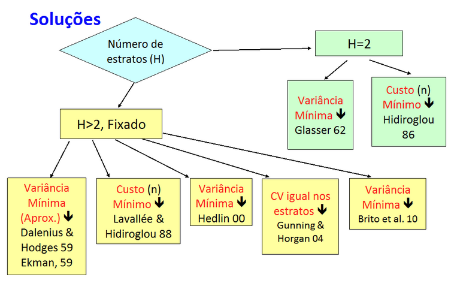
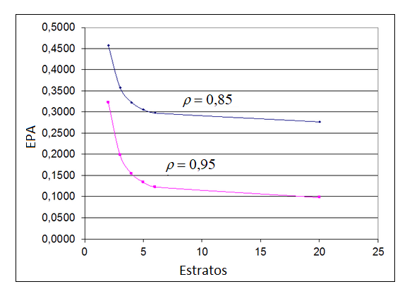

# Amostragem Estratificada {#estrat}

*Amostragem estratificada - AE* é um processo de amostragem que usa alguma informação auxiliar relevante para dividir a população $U$ em $H$ grupos disjuntos e exaustivos, geralmente mais homogêneos em relacão à(s) variável(is) de interesse, chamados *estratos*. Em seguida, é feita a seleção de amostras dentro de cada um dos estratos, de forma independente. A amostra final é formada então pela união das amostras selecionadas em cada um dos estratos. 

Para ser viável, as *variáveis de estratificação* (aquelas usadas para dividir a população em estratos) precisam estar disponíveis para todas as unidades da população da qual se vai selecionar a amostra.
As variáveis de estratificação podem ser geográficas, como por exemplo as unidades da federação ou municípios, ou de outros tipos, tais como sexo, idade, número de empregados na empresa, área do estabelecimento, etc. 

*Amostragem estratificada* é muito empregada na prática das pesquisas por amostragem por diversas razões, a saber:

1. Quando os estratos formam domínios “naturais” ou de interesse, como por exemplo regiões geográficas, tipos de empresas (farmácias, supermercados, lojas de departamentos) etc., a estratificação garante a seleção de amostras de tamanhos especificados em todos os estratos formados e, desse modo, permite controlar a precisão esperada de estimativas para subgrupos da população de pesquisa definidos como estratos ou agregações de estratos.    
2. Quando é necessário “espalhar” a amostra sobre toda a população, isto é, tornar a amostra “representativa” e assegurar que todas as partes (estratos) relevantes da população sejam incluídas na amostra.     
3. Para melhorar a eficiência amostral, isto é, para reduzir a variância dos estimadores dos parâmetros de interesse; quanto maior for a homogeneidade dentro dos estratos, mais a estratificação permite aumentar a precisão de estimativas para o conjunto da população, em comparação com planos de igual tamanho de amostra que não usam estratificação.   
4. Quando for necessário usar métodos diferentes de coleta em diferentes subgrupos da população; a estratificação favorece a administração e implementação da coleta em pesquisas onde as condições de pesquisa variam entre os estratos; por exemplo, estratos podem ser formados de modo a viabilizar o emprego de modos alternativos de coleta (presencial, telefone, internet, etc.). 

Para pesquisas em que a estimação é requerida para cada estrato definido na população, o processo de amostragem e estimação deve ser replicado separadamente em cada estrato. Para pesquisas onde não são de interesse resultados por estrato, parâmetros dos estratos são estimados separadamente em cada estrato, de acordo com o plano amostral adotado, e estas estimativas são então agregadas para obter estimativas dos parâmetros de interesse referentes ao conjunto da população.

Como desvantagens potenciais do método, a AE pode requerer a reestruturação do cadastro antes da amostragem. Além disso, apenas uma estratificação é possível e, uma vez fixada a estratificação, a amostragem vai depender dela de forma direta. Por último, subdividir a população em muitos estratos pode levar a ter amostras muito pequenas para cada estrato, algo que pode causar complicações na implementação da pesquisa, caso ocorra não resposta.

Podemos distinguir dois tipos de estratificação: 

1. *Natural* - quando os estratos são iguais a subgrupos da população para os quais se requer estimativas com precisão controlada.    
2. *Estatística* - quando os estratos são definidos como subgrupos homogêneos da população, visando aumentar eficiência na estimação para a população como um todo. Neste caso, não há interesse específico na estimação de parâmetros dos estratos formados.

Para definir estratos no contexto de *estratificação natural*, o processo requer essencialmente ouvir os clientes ou usuários dos resultados da pesquisa. São eles que devem indicar que subgrupos da população requerem estimativas com precisão controlada. Um exemplo é o de pesquisas do IBGE, que além de produzir resultados para o país como um todo, têm que produzir também resultados por unidades da federação. Estas são então *estratos naturais* nas pesquisas, que passam a ter suas amostras planejadas de modo a ter seleção independente em cada unidade da federação, sendo tais amostras de tamanhos suficientes para estimar com a precisão desejada em cada uma.

Quando os estratos não são formados para permitir divulgação de resultados em cada um, mas somente como forma de melhorar a precisão de estimativas para o conjunto da população, sua formação pode ser feita empregando métodos que visam a otimizar os efeitos da estratificação. Alguns destes métodos são apresentados na sequência deste capítulo.

Na prática, não é incomum encontrar aplicações onde a estratificação usada numa pesquisa combina os dois tipos. Na amostragem de pesquisas econômicas estruturais do IBGE, por exemplo, as empresas são estratificadas por unidade da federação e tipo de atividade econômica, definindo assim seus estratos naturais. Dentro destes estratos, para aumentar a eficiência da amostragem, as empresas são estratificadas por faixas de tamanho, usando a variável pessoal ocupado, num exemplo de estratificação estatística, já que tais pesquisas não buscan estimar parâmetros populacionais nestes estratos de tamanho (dentro dos estratos naturais). Ver, por exemplo, @IBGE2000.

Há diversos fatores que influenciam a eficiência na AE: 

- A(s) variável(is) de estratificação.     
- O número de estratos.     
- A determinação dos limites dos estratos.    
- A alocação da amostra nos estratos.     
- O método de seleção da amostra em cada estrato.

Para *estratificação natural*, a escolha da(s) variável(is) de estratificação se dá considerando TODAS as variáveis disponíveis necessárias para definir os domínios de interesse que se tornam *estratos naturais* da pesquisa.

No caso da *estratificação estatística*, a escolha deve priorizar, entre as variáveis disponíveis, as que são as *melhores preditoras* da(s) variável(is) de interesse da pesquisa. Para ganhar eficiência com o uso da estratificação, a ideia é tornar os valores da(s) variável(is) de estudo dentro de cada estrato os mais similares / homogêneos possíveis, isto é, minimizar a *variância dentro dos estratos*.

Nos dois casos é fundamental ter acesso a cadastro(s) com informações completas sobre variáveis auxiliares que são necessárias para estratificar a população de forma eficiente. 


## O método geral

Particione (divida) a população $U$ em $H$ subconjuntos (grupos) mutuamente exclusivos e exaustivos, chamados *estratos*, denotados por $U_1, ..., U_h, ..., U_H$, de modo que: 

$U = U_1 \cup \dots \cup U_h \cup \dots \cup U_H = \displaystyle \bigcup_{h=1}^H U_h\quad$ e  $\quad U_h \cap U_k = \emptyset, \, h \ne k$.

Então $U_h = \textrm {\{unidades pertencentes ao estrato h}\}$, para $h=1, 2, ...,H$.

Seja $N_h$ o tamanho de $U_h$. O tamanho total da população é dado pela soma dos tamanhos dos estratos, $N = N_1 + \dots + N_h + \dots + N_H$.

Selecione uma amostra $s_h$ de tamanho $n_h$, com $n_h > 0$, segundo um plano amostral $p_h(s_h)$ *independentemente* dentro de cada estrato $h$, onde $n = \displaystyle \sum_{h=1}^{H} n_h$ é o tamanho total da amostra selecionada. Fica assim assegurado que cada estrato tem sua população representada na amostra completa dada por: $s = s_1 \cup \dots \cup s_h \cup \dots \cup s_H$. Note que em função da definição dos estratos, as amostras nos vários estratos também são conjuntos mutuamente exclusivos, isto é, $s_h \cap s_k = \emptyset, \, h \ne k$. 

A independência da amostragem nos diferentes estratos permite tratar cada estrato como se fosse uma população separada, para fins de seleção da amostra. Isto facilita a implementação de amostragem estratificada, que pode ser feita usando um algoritmo em quatro passos:

1. Defina a estratificação da população $U$.    
2. Defina o método para selecionar a amostra em cada um dos estratos formados na população.    
3. Selecione a amostra de cada estrato usando o método definido no passo 2.    
4. Reúna as amostras dos vários estratos para formar a amostra que será objeto da pesquisa.

A seguir, exemplos de possíveis planos de amostragem estratificada:

**(#exm:exmest1)** Amostragem com estratos definidos por conveniência administrativa

Considere uma população de passageiros chegando a um terminal marítimo, onde a chegada é sempre feita em navios que carregam tanto passageiros viajando com seus automóveis como passageiros que viajam a pé. Imagine que é necessário selecionar uma amostra dos passageiros para uma pesquisa que visa estimar a média dos gastos feitos na viagem por passageiro. 

Nesse tipo de cenário, é conveniente para a implementação da coleta dos dados que a população de passageiros seja dividida em dois estratos: passageiros chegando de automóvel (estrato 1) e passageiros chegando a pé (estrato 2). No estrato 1, poderia ser usada *Amostragem Sistemática* para selecionar um de cada $K$ automóveis cruzando um ponto de fluxo na saída do navio. Como as unidades de amostragem nesse caso são os automóveis, que podem ter um ou mais passageiros a bordo, trata-se de um cenário em que a amostragem é de grupos de passageiros (amostragem conglomerada - ver Capítulo \@ref(cong)). No estrato 2, as unidades de amostragem seriam os passageiros que desembarcam a pé, individualmente. Nesse caso, poderia ser empregada, por exemplo, *Amostragem Binomial* para selecionar passageiros para entrevistar ao passarem por um ponto de fluxo na saída do navio. 

Pesquisas como a *UK International Passenger Survey*  usam estratificação desta maneira, pois os métodos mais adequados para amostrar passageiros precisam variar conforme o modo de transporte e a forma de entrada no território do Reino Unido - ver @Horsfield2017.

**(#exm:exmest2)** Amostragem Estratificada por Corte - AEC

Este é um tipo de planejamento muito usado em pesquisas de estabelecimentos ou instituições. A população é dividida em estratos. Partes da população onde existe grande heterogeneidade ou que concentram grande parte do total de uma ou mais variáveis de interesse, porém compostas de um número relativamente pequeno de unidades populacionais, são alocadas num *estrato certo*. Nesse estrato se faz um censo, isto é, se pesquisa o conjunto completo de unidades ali alocadas. Nos demais estratos são pesquisadas amostras de suas unidades. 

Esse tipo de amostragem é muito utilizado em populações onde há grande assimetria das principais variáveis de interesse. Um bom exemplo são pesquisas econômicas na área da indústria onde, muitas vezes, um número pequeno de estabelecimentos industriais é responsável por grande parte do valor da produção. Neste caso, a precisão das estimativas de totais populacionais produzidas pode ser muito melhor ao empregar AEC em comparação com AAS (por exemplo), pois como no estrato certo é feito um censo, não há variabilidade devida ao uso de amostragem nesse estrato (variância nula do total 'estimado' nesse estrato).


## Amostragem estratificada simples 

Diferentes planos amostrais podem ser empregados nos diversos estratos, mas isso é pouco comum na prática. O mais comum é usar um mesmo tipo de amostragem nos vários estratos definidos.

A *Amostragem Estratificada Simples - AES* corresponde ao caso mais simples de todos, quando uma amostra aleatória simples sem reposição - AAS é selecionada em cada um dos estratos definidos. Neste caso, deve estar disponível um cadastro que permita alocar as unidades da população $U$ nos estratos definidos, conhecer os tamanhos dos estratos, e o cadastro deve estar organizado de forma a permitir a seleção da amostra em cada um dos estratos.

Esta seção apresenta os resultados para AES, método que considera sorteio por AAS em cada estrato, mas o mesmo tipo de enfoque pode ser adaptado quando for utilizado qualquer outro método de seleção nos estratos, tais como *Amostragem Sistemática*, *Amostragem Binomial*, *Amostragem com PPT*, etc. Como a seleção nos diferentes estratos é feita de forma independente, basta fazer as estimativas, utilizando as fórmulas adequadas ao método de seleção utilizado em cada estrato, e depois agregar os resultados dessas estimativas de forma adequada para obter estimativas para parâmetros da população como um todo.

### Método de seleção

Para cada estrato $h = 1, 2, \dots, H$, selecione por AAS uma amostra $s_h$ de tamanho $1 \le n_h \le N_h$ das $N_h$ unidades do estrato $U_h$, sempre de forma independente da seleção feita nos outros estratos. Qualquer um dos algoritmos descritos no Capítulo \@ref(aas) pode ser empregado para a seleção das amostras nos estratos. Segue-se então que o conjunto de todas as amostras possíveis $S_{AES}$ é formado por amostras da forma: 

$$
s = s_1 \cup \dots \cup s_h \cup \dots \cup s_H
$$

e seu tamanho é dado pelo produto dos tamanhos dos conjuntos de amostras possíveis em cada um dos estratos. Como em cada estrato usamos AAS, esses tamanhos são iguais a $\binom {N_h}{n_h}$ e, portanto, em cada estrato temos:

$$
p_h(s_h) = 1 \Big/ \binom {N_h}{n_h} = \binom {N_h}{n_h}^{-1} ,\,\,\, h = 1, 2, \dots, H \,\,  (\#eq:eqest1)
$$

Em consequência, o plano amostral $p_{AES}(s)$ é dado por:

$$
p_{AES}(s) = \prod_{h=1}^H p_h(s_h) = \prod_{h=1}^H \binom {N_h}{n_h}^{-1} \,\, (\#eq:eqest2) 
$$

onde $s \in S_{AES}$.

O *tamanho total da amostra* é: $n = n_1 + n_2 + \dots + n_H$.

### Parâmetros populacionais

Seguem as definições de alguns parâmetros populacionais de uma variável de interesse $y$ nos estratos e de como estes podem ser agregados para obter os parâmetros referentes ao conjunto da população.   

**Parâmetros nos estratos:**

A seguir são apresentadas definições para o total $Y_h$, a média $\overline {Y_h}$ e a variância $S_h^2(y)$ do estrato $h$:

$$
Y_h = \displaystyle \sum_{i \in U_h} y_{i}
$$

$$
\overline {Y_h} = Y_h / N_h = \frac {1} {N_h} \displaystyle \sum_{i \in U_h} y_{i}
$$ 

$$
S_{h,y}^2 = \displaystyle \frac {1} {N_h-1} \sum_{i \in U_h}  (y_i - \overline {Y_h})^2
$$

**Parâmetros populacionais (globais):**

O total populacional é dado por: 

$$
Y = \displaystyle \sum_{h=1}^H Y_h = \displaystyle \sum_{h=1}^H N_h \overline {Y_h} (\#eq:eqest3)
$$

A média populacional é definida como:

$$
\overline Y = Y/N = \frac {1} {N}\displaystyle \sum_{h=1}^H N_h \overline {Y_h} = \sum_{h=1}^H W_h\overline {Y_h} (\#eq:eqest4)
$$

onde $W_h = N_h/N$ é o *peso* da média do estrato $h$, $h=1, 2, ..., H$, na composição da média populacional global.

A variância populacional pode ser escrita como:

$$
\begin{eqnarray} 
S_y^2 & = & \frac {1} {N-1} \sum_{h=1}^H \sum_{i \in U_h} \left( y_i - \overline Y \right)^2 \\ 
& = & \frac {1} {N-1} \sum_{h=1}^H \sum_{i \in U_h} \left[ \left(y_i - \overline {Y_h} \right) + \left(\overline {Y_h} - \overline Y \right) \right]^2 \\ 
& = & \frac {1} {N-1} \sum_{h=1}^H (N_h - 1) S_{h,y}^2 + \frac {1} {N-1} \sum_{h=1}^{H} {N_h} \left( \overline {Y_h} - \overline Y \right)^2 \\ 
 & = & S_D^2 + S_E^2 \end{eqnarray} (\#eq:eqest5)
$$
onde: 

$$S_D^2 = \displaystyle  \sum_{h=1}^H  \frac {N_h - 1}{N - 1} S_{h,y}^2\;\;\;\text{e}\;\;\; S_E^2 = \displaystyle \sum_{h=1}^{H} \frac {N_h}{N - 1} \left( \overline {Y_h} - \overline Y \right)^2$$

A Expressão \@ref(eq:eqest5) mostra uma decomposição útil da variância total da variável $y$ na população, com duas componentes que são conhecidas como *Variância Dentro* e *Variância Entre* estratos, respectivamente. Como se vê na sequência, por selecionar amostras de forma independente em *todos* os estratos definidos, a *amostragem estratificada* elimina a componente de variação *entre* os estratos ao estimar parâmetros do conjunto da população, tais como o total ou a média. Além disso, note que para uma variância total $S_y^2$ fixada, minimizar a *Variância Dentro* $S_D^2$, mediante a definição de estratos homogêneos em relação à variável de interesse, deve permitir eliminar grande parte da variação relevante para a estimação de totais e médias populacionais. 


### Estimação do total e da média populacional 

Como a amostragem é feita independentemente por estrato, podemos estimar separadamente os parâmetros de cada estrato. Sob AES, os estimadores usuais dos parâmetros nos estratos são descritos a seguir:

$$
\widehat Y_h = \displaystyle \sum_{i \in s_h} d_i y_i = \frac{N_h}{n_h} \sum_{i \in s_h} y_i = N_h \overline y_h
$$  

é o estimador do total do estrato $h$ da variável $y$, onde $d_i = N_h / n_h$ é o peso da unidade i quando ela pertence ao estrato $h$. Note que o peso $d_i$ é o inverso da probabilidade de inclusão para unidades dentro de cada estrato $h$ sob AES. 

$$
\overline y_h = \frac{1}{n_h} \displaystyle \sum_{i \in s_h} y_i
$$ 

é o estimador da média da variável $y$ no estrato $h$; e 

$$
\widehat S_{h,y}^2 = \frac{1}{n_h - 1} \displaystyle \sum_{i \in s_h} \left( y_i - \overline y_h \right)^2
$$ 

é o estimador da variância $S_{h,y}^2$ da variável $y$ no estrato $h$. 

Como temos AAS de $n_h$ unidades dentro do estrato $h$, são válidas as seguintes propriedades: 

$$
E_{AES} \left( \overline y_h\right) = \overline {Y_h}
$$

$$
E_{AES} \left(\widehat Y_h \right) = Y_h
$$ 

$$
E_{AES} \left(\widehat S_{h,y}^2 \right) = S_{h,y}^2
$$

Todos estes resultados decorrem das propriedades já descritas no Capítulo \@ref(aas) para estimadores de média, total e variância sob AAS. Temos também os seguintes resultados para as variâncias de estimadores de média e total por estrato:

$$
V_{AES} \left( \overline y_h \right) = \left( \frac{1}{n_h} - \frac{1}{N_h} \right) S_{h,y}^2
$$ 

é a variância do estimador da média da variável $y$ no estrato $h$;

$$
V_{AES} \left( \widehat Y_h \right) = N_h^2 V_{AES} \left( \overline y_h \right) = N_h^2 \left( \frac{1}{n_h} - \frac{1}{N_h} \right) S_{h,y}^2
$$ 

é a variância do estimador de total da variável $y$ no estrato $h$;

$$
\widehat V_{AES} \left( \overline y_h \right) = \left( \frac{1}{n_h} - \frac{1}{N_h} \right)\widehat S_{h,y}^2
$$ 

é o estimador da variância do estimador da média da variável $y$ no estrato $h$; e 

$$
\widehat V_{AES} \left( \widehat Y_h \right) = N_h^2 \widehat V_{AES} \left( \overline y_h \right) = N_h^2 \left( \frac{1}{n_h} - \frac{1}{N_h} \right)\widehat S_{h,y}^2
$$ 

é o estimador da variância do estimador de total da variável $y$ no estrato $h$.

Para a estimação de parâmetros populacionais globais, ou seja, para o conjunto da população temos: 

$$
\widehat Y_{AES} = \displaystyle \sum_{h=1}^{H} \widehat Y_h  = \sum_{h=1}^{H} N_h \overline y_h \,\,  (\#eq:eqest6)
$$ 

é o estimador do total $Y$;

$$
\overline y_{AES} = \displaystyle \sum_{h=1}^{H}W_h \overline y_h = \sum_{h=1}^{H} \frac{N_h}{N} \overline y_h \,\, (\#eq:eqest7)
$$
é o estimador da média $\overline Y$.

O estimador da média populacional sob AES é não viciado, isto é: 

$$
E_{AES} \left( \overline y_{AES} \right) = \overline Y
$$

Isto segue porque $E_{AES} \left (\overline y_h\right) = \overline {Y_h}$, $\forall \,h=1,...,H$, e

$$
E_{AES} \left( \displaystyle \sum_{h=1}^{H} W_h \overline y_h \right) = \displaystyle \sum_{h=1}^{H} W_h E_{AES} (\overline y_h) = \sum_{h=1}^{H} W_h \overline {Y_h} = \overline Y
$$

Devido à independência da amostragem nos estratos, a variância do estimador $\overline y_{AES}$ pode ser obtida como:

$$
V_{AES} \left( \overline y_{AES} \right) = \displaystyle \sum_{h=1}^{H} W_h^2 V_{AES} \left( \overline y_h\right ) = \displaystyle \sum_{h=1}^{H} \frac {N_h^2}{N^2} \left( \frac{1}{n_h} - \frac {1}{N_h} \right) S_{h,y}^2 \,\, (\#eq:eqest8)
$$

De forma similar se pode obter a variância do estimador do total populacional como:

$$
V_{AES} \left( \widehat Y_{AES} \right) = \displaystyle \sum_{h=1}^{H} {N_h^2} \left( \frac{1}{n_h} - \frac {1}{N_h} \right) S_{h,y}^2 \,\, (\#eq:eqest9)
$$

Um estimador não viciado da variância de $\overline y_{AES}$ é dado por:

$$
\widehat V_{AES} \left( \overline y_{AES} \right) = \displaystyle \sum_{h=1}^{H} \frac {N_h^2}{N^2} \left( \frac{1}{n_h} - \frac{1}{N_h} \right)\widehat S_{h,y}^2 \,\, (\#eq:eqest10)
$$

No caso da estimação de total $\widehat Y_{AES}$, um estimador não viciado da variância é dado por:

$$
\widehat V_{AES }\left( \widehat Y_{AES} \right) = \displaystyle\sum_{h=1}^{H} N_h^2 \left( \frac{1}{n_h} - \frac{1}{N_h} \right)\widehat S_{h,y}^2 \,\, (\#eq:eqest11)
$$

A Tabela \@ref(tab:tabestr1) apresenta um resumo dos estimadores do total, média e respectivas variâncias da variável $y$ sob AES. 

<center>
```{r, results="asis", echo=FALSE}
cat("<table>",paste0("<caption>", "(#tab:tabestr1)", "Estimadores do total, média e respectivas variâncias sob AES", "</caption>"),"</table>", sep ="\n")
```
---------
Estimador
----------------------------------------
$\widehat Y_{AES} = \displaystyle \sum_{h=1}^{H} \widehat Y_h = \sum_{h=1}^{H} N_h \overline y_h$

$\displaystyle \overline y_{AES} = \sum_{h=1}^{H} \frac{N_h}{N} \overline y_h = \displaystyle \sum_{h=1}^{H} W_h \overline y_h$

$\widehat V_{AES} \left( \widehat Y_{AES} \right) = \displaystyle\sum_{h=1}^{H} N_h^2 \left( \frac{1}{n_h} - \frac{1}{N_h} \right)\widehat S_{h,y}^2$

$\widehat V_{AES} \left( \overline y_{AES} \right) = \displaystyle \sum_{h=1}^{H} W_h^2 \left( \frac{1}{n_h} - \frac{1}{N_h} \right)\widehat S_{h,y}^2$
---------------
</center>

Na Seção \@ref(razCS) são apresentados, como casos particulares de calibração, o estimador de razão combinada e o estimador de razão separada, que são do tipo razão usuais para o total populacional $(Y)$ no caso de AES. 

### Intervalos de confiança

Se $n = \displaystyle \sum_{h=1}^{H} n_h$ for grande, então o Teorema Central do Limite também se aplica. Portanto:

$$
\frac{\overline y_{AES} - \overline Y}{\sqrt{\widehat V_{AES} \left( \overline y_{AES} \right)}} \approx N(0;1)
$$

Logo, um intervalo de confiança de nível $1-\alpha$ para $\overline Y$ é dado por:

$$
IC_{AES} (\overline Y; 1-\alpha) = \left[ \overline y_{AES} \mp z_{\alpha/2} \sqrt{\widehat V_{AES} \left( \overline y_{AES} \right)} \right] \,\,\, (\#eq:eqest12)
$$

Para médias dentro de estratos, $\overline y_h$, os tamanhos de amostras *por estratos* $n_h$ sendo suficientemente grandes, o Teorema Central do Limite indica que:

$$
\frac{\overline y_h - \overline {Y_h}}{\sqrt{\widehat V_{AES}\left(\overline y_h\right)}} \approx N(0;1)
$$
 
e então um intervalo de confiança de nível $1-\alpha$ para $\overline {Y_h}$ é dado por:

$$
IC_{AES} (\overline {Y_h}; 1-\alpha) = \left[ \overline y_h \mp z_{\alpha/2} \sqrt{\widehat V_{AES} \left( \overline y_h \right)} \right]
$$


## Alocação da amostra nos estratos

Uma decisão importante que precisa ser tomada quando se vai usar amostragem estratificada é a forma pela qual o tamanho total da amostra será alocado ou distribuído nos estratos. Há dois caminhos principais a seguir.

Quando os estratos são *estratos naturais*, é geralmente necessário calcular tamanhos de amostra necessários para estimar parâmetros dos estratos com precisão controlada. Nesse caso, o tamanho total da amostra é obtido numa abordagem tipo agregação, somando os tamanhos de amostra calculados para os estratos naturais definidos. Nesse caso, a alocação nos estratos vem antes da obtenção do tamanho total da amostra. 

Quando não há interesse específico na estimação de parâmetros dos estratos e um tamanho total de amostra foi calculado, é necessário distribuir esse tamanho entre os estratos definidos na população. Há duas maneiras principais de alocação da amostra, que pode ser feita de forma *proporcional* ou *desproporcional* aos tamanhos $N_h$ dos estratos. 

A chamada *alocação proporcional* é o método no qual o tamanho da amostra alocado no estrato $h$ é proporcional ao número de unidades populacionais nesse estrato. Em consequência, a fração amostral em cada estrato é constante e igual à fração amostral da amostra inteira. Com esse método de alocação, os estratos maiores ficam com amostras maiores. Todas as outras formas de alocação vão resultar em uma alocação *desproporcional* da amostra nos estratos. 

Entre os métodos mais comuns de *alocação desproporcional* podemos citar: 

- *Alocação igual*: quando os tamanhos das amostras em todos os estratos são iguais a $n/H$.     
- *Alocação de Neyman*: quando a distribuição da amostra total considera tanto os tamanhos como a variabilidade entre unidades dentro dos estratos, levando a tamanhos de amostra maiores em estratos com maior tamanho e maior variabilidade entre unidades do mesmo estrato.    
- *Alocação ótima*: quando a distribuição da amostra total depende do tamanho, da variabilidade e do custo de coleta de cada estrato.    
- *Alocação potência*: quando os tamanhos das amostras nos estratos são proporcionais a uma potência dos tamanhos dos estratos.    

Todas estas formas de alocação estão disponíveis para aplicações, e cabe ao planejador da amostra escolher a que melhor se adapta à situação de sua pesquisa. Na sequência apresentamos com detalhes cada um dos métodos de alocação mencionados acima e, ao final, apresentamos também métodos mais modernos baseados no emprego de otimização.

### Alocação proporcional

Uma amostra ‘representativa’ deveria ‘imitar’ ou se parecer bastante com a população de onde foi extraída. Uma das formas de tornar a amostra parecida com a população é assegurar que suas unidades são distribuídas nos estratos da mesma forma que na população. Por exemplo, numa população onde há 51% de mulheres e 49% de homens, as proporções na amostra deveriam ser idênticas. Esta ideia norteou algumas das abordagens inicialmente consideradas para a amostragem de populações e deu origem, entre outros tipos de técnicas, à *amostragem por cotas*. No contexto da *amostragem probabilística*, a *amostragem estratificada simples com alocação proporcional* é o plano amostral mais similar à ideia de uma amostra por cotas.

Nesse método, as unidades populacionais são distribuídas nos estratos segundo as proporções: 

$$
W_h = N_h/N , \,\, h=1,\dots,H, \;\; \text{com} \;\; \displaystyle \sum_{h=1}^{H} W_h = 1
$$

As proporções amostrais nos estratos são definidas como:

$$
\lambda_h = n_h/n , \,\, h = 1, \dots , H \;\; \text{com} \; \;\displaystyle \sum_{h=1}^{H} \lambda_h = 1
$$.

Então, o critério de *alocação proporcional* implica tentar fazer $\lambda_h = W_h, \,\, \forall\, h = 1, 2, \dots, H$. 

Logo:

$$
\displaystyle \frac{n_h}{n} = \frac{N_h}{N} \Rightarrow \displaystyle n_h = n \frac{N_h}{N} = n W_h, \,\, \forall\, h = 1, 2, \dots, H \,\, (\#eq:eqest13)
$$.

Esta distribuição da amostra nos estratos é chamada *Alocação Proporcional*.

Um plano AES com $\displaystyle \frac{n_h}{n} = \frac{N_h}{N}$ é chamado de *Amostragem Estratificada Simples Proporcional - AESP* ou equiponderada.

Vale notar, de imediato, que a solução indicada não fornecerá resultados exatos, pois os tamanhos de amostra calculados podem não ser números inteiros. A prática usual é arredondar para cima os tamanhos de amostra calculados conforme a Expressão \@ref(eq:eqest13). Isto vai implicar um pequeno aumento do tamanho total da amostra, a menos que a estratificação tenha definido um número muito grande de estratos - algo conhecido como *estratificação profunda*. Nesse caso, a estratégia pode ser adaptada para uso de arredondamento comum ao inteiro mais próximo.

Sob AESP, como $n_h = n W_h$, a *média amostral simples* é o estimador não viciado da média populacional:

$$
\overline y_{AESP} = \displaystyle \sum_{h=1}^{H} W_h \overline y_h = \sum_{h=1}^{H} W_h \frac{1}{n_h} \sum_{i \in s_h} y_i = \frac{1}{n} \sum_{h=1}^{H} \sum_{i \in s_h} y_i = \overline y \,\, (\#eq:eqest14)
$$ 

A variância de $\overline y_{AESP}$ simplifica para: 

$$
V_{AESP} \left( \overline y_{AESP} \right) = \left( \frac{1}{n} - \frac{1}{N} \right) \sum_{h=1}^{H} W_h S_{h,y}^2 \doteq  \left( \frac{1}{n} - \frac{1}{N} \right) S_D^2 \,\, (\#eq:eqest15)
$$ 

onde a aproximação envolvida para obtenção do último termo decorre do uso de pesos $N_h/N$ em lugar dos pesos $(N_h - 1) / (N - 1)$ usados na definição da *variância dentro* dos estratos. 

Note que a expressão aproximada tem a mesma forma que a expressão correspondente ao caso da AAS, com $S_y^2$ substituído por $S_D^2$. Como a *variância dentro* é menor que a variância total $\left(S_D^2 < S_y^2 \right)$, fica evidenciado que AESP geralmente reduz a variância do estimador quando comparada com AAS de igual tamanho.

### Alocação ótima

A maioria das pesquisas convive com restrições orçamentárias. Já se mostrou acima que é sempre possível ganhar eficiência com uso de amostragem estratificada simples em comparação com uma AAS de igual tamanho. Mas o caminho da alocação proporcional não é o caminho que permite obter o maior ganho de eficiência possível. É nesse contexto que foi desenvolvido o método de *alocação ótima* para amostras estratificadas simples que vamos discutir na sequência.

Se o custo total da pesquisa é fixado em $C$ unidades monetárias, então é necessário especificar uma *função custo* que descreva como esse custo varia para diferentes tamanhos amostrais e alternativas de alocação da amostra nos estratos. Vamos considerar aqui que uma função custo linear dada por: 

$$
C = c_0 + \displaystyle \sum_{h=1}^{H} n_h c_h \,\,\, (\#eq:eqest16)
$$
é adequada para descrever os custos de pesquisa num cenário onde AES vai ser empregada. 

Note que na Expressão \@ref(eq:eqest16), $c_0$ representa os custos fixos da pesquisa e $n_hc_h$ os custos que dependem efetivamente de cada estrato $h$. 

A ideia é minimizar a $V_{AES} \left( \overline y_{AES} \right)$ sujeita à restrição de que o custo da pesquisa não ultrapasse o orçamento disponível, isto é, não ultrapasse o custo total $C$. Para resolver este problema, note que a variância do estimador da média populacional pode ser escrita como:

$$
V_{AES} \left( \overline y_{AES} \right) = \displaystyle \sum_{h=1}^{H} W_h^2 S_{h,y}^2 \left( \frac{1}{n_h} - \frac{1}{N_h} \right) = \sum_{h=1}^{H} W_h^2 S_{h,y}^2 / n_h - V_0 \,\,\, (\#eq:eqest17)
$$

onde $V_0 = \displaystyle \sum_{h=1}^{H} W_h^2 S_{h,y}^2 / N_h$.

Como $V_0$ não depende de $n_h$, para minimizar $V_{AES} \left( \overline y_{AES} \right)$ basta calcular os valores de $n_h$ que minimizem o primeiro termo na última expressão à direita na Expressão \@ref(eq:eqest17), desprezando o componente $V_0$. Isto pode ser feito empregando as técnicas usuais de minimização de funções sujeitas a restrições lineares, empregando o método dos multiplicadores de Lagrange. O resultado da minimização corresponde à *alocação ótima* dada por:

$$
n_h = n \times \frac {W_h S_{h,y} / \sqrt c_h} {\displaystyle \sum_{k=1}^{H} W_k S_{k,y} / \sqrt c_k}, \,\, \forall \, h = 1, \dots, H \,\,\, (\#eq:eqest18)
$$ 

Este método de alocação foi proposto por @Neyman1934, em seu artigo seminal que introduziu as bases da amostragem probabilística, definiu a amostragem estratificada e já indicava a maneira ótima de alocar amostras nos estratos no contexto da AES. Note que, sob *alocação ótima*, uma amostra maior será selecionada num estrato $h$ sempre que:

a. O estrato tiver mais unidades $(N_h$ grande).
b. A variabilidade no estrato for maior ($S_{h,y}$ grande).
c. O custo de amostragem no estrato for menor ($c_h$ pequeno).

Note também que, quando $S_h = S^*$ e $c_h = c^*, \,\, \forall \, h = 1, 2, \dots, H$, ambos constantes, então $n_h = n N_h / N$, isto é, a *alocação ótima* coincide com a *alocação proporcional*. Entretanto, se apenas os custos de amostragem forem constantes ao longo dos estratos, isto é, quando $c_h = c^*, \, \forall \, h = 1, 2, \dots, H$, então: 

$$
n_h = n \times \frac {N_h S_{h,y}} {\displaystyle \sum_{k=1}^{H} N_k S_{k,y}}
$$
gerando a chamada *Alocação (Ótima) de Neyman*.

Esta alocação é muito usada em pesquisas de estabelecimentos quando os desvios padrões $S_{h,y}$ crescem com o tamanho das unidades, ou seja, a variável de interesse tem maior variação em estabelecimentos maiores.

### Tamanho da amostra estratificada - caso geral

Dado um tipo de alocação e fixando a variância que se deseja para a estimativa da média populacional, por exemplo, é possível determinar o tamanho total da amostra estratificada necessária, a partir da Expressão \@ref(eq:eqest17).

Seja uma alocação $a_h$ e um valor fixado para a variância da média populacional máximo de $V$. Tem-se, então:

$$
V\le V_{AES} \left( \overline y_{AES} \right) = \displaystyle \sum_{h=1}^{H} W_h^2 S_{h,y}^2 \left( \frac{1}{n_h} - \frac{1}{N_h} \right) = \frac1n\sum_{h=1}^{H} \frac {W_h^2 S_{h,y}^2}{a_h} - \frac1N\sum_{h=1}^{H}{ W_h S_{h,y}^2}
$$
Logo:

$$
n \ge \frac {\sum_{h=1}^{H} \frac {W_h^2 S_{h,y}^2}{a_h}}{V+\frac1N\sum_{h=1}^{H}{ W_h S_{h,y}^2}}\;\;(\#eq:eqest19)
$$

Para obter a expressão para uma alocação particular basta substituir $a_h$ de forma adequada. Por exemplo, no caso da alocação proporcional basta substituir $a_h$ por $W_h$ e obter a expressão para o cálculo do tamanho da amostra.

### Tamanho da amostra sob alocação ótima

Para um custo fixado $C$ basta substituir o valor de $n_h$, dado pela Expressão \@ref(eq:eqest18), na função de custo linear, Expressão \@ref(eq:eqest16), para se obter o tamanho total da amostra sob *amostragem estratificada simples com alocação ótima - AESO*:


$$
n_{AESO} = \left( C - c_0 \right) \times \frac{\displaystyle \sum_{h=1}^{H} N_h S_{h,y} / \sqrt c_h} {\displaystyle \sum_{h=1}^{H} N_h S_{h,y} \sqrt c_h} \,\,\, (\#eq:eqest20)
$$

Se *amostragem estratificada simples com alocação de Neyman - AESN* é usada, então o valor da variância minimizada para o estimador da média populacional é dado por:

$$
V_{AESN} \left( \overline y_{AES} \right) = \frac{1}{n} \left( \displaystyle \sum_{h=1}^{H} W_h S_{h,y} \right)^2 - \frac{1}{N} \left( \sum_{h=1}^{H }W_h S_{h,y}^2 \right) \,\,\, (\#eq:eqest21)
$$
O segundo termo à direita corresponde à *correção de população finita*.

A Expressão \@ref(eq:eqest21) é obtida pela substituição de $n_h$ na Expressão \@ref(eq:eqest8) pela expressão do $n_h$ da alocação de Neyman.

As soluções aqui apresentadas para alocação ótima ou de Neyman são aproximadas, pois ignoram restrições do tipo $1 \le n_h \le N_h$ e $n_h$ inteiro, $\forall \, h$. Soluções exatas para o problema de alocação devem ter em conta estas restrições e a literatura tem várias propostas. @Brito2015 oferecem uma solução exata para este problema de otimização utilizando uma formulação de *Programação Inteira Binária*. Um pacote denominado *stratbr* para o R foi desenvolvido onde esta solução está disponível - ver @Brito2019 para detalhes.


### Comparação de alternativas de alocação da amostra

Usando a partição da soma de quadrados total em parcelas devidas à variação dentro e entre estratos e ignorando termos de ordem $1/N_h$, então sob *alocação de Neyman*, isto é, com $n_h \propto N_h S_{h,y}$ pode-se mostrar que (@Cochran1977, página 99):

$$
V_{AESN} \left( \overline y_{AES} \right) \le V_{AESP} \left( \overline y_{AES} \right) \le V_{AAS} \left( \overline y \right)
$$

ou seja, AES com alocação de Neyman é mais eficiente que AES com alocação proporcional, ambas superando AAS como plano amostral para um mesmo tamanho especificado de amostra. 

### Alocação potência

Este método de alocação da amostra foi proposto por @Bankier1988 num contexto em que a alocação da amostra em *estratos naturais* tem que satisfazer simultaneamente dois objetivos distintos:

- Permitir estimar para a população como um todo com precisão controlada.    
- Permitir estimar para os estratos naturais com uma precisão controlada.    

A alocação proposta é dada por:

$$
n_{AESPo} = n \times \frac{ X_h^q (S_{h,y} / \overline {Y_h})} {\displaystyle \sum_{k=1}^{H} X_k^q (S_{k,y} / \overline Y_k) } \,\,\, (\#eq:eqest22)
$$
onde $X_h = \sum_{i \in U_h} x_i$ é o total de alguma variável de tamanho das unidades do estrato $h$, e $0 \le q \le 1$ é uma potência a ser escolhida pelo responsável pelo planejamento da pesquisa. As quantidades $S_{h,y} / \overline {Y_h}$ representam os *coeficientes de variação* da variável de interesse dentro de cada um dos estratos definidos. Em muitas aplicações práticas, os estratos são construídos tentando fazer com que estes coeficientes de variação fiquem aproximadamente iguais ao longo dos vários estratos definidos. Nesse caso, a alocação potência se resume à forma simplificada:

$$
n_{AESPo} = n \times \frac{ X_h^q } {\displaystyle \sum_{k=1}^{H} X_k^q } \,\,\, (\#eq:eqest23)
$$

Um caso particular de interesse ocorre quando o número de unidades no estrato $h$ é usado como medida de tamanho, resultando na alocação:

$$
n_{AESPo} = n \times \frac{ N_h^q } {\displaystyle \sum_{k=1}^{H} N_k^q } \,\,\, (\#eq:eqest24)
$$

Quando se faz $q=1$ nesta última expressão, obtem-se a *alocação proporcional*, que pode assim ser vista como um caso particular da *alocação potência*.


### Alguns problemas com alocação ótima

A implementação de amostragem estratificada simples com alocação ótima pode apresentar dificuldades em algumas situações práticas. 

1. Em geral, os valores de $S_{h,y},\, h=1,...,H$, são desconhecidos.    
    As solucões usadas na prática incluem as seguintes alternativas:    
    a. Usar informações de uma variável auxiliar $x$, usando $S_{h,x}$ em lugar de $S_{h,y}$ na Expressão \@ref(eq:eqest20).    
    b. Predizer $y_i$ usando informações auxiliares $x_i$, e então estimar $S_{h,y}$ a partir dos valores preditos.     
    c. Usar o total ou a amplitude da variável auxiliar $x$ no estrato $h$ como proxy para $S_{h,y}$.    
    d. Selecionar pequena amostra piloto (preliminar) e usar dados desta amostra para estimar $S_{y,h}$.    
2. Pode haver muitas variáveis de pesquisa $y$.    
    Caso se tenha informações sobre as diversas variáveis de interesse da pesquisa para fazer alocações alternativas da amostra, isto pode ser feito usando um dos métodos de alocação descritos acima. Entretanto, tomar cada variável como guia para a alocação geralmente levaria a ter alocações ótimas diferentes. Nesses casos, os métodos mais simples buscam soluções de compromisso considerando as diversas alocações alternativas: 
    a. Usar a média das alocações alternativas em cada estrato.     
    b. Escolher uma ou duas variáveis principais; com duas variáveis, usar a média das alocações alternativas.    
    c. Construir um ‘índice’ das variáveis de pesquisa e usar este índice para definir a alocação.    
    d. Usar alocação proporcional.   
    
    Todas as soluções acima são saídas simplificadoras, que na verdade não enfrentam o problema existente. @Brito2015 oferece uma abordagem para *alocação ótima multivariada*, usando formulações de programação inteira binária para obter soluções exatas do problema, que inclusive consideram que os tamanhos de amostra nos estratos têm que ser inteiros e limitados abaixo por 1 (ou outro valor especificado) e acima (por $N_h$). O pacote *stratbr* do R implementa duas soluções: uma delas permite minimizar o custo ou tamanho amostral para limites de precisão especificados; a outra permite minimizar uma função de variância dado um orçamento ou tamanho amostral total especificado.    
3. Se $n_h > N_h$ para algum estrato.    
    Fazer $n_h = N_h$, tornando esse estrato um *estrato certo* ou *estrato censitário* para os estratos em que $n_h > N_h$. Em seguida, refazer a alocação ótima nos demais estratos, após ajustar o tamanho da amostra disponível para seleção nestes outros estratos.    
4. Se $n_h < 2$ para algum estrato.    
    Se a estimação de variâncias for importante, então forçar $n_h \geq 2$ para todos os estratos. Na prática, costuma-se fazer $n_h \geq 5$ devido à possibilidade de ocorrência de não resposta. Para estimação sem viés do total ou média, é essencial que $n_h \geq 2$ para todos os estratos. Quando ocorrem situações de estratos com $n_h = 1$, é necessário utilizar métodos aproximados para estimação de variâncias, tais como agregação de estratos ou similares (ver @Cochran1977, Seção 5A.12).    
5. Ganhos de eficiência podem ser modestos, particularmente para estimação de proporções.     
    @Cochran1977, página 99, mostra que: $$V_{AESN} \left( \overline y_{AES} \right) \le V_{AESP} \left( \overline y_{AES} \right) \le V_{AAS} \left( \overline y \right)$$ 
    Os ganhos de precisão possíveis dependem da relação entre a(s) variável(is) de estratificação e as variáveis de pesquisa. Em geral, os ganhos são pequenos para amostras de pessoas e variáveis ligadas a atitudes, opiniões, comportamentos, etc. Para pesquisas amostrais de estabelecimentos ou instituições, os ganhos podem ser maiores.     
    Quando os ganhos de precisão alcançados com a estratificação não são grandes, o responsável pelo planejamento da pesquisa precisa avaliar se a estratificação proposta vale a pena ou se pode ser melhorada. Caso possa ser melhorada, o trabalho de alocação deve ser refeito após a redefinição.

## Definição dos limites dos estratos

Conforme já dito anteriormente, a determinação dos limites dos estratos influencia na eficiência na amostragem estratificada. Para definir estratos num contexto de *estratificação estatística*, se estiver disponível uma variável auxiliar $x$ correlacionada positivamente com a variável de interesse $y$, seus valores podem ser usados para formar estratos. Surge então a questão de como formar os estratos de maneira a tirar proveito dessa variável para aumentar a eficiência da amostragem estratificada simples na estimação de parâmetros da variável de pesquisa $y$. Este problema é conhecido como problema da *delimitação ótima dos estratos*. 

O primeiro passo é a escolha do valor de $H$, o número total de estratos. Quanto maior for a correlação entre a variável auxiliar $x$ disponível e a variável de pesquisa $y$, maior pode ser o número de estratos formados, até um certo limite. Evidências empíricas sugerem, entretanto, que valores no intervalo $5 \le H \le 10$ são suficientes para alcançar grande parte dos ganhos de eficiência decorrentes da estratificação. 

Quando $H = 2$, há um par de métodos disponíveis para obter soluções 'exatas' do problema de delimitação ótima dos estratos. @Glasser1962 descreve um algoritmo para delimitar estratos de modo a minimizar a variância do estimador de total, supondo que num dos estratos formados será feito um censo (levantamento exaustivo), e no outro será feita amostragem aleatória simples. Este é um exemplo de *amostragem estratificada por corte - AEC*, onde o valor que delimita a partir de que ponto as maiores unidades devem ser incluídas num *estrato certo* é escolhido pelo algoritmo. @Hidiroglou1986 apresenta um algoritmo alternativo também considerando AEC, mas onde o ponto de corte da estratificação é escolhido de modo a minimizar o tamanho total da amostra, para um valor especificado da variância do estimador de total aplicado à variável auxiliar $x$.

Para valores de $H \ge 3$, há uma variedade de soluções disponíveis na literatura. @Brito2019 apresenta uma revisão da literatura sobre estes métodos, mas também apresenta um algoritmo de otimização estocástica para resolver o problema. Este algoritmo está implementado no pacote *stratbr* do sistema R. A Figura \@ref(fig:numeroestratos) lista as principais referências que tratam do tema. 

<center>
```{r,numeroestratos, echo=FALSE, fig.cap="Soluções sobre escolha de número de estratos",out.width="100%"}

```
</center>

## Número de estratos na amostragem estratificada simples 

Quando a estratificação tem por objetivo viabilizar a estimação em domínios predefinidos, recomenda-se utilizar tantos *estratos naturais* quantos sejam os domínios de interesse. Nesse caso, não cabe muita análise técnica, a não ser que o orçamento disponível para realização da pesquisa não permita obter amostras de tamanhos suficientes em todos os domínios de interesse. Quando tal situação ocorrer, o caminho deve ser a negociação do ajuste dos limites orçamentários e da definição dos domínios de interesse junto aos demandantes ou principais usuários da pesquisa.

Quando se trata de *estratificação estatística*, não há interesse na estimação de parâmetros dos estratos a serem definidos, e o objetivo é a estimação do total ou da média global, @Cochran1977, Seção 5A.8, recomenda usar até $H=6$ (seis) estratos. A justificativa para essa recomendação se baseia na análise descrita a seguir.

Considere as hipóteses aqui indicadas: 

- $N$ é grande e $f=n/N$ é pequena.     
- O modelo $y_i = a + b x_i + \varepsilon_i$ para $i \in U$ descreve bem a relação entre a variável de pesquisa $y$ e a variável de estratificação $x$ na população.     
- É usada *delimitação ótima* dos estratos com base em $x$.    
- É usada *alocação igual* da amostra nos estratos ($n_h = n/H$).

Sob as hipóteses enumeradas, pode-se mostrar que: 

$$
EPA \left( \overline y_{AES} \, ; \, \overline y \right) = V_{AES} \left( \overline y_{AES} \right) / V_{AAS} \left( \overline y \right) \doteq \rho_{x,y}^2 / H^2 + \left( 1 - \rho_{x,y}^2 \right)
$$ 

onde $\rho_{x,y}$ é correlação entre $x$ e $y$ conforme o modelo linear assumido para a população.

A Tabela \@ref(tab:tabestr2) apresenta valores de $EPA\left(\overline y_{AES} \, ; \,\overline y \right)$ para alguns valores de $H$ e de $\rho_{x,y}$.

```{r, results="asis", echo=FALSE}
cat("<table>",paste0("<caption>", "(#tab:tabestr2)", "Valores de $EPA$ para valores variados de $H$ e de correlação", "</caption>"),"</table>", sep ="\n")
```
<center>
---------
Valores de $\rho$   $H=2$         $H=3$        $H=4$       $H=5$        $H=6$           $H=\infty$
------------------ ------------ ------------ ------------ ------------ ------------ --------------- 
$\rho=0,85$         0,458        0,358         0,323        0,306        0,298          0,277

$\rho=0,95$         0,323        0,198         0,154        0,134        0,123          0,098

---------
</center>

A análise dos resultados acima evidencia que ganhos adicionais de eficiência para casos com mais de seis estratos seriam modestos. Na Figura \@ref(fig:precisaovsestratos) temos o gráfico dos ganhos de precisão versus número de estratos para $\rho_{x,y}=0,85$ e $\rho_{x,y}=0,95$. 

<center>
```{r, precisaovsestratos,echo=FALSE, fig.cap="Ganhos de precisão versus número de estratos"}

```
</center>

## Exercícios {#exerc11}

**(#exr:exeest1)** Mostre que a média amostral global $\overline y=\displaystyle\frac{1}{n}\displaystyle\sum_{h=1}^{H}\sum_{i \in s_h}y_{hi}$ pode ser escrita como $\overline y=\displaystyle\sum_{h=1}^{H}\frac{n_h}{n}\overline y_h\ne \sum_{h=1}^{H}\frac{N_h}{N}\overline y_h=\overline y_{AES}$, a menos que $\displaystyle\frac{n_h}{n}=\frac{N_h}{N}, \,\, \forall\, h=1,\dots,H$ ou seja, a menos que se adote amostragem estratificada simples proporcional ou equiponderada.

**(#exr:exeest2)** Quais são as probabilidades de inclusão de primeira e segunda ordem para unidades na população sob AES? Que valores estas probabilidades assumem em caso de um plano AES proporcional ou equiponderada?

**(#exr:exeest3)** Seja uma população fictícia, de tamanho $N=6$, onde são conhecidos os valores para uma variável $y$, sendo $Y=\{2, 4, 9, 2, 10, 11\}$.

a)  Selecione todas as possíveis amostras de tamanho $n=4$ usando AAS.
b)  Calcule as estimativas da média populacional para cada uma das amostras AAS possíveis.
c)  Calcule a variância da estimativa da média populacional com AAS.
d)  Selecione todas as amostras possíveis de tamanho $n=4$ usando AES, estratificando a população em dois estratos formados pelas unidades onde $y_i<5$ e $y_i\ge 5$, com alocação proporcional.
e)  Calcule as estimativas da média populacional para cada uma das amostras AES possíveis.
f)  Calcule a variância da estimativa da média populacional com AES.
g)  Compare e comente os resultados encontrados.

**(#exr:exeest4)** Em uma determinada localidade formada por 500 domicílios deseja-se fazer um estudo sobre o hábito de fumar entre as pessoas maiores de 16 anos. A população foi estratificada em 2 estratos: domicílios com renda alta (estrato 1), onde foram classificados 200 domicílios; e domicílios com renda mais baixa (estrato 2), onde foram classificados os outros 300 domicílios. É conhecido que o número de pessoas com mais de 16 anos no estrato 1 é 520 e no estrato 2 é 1.230. De cada um dos estratos foi selecionada e pesquisada uma amostra aleatória simples de 5 domicílios, apresentando os resultados mostrados na Tabela \@ref(tab:tabestr3):
 
<center>
```{r, results="asis", echo=FALSE}
cat("<table>",paste0("<caption>", "(#tab:tabestr3)", "Dados observados na amostra, por estrato", "</caption>"),"</table>", sep ="\n")
```
----------
                                     Estrato 1          Estrato 2 
------------------------------ ------------------- -------------------
**Domicílios na amostra**       **1  2  3  4  5**   **1  2  3  4  5**

Moradores com mais de 16 anos   4  3  2  1  2       5  6  4  4  3

Fumantes com mais de 16 anos    1  1  0  1  1       3  3  1  2  2 
----------
</center>

Estime o total de fumantes e o intervalo de 95% de confiança, entre as pessoas maiores de 16 anos na localidade, utilizando o estimador simples da amostragem estratificada.

**(#exr:exeest5)** Um pesquisador pretende realizar uma pesquisa por amostragem para estimar a produção de soja numa determinada região. Ele tem acesso a uma lista das fazendas produtoras de soja localizadas na região, compilada por ocasião do último censo agropecuário, realizado menos de 1 ano atrás. Usando essa lista, que contém a informação sobre área plantada com soja na ocasião do censo em cada fazenda, o pesquisador dividiu as fazendas da população em dois grupos: fazendas grandes (área plantada com soja maior que 50 hectares) e fazendas pequenas (todas as demais). A Tabela \@ref(tab:tabestr4) contém as informações compiladas pelo pesquisador usando a lista.

<center>
```{r, results="asis", echo=FALSE}
cat("<table>",paste0("<caption>", "(#tab:tabestr4)", "Informações da estratificação das fazendas de soja", "</caption>"),"</table>", sep ="\n")
```
----------
Grupo           $N_h$  $\overline {Y_h}$      $S^2_{h,y}$
--------- ----------- ------------------ ---------------- 
Pequenas       2.400               10           100    
                                   
Grandes        100                 80          1.600   
----------
</center>   

Determine a alocação de uma amostra de 200 fazendas usando:

a)  A alocação proporcional.
b)  A alocação de Neyman.
c)  A alocação ótima, supondo que o custo de coleta de uma unidade entre as grandes fazendas é metade do custo da coleta de uma unidade entre as pequenas.
d)  Amostragem Estratificada por Corte.
  
**(#exr:exeest6)** Para estimar o total de uma variável de interesse $y$, uma população foi estratificada em quatro estratos. Algumas informações sobre a variável $y$ e sua distribuição nos estratos, obtidas de um censo recente, estão disponíveis na Tabela \@ref(tab:tabestr5).

<center>
```{r, results="asis", echo=FALSE}
cat("<table>",paste0("<caption>", "(#tab:tabestr5)", "Informações censitárias sobre a variável de interesse", "</caption>"),"</table>", sep ="\n")
```
----------
 Estrato      $N_h$  $\overline {Y_h}$        $S^2_{h,y}$
--------- --------- ------------------ -----------------
    1         44             17,18               18,48

    2        168             20,14               24,55

    3         56             27,59               34,60

    4         16             38,56               122,93
----------
</center>

Uma amostra estratificada simples de tamanho 40 será usada para pesquisar essa população visando estimar o total da variável de interesse $y$.

a)  Determine a alocação proporcional da amostra nos estratos.
b)  Determine a alocação de Neyman da amostra nos estratos.
c)  Compare a eficiência da AES, com as alocações utilizadas nos itens anteriores, em relação a uma AAS de mesmo tamanho.

**(#exr:exeest7)** As 2.120 lojas de uma certa localidade foram estratificadas pelo número de empregados (única variável relativa ao tamanho da empresa encontrada no cadastro) numa pesquisa para estimar o faturamento total. A Tabela \@ref(tab:tabestr6) contém as informações da variável número de empregados, $x$, utilizadas no planejamento da amostra e os resultados sobre o faturamento das lojas, $y$, obtidos da coleta dos dados na amostra .

<center>
```{r, results="asis", echo=FALSE}
cat("<table>",paste0("<caption>", "(#tab:tabestr6)", "Estratificação das lojas e resultados da amostra", "</caption>"),"</table>", sep ="\n")
```
---------- 
 Limites dos estratos             $N_h$              $X_h$         $S^2_{h,x}$        $\overline y_h$    $\widehat S^2_{h,y}$
---------------------- ---------------- ------------------ ------------------- --------------------- ---------------------
      5-14                1.100               9.020               8,30                   3                      2,53 

     15-49                  500               13.500             102,08                  17                     66,59

     50-99                  250               17.750             207,00                  52                     411,28

    100-199                 130                17.329             840,10                 170                    1.953,64

    200-499                 120                36.600            7.500,00                 350                   16.770,25

   500 e mais                20                14.280            20.805,00               7.000                  3.062.500,00

  **Totais**             **2.120**             **108.479**    
----------
</center>

  a) Dimensione, utilizando os dados referentes a $x$, a amostra necessária para estimar o numero total de empregados com um erro máximo admissível de 2% e com um nível de confiança de 95%, supondo alocação de Neyman.
  b) Suponha que a amostra alocada no item anterior tenha sido efetivamente selecionada fornecendo os resultados apresentados para $y$. Com estas informações estime o faturamento total, $Y$, e o coeficiente de variação desta estimativa.
       
**(#exr:exeest8)** (@Thompson2012) A Tabela \@ref(tab:tabestr7) mostra os resultados observados numa amostra estratificada:

<center>
```{r, results="asis", echo=FALSE}
cat("<table>",paste0("<caption>", "(#tab:tabestr7)", "Resultados observados na amostra", "</caption>"),"</table>", sep ="\n")
```
---------- 
 Estrato    $N_h$           $n_h$  $\overline y_h$  $\widehat S^2_{h,y}$
--------- ------- --------------- ---------------- ---------------------
 1            50               50               20                  700
 
 2           100               50               10                  2.800
    
 3           300               50               30                 600
----------
</center>

a)  Qual o tipo de estratificação utilizado?
b)  Estime a média populacional.
c)  Construa o intervalo de 95% de confiança para a média populacional.

**(#exr:exeest9)** (Adaptado de @Scheaffer2011) Uma empresa deseja estimar o total de faltas ao trabalho, num determinado mês, entre todos os funcionários. Como técnicos, administrativos e trabalhadores sem formação específica têm taxas distintas de faltas, esses grupos devem ser tratados como estratos. A Tabela \@ref(tab:tabestr8) dá as informações populacionais, para cada um dos estratos, sobre o total de trabalhadores e a variância do número de faltas.

<center>
```{r, results="asis", echo=FALSE}
cat("<table>",paste0("<caption>", "(#tab:tabestr8)", "Tamanho e variância por estrato", "</caption>"),"</table>", sep ="\n")
```
---------- 
Trabalhadores      $N_h$  $S^2_{h,y}$
---------------- ------- ------------ 
Técnicos              92       25

Administrativos       27        9

Sem formação         132       36
----------
</center>

a)  Supondo $n=30$, determine a alocação de Neyman da amostra estratificada simples.
b)  Usando os dados da Tabela \@ref(tab:tabestr9), estime o número total de faltas e estime um limite superior para o erro de estimativa, com 95% de confiança.
c)  Qual seria a estimativa do total e o limite superior para o erro de estimativa, com 95% de confiança, se essa mesma amostra tivesse sido selecionada por uma AAS, sem considerar a estratificação.
d)  Compare os resultados e comente-os.

<center>
```{r, results="asis", echo=FALSE}
cat("<table>",paste0("<caption>", "(#tab:tabestr9)", "Faltas no mês para cada trabalhador selecionado", "</caption>"),"</table>", sep ="\n")
```
---------- 
Trabalhadores    Faltas
---------------- ------------
Técnicos         2, 0, 3, 1, 0, 3, 8, 5, 1, 3

Administrativos  1, 3

Sem formação     4, 0, 2, 2, 3, 6, 8, 4, 0, 1, 1, 0, 0, 7, 4, 2, 0, 0
----------
</center>

**(#exr:exeest10)** (Adaptado de @Scheaffer2011) Uma empresa tem suas divisões localizadas em três continentes distintos: América, Europa e Ásia. Deseja-se realizar uma pesquisa sobre um de seus produtos através de uma amostra de clientes a serem entrevistados por telefone a partir da divisão localizada na América. O custo das ligações é diferente para cada uma das divisões. A Tabela \@ref(tab:tabestr11) tem as informações do custo, em dólares, de cada ligação/entrevista para cada uma das divisões, além da variância das taxas de satisfação e o número total de clientes em cada estrato. Calcule o tamanho total da amostra a ser selecionada e a alocação apropriada para essa amostra, sabendo que se deseja que a variância da estimativa da média populacional seja $V_{AES}(\overline y_{AES})\le 0,1$.

<center>
```{r, results="asis", echo=FALSE}
cat("<table>",paste0("<caption>", "(#tab:tabestr11)", "Informações populacionais dos clientes", "</caption>"),"</table>", sep ="\n")
```
---------- 
Estrato    $N_h$  $S^2_{h,y}$      $c_h$
-------- ------- ------------ ---------- 
América      112     2,25      9       

Europa        68     3,24     25  

Ásia          39     3,24     36     
----------
</center>

**(#exr:exeest11)** Raramente é necessário estimar a variância global $S_y^2$. Se fosse necessário, e considerando que seria usada *amostragem estratificada simples*, como você faria isso? 
