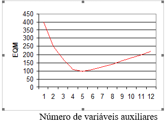

# Estimadores de Calibração {#calib}

## Motivação {#motiva13}

Em Amostragem, há várias maneiras de aproveitar *informações auxiliares* disponíveis para melhorar a precisão de estimativas de interesse em uma pesquisa amostral.
As duas maneiras mais conhecidas são: *estratificação* e *amostragem com probabilidades proporcionais ao tamanho (PPT)*.
Nos dois casos, a informação auxiliar é utilizada durante a etapa de planejamento amostral, portanto deve estar disponível *antes da seleção da amostra* para a realização de uma pesquisa.

Nem sempre se consegue aproveitar toda a informação auxiliar existente nesta etapa da pesquisa. Por exemplo, quando existem muitas variáveis auxiliares, pode não ser possível usar todas na estratificação.
Por outro lado, num plano PPT, só podemos usar uma *medida de tamanho* para definir as *probabilidades de inclusão*. Em consequência, pode não ser possível obter ganhos de eficiência para algumas variáveis de pesquisa. 

Uma ideia complementar é considerar o uso da informação auxiliar também na *etapa de estimação da pesquisa*, usando *estimação de calibração*.

Este capítulo aborda *quando* usar estimadores de calibração; estimadores de calibração; estimadores de regressão como calibração; *porque* calibrar; *como* fazer calibração clássica; *quanta* calibração é necessária; *indicadores de qualidade* da calibração. Apresenta uma revisão da literatura sobre métodos de calibração usados na ponderação e estimação de pesquisas por amostragem, aponta referências bibliográficas relevantes, discute questões importantes que surgem quando os métodos de calibração são usados em situações reais de pesquisa e aponta critérios que podem ser usados para avaliar se sua utilização foi bem sucedida ou se ocorreram dificuldades que demandem revisão dos resultados.

## O problema {#problema}

Seja uma *população finita* $U$ de *tamanho* $N$, que pode ser representada pelo conjunto de rótulos ${1, 2, ..., i, ..., N}$. Seja ${\bf y}_i=(y_{i1},y_{i2},\dots,y_{iJ})'$ um vetor com os valores de $J$ *variáveis de pesquisa* para a unidade $i \in U$. 

Uma *amostra aleatória* $s\subset U$ é selecionada e os valores de ${\bf  y}_i$ para $i \in s$ são observados para fazer inferência sobre alguns *parâmetros populacionais* de interesse. Suponha, por ora, que seja possível observar as *respostas* ${\bf y}_i$ para *todas* as unidades da amostra selecionada (resposta completa).

O *alvo de inferência* que vamos considerar inicialmente é o *total populacional* definido como:

$$
{\bf T}_y = \sum_{i \in U}{\bf y}_i\,\,(\#eq:eqcal1)
$$

Um estimador padrão para este total é o estimador HT (@Horvitz1952) definido por:

$$
{\bf\widehat T}_y = \sum_{i \in s}d_i{\bf y}_i\,\,(\#eq:eqcal2)
$$

onde $d_i$ são *pesos amostrais do desenho* dados por $d_i = \pi_i^{-1}$, sendo $\pi_i = P(i \in s)$ a *probabilidade de inclusão* da unidade $i$ na amostra $s$.

Seja ${\bf x}_i = (x_{i1}, x_{i2}, \dots, x_{iQ})'$ um vetor com os valores de $Q$ *variáveis auxiliares* para a unidade $i$. 

Quando os *totais populacionais* das variáveis auxiliares ${\bf T}_x$ são *conhecidos exatamente*, isto é, quando sabemos o valor de ${\bf T}_x = \sum_{i \in U}{\bf x}_i$ podemos usar esta informação para obter estimadores mais eficientes que ${\bf \widehat T}_y$ para o total das variáveis de pesquisa ${\bf T}_y$. Trata-se do uso de informações auxiliares na etapa de estimação da pesquisa.

O estimador HT para o total das variáveis auxiliares dado por ${\bf \widehat T}_x = \sum_{i \in s} d_i {\bf x}_i$ vai diferir do total populacional conhecido ${\bf T}_x = \sum_{i \in U} {\bf x}_i$. Esta diferença é o chamado *erro de calibração*.

Na *estimação de calibração*, a ideia básica é que as estimativas amostrais do total populacional das variáveis auxiliares podem ser *calibradas* para igualarem os totais populacionais conhecidos ${\bf T}_x$, de tal forma que o *erro de calibração* seja eliminado. 

Isto pode ser feito modificando os pesos amostrais $d_i$ usados no estimador HT usando um *estimador calibrado* tal que os *novos pesos* $(w_i)$ permitam reproduzir exatamente os totais populacionais conhecidos, definido por: 

$$
{\bf \widehat T}_x^C = \sum_{i \in s} w_i {\bf x}_i = {\bf T}_x \,\, (\#eq:eqcal3)
$$

onde ${w_i,\, i \in s,}$ são *pesos calibrados* satisfazendo: 

$$
{\bf \widehat T}_x^C - {\bf T}_x = \sum_{i \in s} w_i {\bf x}_i - {\bf T}_x = 0 \,\, (\#eq:eqcal4)
$$

As condições da Expressão \@ref(eq:eqcal4) são chamadas de *restrições de calibração*. A ideia é que, se os *pesos calibrados* ${w_i, \,i \in s},$ tiverem sucesso em reduzir ou evitar erros ao estimar os totais $\bf x$, eles também podem reduzir o erro ao estimar os totais $y$, usando o estimador de calibração:

$$
{\bf \widehat T}_y^C = \sum_{i \in s}w_i{\bf y}_i \,\,(\#eq:eqcal5)
$$

Os pesos calibrados ${w_i,\, i \in s},$ podem depender de todas as informações disponíveis sobre as variáveis auxiliares $\bf x$, mas não das variáveis de pesquisa $y$. Se este for o caso, então ${\bf \widehat T}_y^C$ é um estimador linear de ${\bf T}_y$.

Neste capítulo, nos concentramos nos estimadores de *calibração para total* da forma da Expressão \@ref(eq:eqcal5), ou seja, estimadores lineares definidos por conjuntos de pesos ${w_i, \,i \in s},$ satisfazendo as *restrições de calibração para totais* dadas pela Expressão \@ref(eq:eqcal4). 

Outras formas de restrições de calibração podem ser consideradas, como calibração para momentos de ordem mais alta ou até mesmo para a função de distribuição de população finita das variáveis auxiliares - ver a discussão na Seção 10 em @Chambers1997. Entretanto, essas outras formas de estimadores de calibração não são consideradas aqui e, por simplicidade, seguiremos a denominação simples predominante dos estimadores definidos por \@ref(eq:eqcal5) com pesos que satisfazem a Expressão \@ref(eq:eqcal4) como *estimadores de calibração*.

Um grande número de conjuntos de pesos $\{w_i,\, i \in s\}$ pode satisfazer as restrições de calibração. Uma maneira de selecionar aqueles que levam a conjuntos de pesos razoáveis a serem usados para estimar totais para as variáveis $y$ é pensar nos pesos de calibração $w_i$ como modificações nos pesos do desenho $d_i$ que *não diferem muito* dos pesos originais. Isso se justifica porque o uso dos pesos originais de desenho $d_i$ dados pelo estimador HT assegura propriedades desejáveis, como *estimação não viciada e consistente* do total (no sentido de que, à medida que o tamanho da amostra aumenta, o estimador HT do total converge em probabilidade em direção ao alvo correto ${\bf T}_y$).

## Estimadores de regressão como estimadores de calibração {#estreg}
 
 Em @Sarndal1992 foi definida uma família de estimadores de calibração clássica para ${\bf T}_y$, onde os pesos $w_i$ são escolhidos de tal forma que as funções de distância especificadas que medem a distância entre o $w_i$ e $d_i$ são minimizadas. 
 
A ideia é resolver o problema de encontrar *novos pesos* $\{w_i,\, i \in s\}$  que *minimizem a distância* para os pesos originais:

$$
D({\bf w};{\bf d}) = \sum_{i \in s} G_i(w_i,d_i) \,\, (\#eq:eqcal6)
$$
tal que os totais estimados das variáveis auxiliares com os novos pesos $w_i$ satisfaçam as *restrições de calibração* definidas em \@ref(eq:eqcal4), isto é, tal que não ocorra *erro de calibração*.

Os *estimadores de regressão como estimadores de calibração* são definidos quando: 

$$
G_i(w_i,d_i) = \frac{(w_i - d_i)^2}{q_i d_i}, \,\, \forall\, i \in s \,\, (\#eq:eqcal7)
$$
para algumas constantes conhecidas $q_i > 0, \, i \in s$. Neste caso, *a solução* do problema é dada por:

$$
w_i = d_i \times g_i \,\, (\#eq:eqcal8)
$$
onde: 
$$
g_i = 1 + ({\bf T}_x -{\bf \widehat T}_x)' \left( \sum_{i \in s} d_i q_i {\bf x}_i {\bf x}_i' \right)^{-1} q_i {\bf x}_i \,\, (\#eq:eqcal9)
$$
Os pesos dados por \@ref(eq:eqcal8) e \@ref(eq:eqcal9) são exatamente os obtidos quando se emprega um *estimador de regressão generalizado (Generalized Regression - GREG)* motivado pelo *modelo de superpopulação*, denotado por $\xi$, definido como:

$$
\begin{cases} y_{ij} = {\bf x'}_i{\bf B}_j + E_{ij} \\
V_{\xi} \left( E_{ij} \right) = \sigma_j^2/q_i \end{cases} \,\, i \in U;\, j=1,\dots,J \,\, (\#eq:eqcal10)
$$
com os coeficientes de regressão da população definidos por: 
$$
{\bf B}_j = \left( \sum_{i \in U} q_i {\bf x}_i {\bf x}'_i \right)^{-1} \left( \sum_{i \in U} q_i {\bf x}_i y_{ij} \right) \,\, (\#eq:eqcal11)
$$
e $E_{ij}$ como sendo o erro do modelo de regressão $\xi$ para a variável de pesquisa $y_j$. Os erros do modelo são supostos independentes para unidades $i \ne k \in U$.

Sob o modelo definido em \@ref(eq:eqcal10), o *estimador GREG* para o total da variável $y_j$, de acordo com @Sarndal1992, página 234, pode ser escrito como:

$$
\widehat T_{y_j}^C = \sum_{i \in s} w_i y_{ij} = \sum_{i \in s} d_i g_i y_{ij} = \widehat T_{y_j} + \left( {\bf T}_x - {\bf \widehat T}_x \right)' {\bf\widehat  B}_j \,\, (\#eq:eqcal12)
$$
onde os *coeficientes do modelo* são estimados por: 
$$
{\bf \widehat B}_j = \left(\sum_{i \in s} d_i q_i {\bf x}_i {\bf x}'_i \right)^{-1} \left(\sum_{i \in s} d_i q_i {\bf x}_i y_{ij} \right) \,\, (\#eq:eqcal13)
$$
Uma questão prática importante é a *escolha das constantes* $\{ q_i,\, i \in s \}$ que serão usadas para obter os pesos $\{ w_i, \,i \in s \}$. Na prática, é comum adotar o *mesmo conjunto de constantes* $\{ q_i,\, i \in s \}$  *para todas as variáveis de pesquisa*, de modo a ter um *único conjunto de pesos* $\{ w_i,\, i \in s \}$ para cada pesquisa. Se os mesmos pesos $\{ w_i, \,i \in s \}$ propostos forem usados para *todas* as variáveis de pesquisa, então as mesmas constantes $\{ q_i, \,i \in s \}$ serão usadas para todas as variáveis. Em muitas aplicações, isso não seria um problema, já que uma escolha comum é tornar todas essas constantes iguais, ou seja, $q_ i= 1, \,\,\forall \,i \in s$.

Em alguns casos, as diferentes variáveis $y$ podem ter resíduos da regressão linear da população nas variáveis auxiliares que mostram diferentes padrões de heteroscedasticidade. Nestes casos, os diferentes conjuntos de valores para as constantes $q_i$ necessários para representarem adequadamente esses padrões podem levar a diferentes conjuntos de pesos calibrados, para cada conjunto específico de uma ou mais variáveis de pesquisa. Por um lado, usar *pesos distintos para cada variável* pode ser justificado com base em maior eficiência resultante de modelos mais aderentes para estimar o total de cada variável de pesquisa $y_j$. Por outro lado, isso levaria a possíveis problemas de coerência na estimação de certos parâmetros populacionais. Por exemplo, para estimar razões de totais, sempre que os pesos usados para estimar o total do numerador fossem distintos dos pesos usados para estimar o total do denominador. Outra incoerência surge quando estimativas ponderadas de partes de uma soma podem não corresponder à estimativa ponderada do total para a soma das partes. 

Portanto, a ideia de usar diferentes conjuntos de pesos para diferentes variáveis $y$ é pouco atraente e raramente aplicada na prática. Embora isso não seja um requisito para a definição de estimadores de calibração, assumimos a partir de agora que a derivação dos pesos de calibração é feita com o objetivo de usar um único conjunto de pesos calibrados $\{ w_i,\, i \in s \}$ para estimar totais de todas as variáveis de pesquisa.

## Razões para calibração

Os estimadores de calibração possuem algumas boas propriedades. Primeiro, os pesos de calibração de acordo com a Expressão \@ref(eq:eqcal4) fornecem estimativas amostrais para os totais das variáveis auxiliares que correspondem exatamente aos totais populacionais conhecidos para essas variáveis. Portanto, se os totais populacionais das variáveis auxiliares tiverem sido publicados antes que os resultados da pesquisa sejam produzidos, a calibração garantirá que as estimativas da pesquisa sejam *coerentes* com as já existentes no domínio público. Essa propriedade, embora não seja essencial, é uma das razões dominantes pelas quais a calibração é usada com frequência na prática de pesquisa.

A segunda propriedade é a sua *simplicidade*, ou seja, o fato de que o estimador de calibração é linear. Isso significa que cada registro de pesquisa pode ter um único peso a ser usado para estimar todas as variáveis da pesquisa. O cálculo das estimativas para totais, médias, proporções e muitos outros parâmetros é simples, usando um *software* estatístico padrão. No caso das funções de distância definidas pelas Expressões \@ref(eq:eqcal6) e \@ref(eq:eqcal7), os pesos calibrados são dados em uma expressão de forma fechada e são fáceis de calcular usando um *software* estatístico padrão.

A terceira propriedade de tais estimadores de calibração é sua *flexibilidade* para incorporar informações auxiliares que podem incluir variáveis contínuas, categóricas ou de ambos os tipos ao mesmo tempo. Se os totais auxiliares representam contagens dos números de unidades populacionais em certas classes de variáveis categóricas (discretas), então os valores das variáveis $\bf x$ são simplesmente indicadores de que as unidades são membros das classes correspondentes. A classificação cruzada de duas ou mais variáveis categóricas também pode ser facilmente acomodada pela definição de variáveis indicadoras para as respectivas combinações de categorias.

Os estimadores de calibração também conferem algum grau de *integração* aos processos de estimação, no sentido de que vários estimadores amplamente usados são casos particulares. Por exemplo, estimadores de razão, de regressão, de pós-estratificação (ver Capítulo 7 de @Sarndal1992), bem como de *raking* ou de pós-estratificação multivariada incompleta (ver @Bethlehem1987) podem todos ser obtidos como casos particulares da família de estimadores de calibração definida aqui.

Os estimadores de calibração, sob certas hipóteses, também podem oferecer alguma proteção contra o *vício de não resposta* e permitir a obtenção de *estimativas mais precisas* de totais. Ver, por exemplo, @Sarndal2005.  

A pós-estratificação e a estimação de regressão são amplamente usadas para tentar reduzir o vício de não resposta em pesquisas por amostragem. O estimador de regressão (calibração) será aproximadamente não viciado quando o modelo de regressão definido em \@ref(eq:eqcal10) for adequado e o mecanismo combinado de amostragem e resposta for ignorável, dado o conjunto de variáveis $\bf x$ para as quais informações populacionais auxiliares estão disponíveis (ver, por exemplo, @Bethlehem1988, @Lundstrom1999, o Capítulo 15 de @Sarndal1992 e @Sarndal2005).

Todas essas razões são argumentos poderosos para usar a calibração. No entanto, ao fazer isso, os usuários também devem estar cientes de alguns problemas ou dificuldades que podem ser encontrados. Primeiro, notamos que os estimadores de calibração não são exatamente não viciados. De fato, o vício do estimador de calibração é dado por: 

$$
E({\bf \widehat T}_{y}^C - {\bf T}_y) = E \left[\sum_{i \in s} (w_i - d_i) {\bf y}_i \right] \,\, (\#eq:eqcal14)
$$

A Tabela \@ref(tab:tabcalib1) apresenta uma comparação dos estimadores HT e de calibração. 

```{r, results="asis", echo=FALSE}
cat("<table>",paste0("<caption>", "(#tab:tabcalib1)", "Comparação dos estimadores HT e de calibração, dado um plano amostral $p$", "</caption>"),"</table>", sep ="\n")
```
<center>
---------
Descrição        Estimador HT                                              Estimador de Calibração 
------------ --- --------------------------------------------------------  ----------------------------------------------------------------
Pesos            $\{d_i,\, i \in s\}$                                        $\{w_i, \,i \in s\}$

Vício            0                                                         $E_p\left( \displaystyle \sum_{i \in s} (w_i - d_i) y_{ij} \right)$

Variância        $\displaystyle V_p \left(\sum_{i\in s}d_i y_{ij}\right)$  $V_p \left( \displaystyle \sum_{i \in s} w_i E_{ij} \right)$
---------
</center>


Se os pesos calibrados estiverem próximos dos pesos básicos do desenho para todas as amostras, então o vício será insignificante ou próximo de zero. Isto sustenta o critério usado para definir os pesos de calibração $w_i$, que requer que sua distância aos pesos $d_i$ seja minimizada. No entanto, para amostras pequenas ou moderadas, é preciso estar ciente da possibilidade de enfrentar uma certa quantidade de vício.

Se os erros $E_{ij}$ do modelo definido em \@ref(eq:eqcal10) forem ‘menos espalhados’ que os valores $y_{ij}$, então: 

$$
V_p \left( \displaystyle \sum_{i \in s} w_i E_{ij} \right) < V_p \left( \displaystyle \sum_{i \in s} d_i y_{ij} \right) \,\, (\#eq:eqcal15)
$$

Podemos então observar que o estimador de calibração (regressão) terá um bom desempenho em termos de precisão quando a variância dos resíduos do modelo de regressão definido pela Expressão \@ref(eq:eqcal10) for pequena em comparação com a da variável $y$ original. Este será o caso quando a relação linear especificada em $\xi$ for uma boa aproximação para a regressão de $y$ em $\bf x$ e as variáveis $\bf x$ no estimador de regressão tiverem bom poder preditivo para $y$. 

Os dois gráficos da Figura \@ref(fig:figcalib1) ilustram essa ideia. Neste exemplo, os resíduos do estimador de regressão para o modelo $E_{\xi}(y_j) = {\bf x' B}_j$ têm variância menor do que a variável $y_j$ original (modelo implícito $E_{\xi}(y_j) = {\bf B}_j$), levando ao estimador de regressão com menor variância aproximada do que a variância do estimador de HT para amostras do mesmo tamanho. Nas duas figuras, os gráficos de colunas à direita mostram os valores absolutos dos resíduos ordenados, evidenciando que estes são menores no caso do modelo de regressão com as variáveis auxiliares $\bf x$ (painel à direita).

<center>
```{r, figcalib1, echo=FALSE, encoding="UTF-8", fig.cap="Residuos para o modelo de regressão da população para os estimadores de HT (esquerda) e de calibração (direita)",out.width = '100%'}
knitr::include_graphics("Figuras/Figcalib1.PNG")
```
</center>

**(#exm:exmcalib1)** Considere o gráfico que ilustra, para a população de fazendas de cana-de-açúcar fornecida no arquivo ‘fazendas_dat.rds’, a relação entre a quantidade produzida, $y$, e a área plantada, $x$. 

<center>
```{r, figcalib2, echo=FALSE, encoding="UTF-8", fig.cap="Regressão linear para a população de fazendas de cana-de-açúcar",out.width = '60%'}
knitr::include_graphics("Figuras/Figcalib2.PNG")
```
</center>

Usando uma amostra aleatória simples com $n=50$ fazendas, estimamos os totais populacionais das variáveis Quant, Receita e Despesa para as fazendas de cana-de-açúcar por dois métodos: estimador HT e estimador de regressão (GREG), considerando a variável Area como variável auxiliar. A Tabela \@ref(tab:tabcalib2) apresenta as estimativas de total, respectivos erros padrão e coeficientes de variação (CV) para as variáveis selecionadas. 


```{r, echo=FALSE, label="tabcalib2"}
quadro14_1 <- data.frame (
X1 = c("Area", "Quant", "Receita", "Despesa"),
X2 = c("18.015", "1.236.046", "29.957.792", "18.480.035"),
X3 = c("20.364", "1.375.931", "33.915.479", "20.785.241"),
X4 = c("1.699", "111.997", "3.123.624", "1.835.615"),
X5 = c("0", "55.658", "1.439.641",  "866.154"),
X6 = c("9,43", "9,06", "10,43", "9,93"),
X7 = c("0,00", "4,05", "4,24", "4,17")
)

names(quadro14_1) <- c("Variável", "Total HT", "Total GREG", "Erro Padrão HT","Erro Padrão GREG", "CV HT", "CV GREG")

knitr::kable(quadro14_1, booktabs = TRUE, align= "lrrrrrr",
             format.args= list(big.mark = '.'),
  caption = "Estimativas de total de fazendas de cana-de-açúcar, dos erros padrão e coeficientes de variação (CV) usando os estimadores HT e GREG para variáveis selecionadas"
  )
```

Os resultados mostram a superioridade do estimador de regressão usando a variável Area como variável auxiliar, com redução substancial dos erros padrão (ou CVs).

Comandos relevantes do R

> fazendas.plano = svydesign(data=fazendas.amo, id=~1, fpc=~CPF)

> Totais.HT = svytotal(design=fazendas.plano, ~Area + Quant + Receita + Despesa)

> fazendas.calib1 = calibrate(fazendas.plano, formula=~Area, population=Totais.pop)

> Totais.GREG = svytotal(design=fazendas.calib1, ~Area + Quant + Receita + Despesa)

**(#exm:exmcalib2)** Usando a mesma amostra aleatória simples com $n=50$ fazendas e considerando agora a variável Regiao como variável auxiliar, estimamos novamente os totais populacionais usando agora os estimadores HT e de pós-estratificação (PS-Região). A Tabela \@ref(tab:tabcalib3) apresenta as estimativas de total, respectivos erros padrão e coeficientes de variação (CV) para as variáveis selecionadas. 


```{r, echo=FALSE, label="tabcalib3"}
quadro14_2 <- data.frame (
X1 = c("Area", "Quant", "Receita", "Despesa"),
X2 = c("18.015", "1.236.046", "29.957.792", "18.480.035"),
X3 = c("18.059", "1.234.739", "29.719.944", "18.690.411"),
X4 = c("1.699", "111.997", "3.123.624",  "1.835.615"),
X5 = c("1.501", "104.861", "2.788.930", "1.715.898"),
X6 = c("9,43", "9,06", "10,43", "9,93"),
X7 = c("8,31", "8,49", "9,38", "9,18")
)

names(quadro14_2) <- c("Variável", "Total  HT", "Total PS-Região", "Erro Padrão HT","Erro Padrão PS-Região", "CV HT", "CV PS-Região")

knitr::kable(quadro14_2, booktabs = TRUE, align= "lrrrrrr",
             format.args= list(big.mark = '.'),
  caption = "Estimativas de total de fazendas de cana-de-açucar, dos erros padrão e coeficientes de variação (CV) usando os estimadores HT e pós-estratificação (PS-Região) para variáveis selecionadas"
  )
```

Os resultados mostram pequena redução do CV para o estimador de pós-estratificação com variável auxiliar Regiao, quando comparado com o estimador HT. Portanto, concluímos que a variável auxiliar Area leva a estimativas mais precisas, com ganhos de eficiência bem maiores que os alcançados com uso da pós-estratificação com a variável auxiliar Regiao.   

## Propriedades dos estimadores para grandes amostras

Para grandes amostras, os estimadores de calibração definidos pelos pesos de regressão \@ref(eq:eqcal8) e \@ref(eq:eqcal9) são *assintoticamente não viciados* sob o plano amostral, $p$, ou seja:

$$
\text{Vício} \left(\widehat T_{y_j}^C \right) = E_p \left[ \sum_{i \in s} (w_i - d_i) y_{ij} \right] \longrightarrow 0, \,\, \text{quando} \,\, n \rightarrow \infty \,\, (\#eq:eqcal16)
$$

e têm variância assintótica aproximada (ver @Sarndal1992, página 235) dada por: 

$$
V_p \left( \widehat T_{y_j}^C \right) \doteq \displaystyle \sum_{i \in U} \sum_{k \in U} \left( \frac{d_i d_k}{d_{ik}} - 1 \right) {E_{ij}} {E_{kj}} \,\, (\#eq:eqcal17)
$$

Se o vício for desprezível, podemos comparar essa variância aproximada com a do estimador HT, dada por:

$$
V_p \left( \widehat T_{y_j} \right) = \displaystyle \sum_{i \in U} \sum_{k \in U} \left( \frac{d_i d_k} {d_{ik}} - 1 \right) {y_{ij}} {y_{kj}} \,\, (\#eq:eqcal18)
$$

Os estimadores de calibração são mais *eficientes*  que o estimador HT sempre que:

$$
V_p \left( \widehat T_{y_j}^C \right) < V_p \left( \widehat T_{y_j} \right) \,\, (\#eq:eqcal19)
$$

Dois estimadores de variância relativamente diretos estão disponíveis para uso com o estimador de regressão. @Sarndal1992, página 235, recomendam usar o estimador da *variância* do estimador de calibração:

$$
\widehat V_g \left( \widehat T_{y_j}^C \right) = \sum_{i \in s} \sum_{k \in s} \left( {d_i d_k} - {d_{ik}} \right) \left(g_i e_{ij} \right) \left(g_k e_{kj} \right) \,\, (\#eq:eqcal20)
$$
A Expressão \@ref(eq:eqcal20) é similar à do estimador da variância do estimador HT, porém emprega os *resíduos* $e_{ij} = y_{ij} -{\bf x}'_i {\bf \widehat B}_j$ em lugar dos valores originais da variável $(y_{ij})$ e também emprega os *fatores de calibração* $g_i$ como multiplicadores dos resíduos.
 
Um estimador de variância ainda mais simples que não requer os *fatores de calibração* é dado por: 

$$
\tilde V_p\left(\widehat T_{y_j}^C\right) = \sum_{i \in s} \sum_{k \in s} \left( {d_i d_k} - {d_{ik}} \right) e_{ij} e_{kj} \,\,(\#eq:eqcal21)
$$

Ambos os estimadores de variância são assintoticamente não viciados de primeira ordem sob o desenho para a variância aproximada do estimador de regressão, mas o estimador da Expressão \@ref(eq:eqcal20) também é aproximadamente não viciado sob o modelo $\xi$ - ver @Sarndal1989. 

Sob *Amostragem Aleatória Simples* tem-se os dois resultados simplificados:

$$
V_{AAS} \left( \widehat T_{y_j}^C \right) = N^2 \left( \frac{1}{n} - \frac{1}{N} \right) \frac{1}{N-1} \sum_{i \in U} \left( E_{ij} \right)^2 \,\, (\#eq:eqcal22)
$$

e o correspondente estimador

$$
\widehat V_{AAS, g} \left( \widehat T_{y_j}^C \right) = N^2 \left( \frac{1}{n} - \frac{1}{N} \right) \frac{1}{n-1} \sum_{i \in s} \left(g_i e_{ij} \right)^2 \,\, (\#eq:eqcal23)
$$

@Silva1996 mostrou que o estimador em \@ref(eq:eqcal23) tem vício de ordem $n^{-5/2}$ para estimar a variância correspondente, enquanto o vício de \@ref(eq:eqcal21) adaptado ao caso da AAS seria de ordem $(n-2)$. Por isso o estimador da Expressão \@ref(eq:eqcal23) deve ser preferido ao derivado da \@ref(eq:eqcal21). @Holmes2000 apoiam esta visão com base nos resultados de um estudo empírico realizado para comparar estimadores alternativos de variância para a pesquisa sobre a força de trabalho do Reino Unido (*UK Labour Force Survey*) - UK-LFS.

## Estimadores de razão como casos particulares da calibração {#razCS}

No Capítulo \@ref(razao), foi apresentado o *estimador da razão de totais* $\widehat R$ para o caso de uma amostra aleatória simples sem reposição de tamanho $n$. Aquele estimador é um caso particular do estimador da razão de totais mais geral dado por:

$$
{\widehat R} = \frac {\widehat Y} {\widehat X}  = \frac {\sum_{i \in s} d_i y_i} {\sum_{i \in s} d_i x_i} \,\, (\#eq:eqcal24)
$$
onde $\widehat Y$ e $\widehat X$ são os estimadores de Horvitz-Thompson para os totais de variáveis $y$ e $x$, respectivamente.

Quando a variável $x$ é estritamente positiva $(x_i > 0, \,\, \forall \,i \in U)$ e seu total populacional $X = \sum_{i \in U} x_i$ é conhecido, pode-se empregar o *estimador tipo razão* do total $Y$ dado por:

$$
{\widehat Y}^R = X \times \widehat R = \frac X {\widehat X} \, {\widehat Y} = \sum_{i \in s} w_i y_i \,\, (\#eq:eqcal25)
$$
para estimar o total populacional $Y$, onde $w_i = d_i \times X / {\widehat X}$.

O *estimador tipo razão* do total ${\widehat Y}^R$ pode ser obtido como caso particular do *estimador de calibração* e também do *estimador de regressão* quando se considera no vetor de variáveis auxiliares apenas uma variável auxiliar $x$ de valores estritamente positivos, cujos totais conhecido e estimado aparecem no estimador e definindo as constantes $q_i = 1/x_i$ em função dessa variável - ver o Exemplo 1 em @Deville1992. Esta definição das constantes corresponde a um caso particular do modelo de regressão $\xi$ sem intercepto, onde $x$ é a única variável preditora e a variância dos erros é proporcional a $x_i$ - ver Seção 7.3 de @Sarndal1992.

Estimadores tipo razão são frequentemente usados em amostragem, pois permitem ganhos de eficiência em comparação com o estimador de Horvitz-Thompson em muitas situações práticas. Os casos onde os ganhos de eficiência são maiores ocorrem quando a regressão de $y$ tendo a variável auxiliar $x$ como única preditora passa pela origem e tem bom poder preditivo.

No caso da *amostragem estratificada*, há dois estimadores tipo razão usuais para o total populacional $(Y)$: 

- *Estimador de razão combinada*
- *Estimador de razão separada*.

Considere, então, o problema de estimar o total $Y$ a partir de uma amostra estratificada simples selecionada de uma população com $H$ estratos de tamanhos $N_h$ $(h=1,\dots,L)$, tendo sido selecionadas $n_h$ unidades e investigadas as variáveis $x$ e $y$ em cada unidade da amostra de cada estrato. 

### Estimador de razão combinada sob AES

O *estimador de razão combinada* $\widehat Y_{AES}^{RC}$ para o total populacional $Y$ sob AES é definido por:

$$
{\widehat Y}_{AES}^{RC} = \frac{X}{\widehat X_{AES}} \times \widehat Y_{AES} (\#eq:eqcal26)
$$
Como já discutido no Capítulo \@ref(razao), estimadores tipo razão têm vício técnico, mas este desaparece com amostras grandes. Apesar disso, em muitos casos o estimador tipo razão é preferível ao estimador de Horvitz-Thompson por que tem melhor precisão. Entretanto, esta afirmação só é verdadeira quando se consegue tornar desprezível o vício do estimador de razão. De acordo com @Cochran1977, é usual considerar o vício desprezível quando $CV(\widehat X_{AES}) \leq 0,10$. 

Não se dispõe de uma expressão exata para a variância do estimador de razão combinada. Porém, se a amostra for de tamanho suficientemente grande para tornar o vício desprezível, pode-se usar a expressão aproximada para a variância de ${\widehat Y}_{AES}^{RC}$ dada por @Cochran1977, página 166: 

$$
V({\widehat Y}_{AES}^{RC}) \doteq \displaystyle \sum_{h=1}^{H} N_h^2 \left( \frac {1}{n_h} -  \frac {1}{N_h} \right) S_{h,r}^2 (\#eq:eqcal27)
$$

onde $S_{h,r}^2 = \displaystyle \frac{1}{N_h-1} \displaystyle \sum_{i \in U_h} (r_i - \overline R_h)^2,\quad r_i = y_i - R x_i,\quad R = {Y}/{X}\quad\text{e}\quad\overline R_h = \displaystyle\frac{1}{N_h}\sum_{i \in U_h} r_i$. 

Um estimador consistente da variância aproximada $V({\widehat Y}_{AES}^{RC})$ é dado por: 

$$
\widehat V({\widehat Y}_{AES}^{RC}) = \displaystyle \sum_{h=1}^{H} N_h^2 \left( \frac {1}{n_h} -  \frac {1}{N_h} \right) \widehat S_{h,r}^2 (\#eq:eqcal28)
$$
onde $\widehat S_{h,r}^2 = \displaystyle \frac{1}{n_h-1} \displaystyle \sum_{i \in s_h} (\widehat r_i - \overline r_h)^2,\quad \widehat r_i = y_i - \widehat R x_i,\quad\widehat R = \widehat Y_{AES}/\widehat X_{AES}\quad\text{e}\quad \overline r_h = \displaystyle\frac{1}{n_h} \sum_{i \in s_h} \widehat r_i$.

### Estimador de razão separada sob AES

Uma outra forma de utilizar estimadores tipo razão para conseguir maior precisão sob amostragem estratificada simples é através do chamado *estimador de razão separada* $\widehat Y_{AES}^{RS}$ para estimar o total populacional $Y$ dado por:

$$
\widehat Y_{AES}^{RS} = \displaystyle \sum_{h=1}^{H} \frac{X_h}{\widehat X_h} \widehat Y_h (\#eq:eqcal29)
$$

sendo $X_h = \displaystyle \sum_{i \in U_h} x_i$ o total conhecido da variável $x$ no estrato $h$, $\widehat X_h = \displaystyle \frac{N_h}{n_h} \sum_{i \in s_h} x_i$ e $\widehat Y_h = \displaystyle \frac{N_h}{n_h} \sum_{i \in s_h} y_i$.

A principal diferença do estimador de razão separada para o estimador de razão combinada está no nível em que se faz o uso da estimação por razão: no estimador de razão separada são feitas razões em cada um dos estratos, enquanto no estimador de razão combinada uma única razão é feita para o estimador de total. 

Quanto ao vício, este estimador precisa ser analisado com maior cuidado, porque depende de razões construídas em cada um dos estratos. Se os tamanhos de amostra em cada estrato $(n_h)$ forem suficientemente grandes, pode-se admitir que o vício de $\widehat Y_{AES}^{RS}$ é desprezível. Caso isto não aconteça o uso deste estimador não é aconselhável. 

De acordo com @Cochran1977, página 165, o uso do estimador de razão separada deve ser evitado sempre que: 

$$
\sqrt H\, max_h [{CV_{AES}(\widehat X_h)}] > 0,30
$$

Supondo que os tamanhos de amostra em cada estrato $n_h$ são suficientemente grandes, a variância de $\widehat Y_{AES}^{RS}$ pode ser aproximada por: 

$$
V(\widehat Y_{AES}^{RS}) \doteq \displaystyle \sum_{h=1}^{H} N_h^2 \left( \frac {1}{n_h} -  \frac {1}{N_h} \right) S_{h,r}^2 (\#eq:eqcal30)
$$

onde agora $S_{h,r}^2 = \displaystyle \frac{1}{N_h-1} \sum_{i \in U_h} (r_i - \overline R_h)^2,\quad r_i = y_i - R_h x_i\quad\text{e}\quad R_h = {Y_h}/{X_h}$.

Um estimador de $V(\widehat Y_{AES}^{RS})$ é dado por: 

$$
\widehat V(\widehat Y_{AES}^{RS}) = \displaystyle \sum_{h=1}^{H} N_h^2 \left( \frac {1}{n_h} -  \frac {1}{N_h} \right)\widehat S_{h,r}^2 (\#eq:eqcal31)
$$
com $\widehat S_{h,r}^2 = \displaystyle \frac{1}{n_h-1} \displaystyle \sum_{i \in s_h} r_i^2,\quad\widehat r_i = y_i - \widehat R_h x_i\quad\text{e}\quad\widehat R_h = \widehat Y_h / \widehat X_h$.

### Comparação dos estimadores de razão combinada e separada

Em geral, para amostras de tamanhos idênticos, o *estimador de razão combinada* deve ter vício menor que o *estimador de razão separada*. Em ambos os casos, os tamanhos de amostra que garantam um vício desprezível podem ser determinados examinando-se a precisão estimada para os totais da variável usada no denominador da razão. 

Os dois estimadores serão igualmente precisos se $R_h = R, \,\, \forall\, h$, para todos os estratos. À medida que os $R_h$ sejam mais distantes de $R$, o estimador de razão separada tende a dar maior precisão, inclusive por se basear num conhecimento mais detalhado dos dados do universo da variável $x$. Então, sempre que for desprezível o vício do estimador de razão separada, este deve ter precisão melhor. Mas com tamanhos de amostra pequenos nos estratos, o estimador de razão combinada deve ser preferido. 

## Alguns problemas práticos com calibração

Se, por um lado, os estimadores de calibração possuem um número de propriedades atraentes, eles não estão livres de problemas quando se trata de aplicações práticas. Nesta seção, revisamos alguns dos problemas que afetam os estimadores de calibração e algumas das abordagens que foram desenvolvidas para resolvê-los. Antes de uma discussão detalhada, no entanto, pode ser útil ter uma lista rápida dos problemas que devem ser motivo de preocupação ao realizar a estimação de calibração na prática.

1.	*Amostras* são finitas, podendo ser *pequenas* em certos estratos.    
2.	*Pesos calibrados* podem ser *negativos* (ou menores que 1) ou *extremos* (muito grandes). Ambos os casos são situações indesejáveis que também têm implicações sobre a variância do estimador de calibração.    
3.	Pode haver *grande número de variáveis de pesquisa* $(\bf y)$ ou de ‘grupos de modelagem’ para os quais é necessário ajustar os modelos de regressão que amparam o estimador de calibração.    
4.	Pode haver *grande número de variáveis auxiliares* $(\bf x)$.    
5.	Pesquisas são geralmente afetadas por *não resposta* e os pesos calibrados precisam também ajudar a compensar os efeitos nocivos da não resposta.    
6.	*Erros de medida* ou *totais populacionais podem ser conhecidos* apenas *aproximadamente*.

A última questão nesta lista (erros de medida e seus efeitos na calibração), apesar de sua importância, não é discutida neste livro. Os leitores podem encontrar alguma discussão em @Skinner1999. Todas as outras questões são tratadas nas seções a seguir.

### Tamanhos de amostra pequenos

O problema com os estimadores de calibração quando os tamanhos das amostras são pequenos vem do fato de que seu vício pode se tornar importante, em relação à sua variância. É bem conhecido, por exemplo, que os estimadores de razão são tendenciosos e que o vício é da ordem $(n-1)$ (ver @Cochran1977, páginas 160-162). Como já mencionado, o estimador de razão é um caso especial do estimador de calibração quando o vetor $\bf x$ inclui uma única variável contínua $x$, nenhum termo de intercepto é incluído no modelo $\xi$ e as constantes $q_i$ são definidas como $q_i = 1 / x_i$ (assumindo que $x_i > 0, \, \forall\, i$).

Recomenda-se que os estimadores de razão sejam usados somente para amostras de tamanhos grandes o suficiente para que o seu vício seja desprezível. @Sarndal1992, página 251, sugerem que amostras de tamanho 20 ou mais devem ser suficientes para que isso aconteça. @Cochran1977, página 162, sugere que o coeficiente de variação do estimador de HT do total da variável $x$, $CV(\widehat T_x$), deve ser menor que 10% para que o vício do estimador de razão possa ser ignorado ou considerado pequeno em comparação com o seu erro padrão.

Apesar dessas conhecidas regras práticas ou limitações que recomendam evitar que os estimadores de razão sejam usados com amostras muito pequenas, a disponibilidade de *software* torna fácil usar estimadores de razão e outros estimadores de calibração para amostras de qualquer tamanho, muitas vezes sem qualquer aviso de que os tamanhos de amostra podem ser insuficientes para garantir a utilização segura. Isso deixa espaço para aplicações em que nem mesmo precauções mínimas são tomadas, como essa de verificar se o tamanho da amostra é adequado. 

Nos casos em que os tamanhos das amostras são muito pequenos, as estimativas de calibração podem estar sujeitas não apenas a grande variabilidade (como esperado devido ao pequeno tamanho da amostra), mas também a um vício perceptível. Os usuários de estimadores de calibração são encorajados a evitar a aplicação da técnica quando os tamanhos das amostras são muito pequenos. Até o momento, não foram desenvolvidas regras simples de segurança em relação ao tamanho mínimo das amostras para a família geral de estimadores de calibração. No entanto, pode-se pelo menos sugerir que as mesmas regras aplicáveis a estimadores de razão simples devem ser satisfeitas antes de aplicar alguma outra forma de estimação de calibração. Tal precaução deve ser redobrada caso a calibração vá considerar conjuntos com muitas variáveis auxiliares $\bf x$.

Diante de pequenas amostras, uma ideia alternativa é adotar *métodos dependentes de modelos* e abandonar a inferência guiada somente pela distribuição de aleatorização induzida pelo plano amostral. As dificuldades a enfrentar neste caso surgem quando há um grande número de variáveis de pesquisa e há grande número de ‘grupos de modelagem’. Em consequência, tarefas de *ajuste e validação de modelos* podem se tornar muito onerosas e demoradas, implicando em modelos distintos geralmente requeridos para variáveis de pesquisa distintas, levando a diferentes conjuntos de pesos e às consequências advindas dos problemas de coerência. Portanto, calibração é para amostras moderadas / grandes!

### Pesos negativos ou extremos 

Outro conjunto de problemas compreende as situações que surgem quando os pesos de calibração são, em algum sentido, considerados extremos ou não representativos. Um caso importante ocorre quando a calibração resulta em pesos negativos, isto é, em ter alguns pesos $w_i <0$ (ou $g_i <0$). Esta situação não representa nenhum problema do ponto de vista estritamente teórico, mas leva a duas dificuldades do ponto de vista prático. 

Primeiro, a interpretação usual dos pesos, como o número de unidades populacionais representadas pela unidade de amostra correspondente, é perdida para esses casos, e a liberação de tais pesos seria uma decisão muito desconfortável para muitos órgãos produtores de estatísticas públicas. O segundo problema é que os pesos negativos podem eventualmente gerar estimativas negativas para alguns domínios com tamanhos de amostra pequenos, o que não é um resultado aceitável para a maioria das aplicações práticas de pesquisa quando as variáveis da pesquisa são intrinsecamente não-negativas. Pesos negativos também podem ser uma indicação de algum problema com a tentativa de calibração que precisa de atenção do estatístico responsável.

Para resolver esse problema da possibilidade de pesos negativos, várias abordagens foram desenvolvidas. Uma abordagem que é implementada em pacotes de software desenvolvidos por algumas agências de estatística é calcular os pesos de ajuste de calibração que minimizam:

$$
\sum_{i \in s} (w_i - d_i)^2 / (q_i d_i) = \sum_{i \in s} (d_i g_i - d_i)^2 / (q_i d_i) = \sum_{i \in s} d_i (g_i - 1)^2 / q_i \,\, (\#eq:eqcal32)
$$

tal que não haja *erros de calibração*, ou seja, sujeito às restrições de calibração

$$
{\bf \widehat T}_x^C - {\bf T}_x = \sum_{i \in s} g_i d_i {\bf x}_i - {\bf T}_x = 0 \,\, (\#eq:eqcal33)
$$

e que os fatores de calibração sejam limitados abaixo e acima por limites especificados

$$
LI \le g_i \le LS, \,\, \forall \,i \in s,\,\, \text{com} \,\, 0 < LI < 1 < LS \,\, (\#eq:eqcal34)
$$

Esta é a abordagem adotada no desenvolvimento do *Generalized Estimation System - GES* pelo Statistics Canada (ver @Estevao1995). 

Este problema corresponde à minimização de uma função quadrática \@ref(eq:eqcal32) sob restrições lineares \@ref(eq:eqcal33) e não lineares \@ref(eq:eqcal34). A solução do problema é tentada / obtida por *métodos não lineares de otimização*. 

O sistema *GES* tenta resolver esse problema usando um algoritmo eficiente, mas *nem sempre existe uma solução* garantida, dependendo dos limites epecificados e da configuração dos dados. A probabilidade de encontrar uma solução tende para 1 quando a amostra cresce (ver @Deville1992). 

O sistema *GES* inclui, além da determinação dos pesos de calibração, estimação de totais, médias e razões, global e para domínios, juntamente com suas correspondentes variâncias para planos de amostragem estratificada ou conglomerada com um único estágio. 

Os estatísticos que procuram uma ferramenta computacional para implementar a calibração devem dar a devida consideração a este pacote. Uma desvantagem é a sua dependência do software estatístico *Statistical Analysis System - SAS*, o que torna esta uma opção razoavelmente cara. Se o SAS já estiver disponível, o licenciamento de GES pelo Statistics Canada não é proibitivo para a maioria das agências de estatística e custaria muito menos do que o desenvolvimento de um software equivalente.

Outra implementação da abordagem acima está disponível no *BASCULA*, que é um sistema desenvolvido pelo Statistics Netherlands (ver @Nieuwenbroek2002). A principal diferença entre o GES e o BASCULA é o algoritmo usado para calcular os pesos de calibração. 

O BASCULA adota um algoritmo iterativo proposto por @Huang1978 para calcular pesos calibrados que satisfazem as restrições de limites. Como é o caso do GES, o BASCULA também nem sempre garante encontrar uma solução que satisfaça todas as restrições especificadas. O sistema trata separadamente casos especiais: pós-estratificação, estimação de razão e estimação tipo *raking*. 

O BASCULA é um programa autônomo (*standalone*), mas funciona bem com o sistema BLAISE para coleta apoiada por computador. Também requer licenciamento junto ao desenvolvedor e pode ser mais barato obter do que o GES se a organização ainda não for usuária do SAS.

Outra abordagem proposta para resolver o problema de pesos negativos é devida a @Deville1992, que definiram a família de estimadores de calibração. Na abordagem anterior, a função de distância padrão, levando aos pesos de regressão, foi mantida e as condições de limites foram impostas como restrições adicionais. A abordagem proposta por @Deville1992 consiste em modificar a função de distância a ser utilizada no cálculo dos pesos calibrados, de forma a evitar a possibilidade de pesos negativos desde o início. Por isso, a ideia é definir pesos de calibração que *minimizem a distância* $D({\bf w};\bf d)$ definida em \@ref(eq:eqcal6) para cada amostra $s$, sujeita às restrições de calibração \@ref(eq:eqcal33), mas com a *função de distância* $G_i$ definida como um dos tipos de funções apresentados na Tabela \@ref(tab:tabcalib4).

```{r, results="asis", echo=FALSE}
cat("<table>",paste0("<caption>", "(#tab:tabcalib4)", "Funções de distância para estimação de calibração propostas em @Deville1992", "</caption>"),"</table>", sep ="\n")
```
<center>
---------------------------
 Tipo  Funções de Distância $q_i G_i (w_i, d_i)$                            
------ -----------------------------------------------                            
1      $(w_i - d_i)^2/(2d_i)$

2      $w_i[log(w_i/d_i)-1]+d_i$

3      $2(\sqrt {w_i} - \sqrt {d_i} \,)^2$

4      $w_i - d_i[log(w_i/d_i) + 1]$

5      $(w_i - d_i)^2/(2w_i)$

6      $\small\displaystyle (g_i - LI) log \left( \frac {g_i-LI} {1-LI} \right) + (LS-g_i) log \left( \frac {LS-g_i} {LS-1} \right)\text{com}\,\,g_i = w_i / d_i, \, 0 < LI < 1 < LS$

--------------------------

</center>

Todas as funções de distância $G$ consideradas na Tabela \@ref(tab:tabcalib4) satisfazem algumas condições de regularidade, ou seja, para cada valor fixo $d>0$:

a) $G_i(w,d)\geq 0$ e $G(d,d)=0$.   
b) $G_i(w,d)$ é definida num intervalo $D_i$ que contém $d$.   
c) $G_i(w,d)$ é estritamente convexa e duas vezes diferenciável em $w$.    
d) $\partial G_i(w,d)/\partial w$ é contínua e mapeia $D_i$ sobre o intervalo imagem $Im_i (d)$ de forma biunívoca (um para um).

A solução para o problema de *minimizar a distância* $D(\bf{w;d})$ pode ser obtida usando o método dos multiplicadores de Lagrange, sob as restrições definidas em \@ref(eq:eqcal33). A solução é encontrada resolvendo: 

$$
\partial G_i(w_i,d_i)/\partial w_i - {\bf {x}}'_i \lambda = 0, \,\,\,\forall\, i \in s\,\,(\#eq:eqcal35)
$$

Se uma solução existir, sob algumas das condições de regularidade ela será única e dada por: 

$$
w_i = d_ig_i \,\,\text{com}\,\, g_i = F(q_i{\bf x}'_i{\bf λ})\,\,(\#eq:eqcal36)
$$

onde $F(.)$ é a inversa de $\partial G_i(w_i,d_i)/\partial w_i$ e ${\bf λ}$ é um *multiplicador de Lagrange* que resolve as equações:  

$$
\sum_{i \in s} d_i\left[F(q_i{\bf x}'_i{\bf λ}) - 1\right]{\bf x}_i = {\bf T}_x - {\bf \widehat T}_x\,\,(\#eq:eqcal37)
$$

O estimador de calibração resultante é então dado por:

$$
{\bf \widehat T}_{y}^C = \sum_{i \in s}d_i g_i {\bf y}_i \,\,(\#eq:eqcal38)
$$

com os fatores de ajuste de calibração $g_i$ definidos por uma das funções de calibração $F(·)$, correspondentes a alguma função de distância, propostas em @Deville1992 e descritas na Tabela \@ref(tab:tabcalib5). 

```{r, results="asis", echo=FALSE}
cat("<table>",paste0("<caption>", "(#tab:tabcalib5)", "Funções de calibração propostas em @Deville1992", "</caption>"),"</table>", sep ="\n")
```
<center>
--------------------------------------------------------------------------
 Tipo  Funções de Calibração $F(q_iu) \:\,\text{com}\:\, 0 < LI < 1 < LS$                            
------ -------------------------------------------------------------------                            
1      $1 + q_i u$

2      $exp(q_i u)$

3      $(1 - q_i u/2)^{-2}$

4      $(1 - q_i u)^{-1}$

5      $(1 - 2 q_i u)^{-1/2}$

6      $\displaystyle \frac {LI(LS-1) + LS(1-LI)exp(A q_i u)} {(LS-1)+(1-LI)exp(A q_i u)} \:\:\, \text{com} \:\:\, A = \frac {LS-LI} {(1-LI)(LS-1)}$

7      $LI\:\:\:\:\:\:\:\:\:\:\:\:\: \text{se} \ u<(LI-1)/q_i\:\:\:\:\:\:\:\:\:\:\:\:\:\:\:\:\:\:$                                                                      
       $1+q_i u\:\:\:\:\: \text{se} \: (LI-1)/q_i\le u\le(LS-1)/q_i\:\:\:\:\:\:\:\:\:\:\:\:\:\:\:\:\:\:$
       $LS\:\:\:\:\:\:\:\:\:\:\:\:\: \text{se} \: u>(LS-1)/q_i\:\:\:\:\:\:\:\:\:\:\:\:\:\:\:\:\:\:$
       
-----------------------------------------------------------------------

</center>

Observe na Tabela \@ref(tab:tabcalib5) que a função de calibração tipo 7 corresponde à função tipo 1, mas com valores truncados em limites inferior ($LI$) e superior ($LS$) especificados para os pesos de calibração.

Um algoritmo para calcular os pesos de calibração proposto por @Deville1992 pode ser especificado com a seguinte sequência de etapas. 

*Passo 1:* Calcule os erros de calibração para o estimador de HT para as variáveis auxiliares consideradas: ${\bf T}_x - {\bf \widehat T}_x$.     
*Passo 2:* Para a função de calibração $F(·)$ escolhida, resolva as Expressões \@ref(eq:eqcal37) requeridas para determinar o *multiplicador de Lagrange* ${\bf  λ}$.

Isto pode ser feito aplicando o método de Newton. Defina:

$$
{\bf H}_s({\bf λ}) = \sum_{i \in s} d_i\left[F(q_i{\bf x}'_i{\bf λ}) - 1\right]{\bf x}_i \,\,(\#eq:eqcal39)
$$

Então o passo 2 do algoritmo requer achar o valor de $\bf λ$ tal que:

$$
{\bf H}_s ({\bf λ}) = {\bf T}_x - {\bf \widehat T}_x \,\,(\#eq:eqcal40)
$$

Primeiro obtenha um valor inicial para ${\bf λ}$ como:

$$
{\bf λ}_1 = \left( \sum_{i \in s} q_i d_i {\bf x}_i {\bf x}'_i \right)^{-1} [{\bf T}_x - {\bf \widehat T}_x] \,\, (\#eq:eqcal41)
$$

Em seguida, realize iterações do método de Newton, calculando a cada iteração $r = 2, 3,...$ o valor atualizado para ${\bf λ}$ como:

$$
{\bf λ}_{r+1} = {\bf λ}_r + \left[ {\bf H}'_s({\bf λ}_r) \right]^{-1} \left[ {\bf T}_x - {\bf \widehat T}_x - {\bf H}_s({\bf λ}_r) \right] \,\, (\#eq:eqcal42)
$$

onde: 

$$
{\bf H}'_s({\bf λ}_r) = \partial {\bf H}_s ({\bf λ}) / \partial {\bf λ}|_{\bf λ = {\bf λ}_r} \,\, (\#eq:eqcal43)
$$

As iterações devem prosseguir até convergência (até um limite de tolerância especificado ser satisfeito) ou até o número máximo de iterações ser realizado sem haver convergência.

*Passo 3:* Com a solução obtida para o valor de ${\bf λ}$, calcule os pesos de calibração como: 

$$
w_i = d_i F(q_i {\bf x}'_i{\bf λ}) \,\, (\#eq:eqcal44)
$$

Os pesos de calibração e estimadores correspondentes obtidos como resultado deste algoritmo preservam todas as propriedades desejáveis que discutimos em conexão com os estimadores de regressão (Seções \@ref(problema) e \@ref(estreg)). 

•	*Simplicidade:* o *estimador é linear* e calculável de forma bem simples, uma vez calculados os pesos calibrados.     
•	*Flexibilidade* para incorporar informação auxiliar: tanto para variáveis categóricas, contínuas, ou ambas.    
•	Os *totais são calibrados* para as variáveis auxiliares: ${\bf T}_x - {\bf \widehat T}_x = \bf 0$.    
•	*Integração*: os estimadores de pós-estratificação, razão, GREG e *raking* (como os usados para ponderar pessoas na *UK-LFS*) são todos casos particulares de estimadores de calibração. 

@Deville1992 demonstraram que membros dessa classe de estimadores de calibração possuem propriedades assintóticas idênticas àquelas dos estimadores GREG baseados no mesmo conjunto de variáveis auxiliares. Portanto, os estimadores de calibração definidos por uma das funções de distância acima são assintoticamente *não viciados*, com *variância* assintótica *igual à do estimador GREG* dada pela Expressão \@ref(eq:eqcal17). Além disso, sua *variância* também pode ser *estimada* por uma das Expressões \@ref(eq:eqcal20) ou \@ref(eq:eqcal21).

O estimador de calibração resultante do algoritmo *não é mais eficiente* que o estimador GREG, mas oferece *flexibilidade* para lidar com pesos extremos. 

Os estimadores de calibração deste tipo foram implementados na Macro *CALMAR* em SAS do INSEE (ver @Sautory2003). Este programa executa apenas o cálculo de peso, mas uma variante denominada CALJACK foi desenvolvida no Statistics Canada (ver @Bernier1994) que inclui a estimação de variâncias pelo método de Jackknife para totais, médias, razões e diferenças destes. O CALMAR também requer o SAS, mas uma implementação mais recente (mas limitada) do método está disponível: a Macro *g-CALIB-S*, desenvolvida no Statistics Belgium, é implementada no SPSS, ver @Vanderhoeft2000. As funções *calibrate, postStratify* e *rake* do pacote *survey* do sistema $R$, ver @Lumley2010, também têm o método implementado e são as melhores alternativas disponíveis no momento.

A estimação de calibração como agora estendida fornece as ferramentas para tentar *resolver o problema de pesos negativos*, o que pode ser evitado escolhendo as funções de calibração 2 a 7 na Tabela \@ref(tab:tabcalib5). Também dá algum *controle sobre o problema de pesos extremos ou pesos menores que 1*, o que pode ser evitado escolhendo as funções de calibração 6 ou 7, usando $LI=1/\min \{d_i,\,\,i \in s\}$ e especificando algum $LS$ adequado. 

No entanto, vários dos problemas discutidos anteriormente permanecem sem solução.

Primeiro, para amostras pequenas e moderadas, o *vício* pode ser um problema e a *escolha da função de distância* pode se tornar importante nesse aspecto. Segundo, embora o método seja voltado para evitar pesos negativos ou extremos, a computação dos pesos pode ser demorada (requer *métodos iterativos* de solução) e *pode não haver solução* para as equações de calibração. @Deville1992 provaram que a probabilidade de encontrar uma solução para $\bf λ$  no passo 2 do algoritmo tende para 1 quando $n$ aumenta. No entanto, não é 1 com amostras finitas. Portanto, em algumas aplicações, o método pode não convergir dependendo das opções de $F(·)$, $LI$ e $LS$. Quando esse for o caso, os usuários do método devem tentar investigar as causas por trás da falha em encontrar uma solução. 

Pode ser devido a *amostras pequenas* ou extremas, no sentido de que os pesos de calibração resultantes podem precisar ser mais extremos do que estamos preparados para permitir quando especificamos as restrições de limite $LI$ e $LS$. Isso também pode acontecer porque *grande número de variáveis auxiliares* são consideradas para calibração, o que pode levar a problemas de colinearidade, uma questão que discutimos na Seção \@ref(gvaraux).

@Hedlin2001 também discutiram o problema de pesos de calibração extremos. Este artigo explorou o comportamento dos estimadores de calibração $(GREG)$ quando os modelos subjacentes foram especificados de forma incorreta e propôs algumas medidas de diagnóstico para avaliar a adequação do modelo para uma dada situação de pesquisa. Parte dos diagnósticos considerou a ideia de que os pesos-$g$ definidos pela Expressão \@ref(eq:eqcal9) são funções de medidas de influência bem conhecidas de uma unidade de amostra no ajuste de modelos de regressão linear. Os diagnósticos foram usados para localizar os pesos-$g$ mais extremos e para propor soluções que envolviam, por exemplo, a estratificação da amostra e o uso de estimadores de regressão ou calibração somente para aquelas unidades amostrais para as quais os pesos-$g$ não são extremos e usando estimador de expansão simples para o pós-estrato formado com as unidades com pesos-$g$ extremos.

A mensagem, novamente, é que o mero cálculo automático dos pesos de calibração não é uma boa prática e alguma atenção deve ser dedicada para analisar os pesos resultantes para avaliar se o uso de estimadores de calibração ou regressão é seguro e eficiente. Uma maneira simples de fazer isso é executar a análise de dados dos pesos-$g$ e tentar sinalizar aqueles que são extremos em algum sentido. Os casos mais óbvios são os pesos-$g$ negativos ou pequenos (aqueles que levam a pesos calibrados finais menores que 1  ou os pesos-$g$ muito grandes (digamos, com $g_i> LS$). O ponto de corte $LS$ pode ser determinado arbitrariamente (digamos, fazer $LS=5 \,\,\text{ou}\,\, 10$), ou por métodos dependentes de dados (LS> Q3 + 1,5 (Q3-Q1)), onde Q1 e Q3 denotam os quartis amostrais de $g_i, \, i \in s$.

### Grande número de variáveis de pesquisa ou de grupos de modelagem 

Outra fonte de dificuldades para o uso de estimadores de regressão (ou calibração) é o fato de que eles são aplicados separadamente para vários grupos de modelagem, definidos como grupos de unidades para os quais informações de participação de amostra e de população auxiliar estão disponíveis. Esses grupos de modelagem podem coincidir com estratos de amostragem predefinidos, ou podem ser formados após a seleção da amostra, caso em que desempenharão o papel de pós-estratos. Quando esses grupos de modelos são numerosos, pequenos tamanhos de amostra podem resultar em alguns (ou por vezes muitos) deles.

O problema muitas vezes é agravado pelo fato de que o número de variáveis de pesquisa também pode ser grande. Neste caso, embora o cálculo dos pesos de calibração seja realizado apenas uma vez (os pesos não dependem das variáveis $y$), a adequação dos modelos subjacentes que fornecem as condições para que os estimadores de calibração tenham um bom desempenho (no sentido de fornecer resíduos com pequena variação) deve ser verificada. Em alguns casos, essa tarefa pode se tornar grande demais para ser viável dentro de cronogramas apertados de produção que as pesquisas típicas devem cumprir. Por esse motivo, os usuários são alertados contra a tentativa de executar a calibração em níveis detalhados demais no sentido de envolver muitos grupos de modelagem. Quanto mais grupos de modelagem forem considerados para a calibração, mais recursos deverão ser dedicados à validação dos modelos ajustados e análise das estimativas de calibração resultantes.

Essa discussão se assemelha à comparação de estimadores de razão separada e combinada. Estimadores de razão separada são estimadores de calibração onde a calibração é realizada para os totais conhecidos no nível do estrato (grupo de modelagem). Os estimadores de razão combinada envolvem a calibração apenas no nível agregado (para a amostra como um todo ou para alguns grupos mais amplos formados a partir de conjuntos de estratos agrupados). @Cochran1977, página 167, argumenta que "o uso de uma estimativa de razão separada em cada estrato provavelmente será mais preciso se a amostra em cada estrato for grande o suficiente para que a fórmula aproximada para a variância do estimador de razão separada seja válida e o vício cumulativo que pode afetar o estimador de razão separada seja insignificante. Com apenas uma pequena amostra em cada estrato, o estimador de razão combinada deve ser recomendado, a menos que exista uma boa evidência empírica em contrário". Sugerimos que esse conselho também seja seguido quanto ao uso de estimadores de calibração em geral.

### Grande número de variáveis auxiliares {#gvaraux}

Um problema que as abordagens discutidas acima não trataram é o que fazer quando um grande número de potenciais variáveis $\bf x$ está disponível para serem  consideradas para calibração. Uma opção simplista é considerar cada uma das potenciais variáveis $\bf x$ na calibração. Isso pode parecer desejável do ponto de vista prático, porque o erro de calibração seria zero para todos os totais populacionais conhecidos. No entanto, essa opção também pode causar vários problemas. 

Primeiro, pode ser mais difícil resolver o sistema de equações de calibração necessárias para determinar ${\bf λ}$ no passo 2 do algoritmo, porque seu tamanho aumenta com o número de variáveis $\bf x$ e o cálculo pode ser demorado.

Segundo, números maiores de variáveis $\bf x$ podem levar a problemas de *dependência linear* que afetem a solução das equações de calibração. @Bankier1989 e @Sautory2003 propuseram o *descarte de variáveis auxiliares* linearmente dependentes antes de tentar a solução das equações de calibração na etapa 2 do algoritmo. Essa solução é bastante fácil de implementar e não leva à perda de calibração para nenhuma variável $\bf x$, sempre que as variáveis descartadas forem combinações lineares exatas de variáveis mantidas na calibração, já que os estimadores de calibração são lineares. Uma solução alternativa usando *inversa generalizada* de matrizes foi implementada no programa g-CALIB-S (ver @Vanderhoeft2000).

@Bankier1989 e @Bankier1992 também propuseram o descarte de variáveis auxiliares *quase linearmente dependentes* para controlar a variação dos pesos, mantendo a função de distância padrão do tipo 1 apresentada na Tabela \@ref(tab:tabcalib4). Essa solução leva à perda de calibração nos totais das variáveis $\bf x$ descartadas, bem como não permite controlar sobre quais variáveis $\bf x$ se manteria calibração.

Um problema adicional encontrado quando um número muito grande de variáveis auxiliares é considerado na calibração é o aumento potencial do erro quadrático médio - EQM do estimador de calibração resultante. 

@Silva1996, Capítulo 4, e @Silva1997 mostraram que, às vezes, um grande número de variáveis auxiliares pode na verdade reduzir a eficiência do estimador de calibração (regressão) para tamanhos de amostra pequenos a moderados. Por exemplo, em amostragem aleatória simples sem reposição - AAS e assumindo o modelo $\xi$ definido em \@ref(eq:eqcal10) com $q_i = 1$ para cada $i$, @Silva1996, página 45, mostrou que: 

$$
EQM_{AAS+\xi} \left( N^{-1} \, \widehat T_{y_j}^C \right) = \left( \frac{1}{n} - \frac{1}{N} \right) \sigma_j^2 \left( 1 + \frac{Q}{n} \right) + O \left( n^{-5/2} \right) \,\, (\#eq:eqcal45)
$$

onde $\sigma_j^2$  é a variância dos resíduos da regressão de $y_j$ em $\bf x$ e $Q$ é o número de variáveis $\bf x$ consideradas. 

Essa expressão revela que o $EQM$ do estimador de regressão pode aumentar à medida que o número de variáveis $\bf x$ aumenta, se o aumento no termo de segunda ordem $Q/n$ compensar a diminuição na variância dos resíduos $\sigma_j^2$. Naturalmente, isso não é um problema se a amostra for grande, mas para amostras pequenas a moderadas, o número de variáveis auxiliares pode ter algum efeito perceptível no $EQM$ do estimador de regressão.

Como uma ilustração do problema, a Figura \@ref(fig:figcalib3) plota o $EQM$ do estimador de regressão para o aumento de conjuntos de variáveis auxiliares, assumindo amostragem aleatória simples com $n = 100$ de uma população de chefes de domicílios para os quais os dados foram coletados como parte do Censo Demográfico Experimental de Limeira, São Paulo, Brasil, 1988.

<center>
```{r, figcalib3, echo=FALSE, encoding="UTF-8", fig.cap="$EQM$ do estimador de regressão versus número de variáveis auxiliares",out.width = '60%'}

```
</center>

@Silva1997 mostraram, em um exercício de simulação limitado, que estimadores de regressão *após seleção de subconjuntos de variáveis auxiliares* podem ser mais eficientes do que estimadores de regressão que consideram todas as variáveis auxiliares disponíveis *(modelo saturado)*, para amostras de tamanhos moderados $(n = 100 \,\, \text{e} \,\, Q = 5; 10)$. Achados semelhantes são relatados por @Clark2002 para $n = 100; 250\,\, \text{e} \,\, Q = 24; 40$. Ambas as fontes relataram também que a incidência de pesos negativos foi menor após a seleção de subconjuntos do que quando a calibração usou o conjunto saturado de variáveis $\bf x$. Isso sugere que parte do problema com pesos negativos vem da calibração excessiva.

Embora a ideia de aplicar alguma forma de procedimento de *seleção de variáveis* auxiliares $\bf x$ *para calibração* possa levar a estimadores mais eficientes para algumas variáveis $y$ especificadas, essa abordagem não é livre de problemas. Primeiro, leva à *perda de calibração* para variáveis $\bf x$ descartadas. Segundo, a abordagem é intrinsecamente *univariada*, no sentido de que a seleção de covariáveis é específica para cada variável de pesquisa $y$, implicando que pesos distintos deveriam ser usados para diferentes variáveis $y$. Além disso, a *estimação de variância se torna mais difícil* após a seleção de variáveis, como observado em @Silva1997. 

No entanto, a mensagem emergente desses estudos é que realizar a estimação de calibração ou regressão automaticamente com todas as variáveis auxiliares disponíveis pode não ser uma estratégia eficiente, particularmente para amostras com tamanhos pequenos a moderados ou quando o número de variáveis auxiliares é grande em relação ao tamanho da amostra. Nesses casos, recomenda-se dedicar alguma atenção à seleção de subconjuntos adequados das variáveis disponíveis, mesmo que não se esteja preparado para usar procedimentos formais de seleção de modelos, como os descritos por @Silva1997. Em pesquisas repetidas, por exemplo, pode-se dedicar esforços nas primeiras rodadas da pesquisa para estabelecer um conjunto adequado de variáveis para calibrar e, em seguida, usar o subconjunto fixado para calibração nas rodadas subsequentes da pesquisa.

Algumas outras abordagens foram propostas para lidar com o caso de pesos negativos ou extremos. @Chambers1997 propôs os chamados estimadores de calibração tipo *ridge*, onde a ideia básica é minimizar a função de distância modificada dada por: 

$$
\sum_{i \in s}(w_i-d_i)^2/q_id_i + \frac{1}{\gamma}({\bf T}_x - {\bf \widehat T}_x^C)'\Delta({\bf T}_x - {\bf \widehat T}_x^C)\,\,(\#eq:eqcal46)
$$

onde $\Delta$  é uma matriz diagonal de custos de erro de calibração e $\gamma$ é um parâmetro escalar a ser especificado. Nessa abordagem, não há restrições a serem satisfeitas. Os pesos resultantes são dados por:

$$
w_i = d_i\left[1 + q_i\left({\bf T}_x - {\bf \widehat T}_x^C\right)'\left(\gamma\Delta^{-1} +\sum_{i \in s}q_id_i{\bf x}_i{\bf x}_i'\right)^{-1}{\bf x}_i\right]\,\,(\#eq:eqcal47)
$$

Observe que, nessa abordagem, uma medida da quantidade de erro de calibração é incorporada como o segundo termo da função de distância. No entanto, como não há restrições de calibração vinculadas, não é mais garantido que os pesos e estimadores resultantes evitem totalmente o erro de calibração. Alguma escolha de $γ$ tal que todos os pesos *ridge-calibrated* definidos em \@ref(eq:eqcal47) sejam positivos é sempre possível. Uma ideia pode ser escolher o menor $γ$ que satisfaz essa condição. 

Outras abordagens para a escolha de $γ$ são discutidas por @Chambers1997. A especificação cuidadosa da matriz de custo do erro de calibração permite a seleção flexível de subconjuntos de variáveis auxiliares para as quais o erro de calibração deve ser eliminado. Para isso, basta usar elementos diagonais muito grandes nessa matriz, correspondentes às variáveis auxiliares para as quais o erro de calibração deve ser zero. A abordagem é uma melhoria em relação aos procedimentos que descartam completamente variáveis auxiliares, no sentido de que algum controle sobre a quantidade de erro de calibração pode ser mantido para todas as variáveis $\bf x$. 

@Chambers1997 considerou outras versões de estimadores de calibração tipo *ridge* que têm como ponto de partida pesos derivados sob uma abordagem baseada em modelos ou abordagem baseada em modelos não paramétricos. Também considerou modificações robustas dessa abordagem que podem ajudar nos casos em que os valores discrepantes das variáveis $y$ são motivo de preocupação.

@Rao2009 propuseram uma outra abordagem em linhas similares, que é chamada de calibração *ridge-shrinkage*. Novamente, a ideia é minimizar uma função de distância modificada, mas desta vez, sob restrições de limite. O procedimento é semelhante à calibração de @Chambers1997 se a solução inicial satisfaz as restrições de limite. Se não, essas restrições de limite são relaxadas e o procedimento itera entre modificar adaptativamente a matriz de custo de erro de calibração e as restrições de intervalo desejadas até a convergência.

### Não resposta e calibração

Até agora, discutimos a estimação de calibração sob a hipótese de observação completa da amostra selecionada. No entanto, a não resposta é um problema comum. Na prática, a maioria das pesquisas tem alguma quantidade de não resposta, apesar de incorporar métodos e procedimentos para evitar a não resposta. 

Quando a não resposta é *ignorável* ou *completamente aleatória*, o seu efeito sobre estimadores é *aumentar a variância* devido à redução do tamanho efetivo da amostra. Neste caso, a *compensação da não resposta* costuma ser feita por ajustamentos simples dos pesos usados para estimação. Porém, na prática, a não resposta nunca é *completamente aleatória*. 

Uma importante nova questão trazida pela não resposta é a do vício na estimação. Os estimadores HT usuais *serão viciados* a menos que a não resposta seja completamente aleatória e, mesmo nesta situação improvável, a estimação dos totais requer pelo menos algum ajuste simples para compensar a perda de unidades da amostra devida à não resposta.

A calibração é uma abordagem útil para tentar *reduzir o vício* causado pela não resposta. @Lundstrom1997, @Lundstrom1999 e @Sarndal2005 até sugerem a "calibração como um método padrão para o tratamento da não resposta". Os estimadores de calibração são aproximadamente não viciados se houver resposta completa, para qualquer escolha de variáveis auxiliares. Sob a não resposta, no entanto, os estimadores de calibração podem ser viciados, mesmo com grandes amostras.

Um novo critério para avaliar eficiência de estimadores é necessário quando o *vício* dos estimadores *não é desprezível* quando ocorre não resposta. A ideia básica é considerar:

$$
EQM\left(\widehat T_{y_j}^C\right) = V\left(\widehat T_{y_j}^C\right) + B^2\left(\widehat T_{y_j}^C\right)\,\,(\#eq:eqcal48)
$$
onde $B()$ denote o vício do estimador.

Para avaliar estimadores com base neste novo critério, é essencial adotar um *modelo* para o *mecanismo de resposta*, sem o que não é possível calcular o componente de vício. Um modelo simples consiste em supor que a unidade $i \in U$ responde com probabilidade $r_i > 0$. Esse mecanismo de resposta é independente do de seleção para a amostra. Sob a *distribuição conjunta* do plano amostral e do modelo de resposta, o estimador de calibração do tipo regressão tem vício aproximado dado por:

$$
B \left( \widehat T_{y_j}^R \right) \doteq N^{-1} \displaystyle \sum_{i \in U} \left( y_{ij} - {\bf x'}_i {\bf C}_j \right) \,\, (\#eq:eqcal49)
$$

onde: 

$$
{\bf C}_j = \left( \displaystyle \sum_{i \in U} r_i q_i {\bf x}_i'{\bf x}_i \right)^{-1} \left( \sum_{ i \in U} r_i q_i {\bf x}_i' y_{ij} \right) \doteq E \left( \widehat {\bf B}_j \right) \,\, (\#eq:eqcal50)
$$

A *redução de vício* pretendida com uso de calibração somente será alcançada, no entanto, se o mecanismo combinado de resposta e amostragem for *ignorável* dadas as variáveis $\bf x$ consideradas na calibração, isto é, se a seleção dos respondentes for condicionalmente independente de $y_{ij} \, | \, {\bf {x}_i}, \,\, \forall \, i \in U$. Alternativamente, o vício se anula quando ${\bf c}'{\bf x}_i = {1/r_i},\,\, \forall \, i\, \in U$,  sendo ${\bf c}$ um vetor de constantes.

Isto sugere que a escolha das variáveis $\bf x$ a serem consideradas para a calibração deve levar em conta os prováveis efeitos da não resposta e, em particular, deve-se incorporar todas as variáveis $\bf x$ para as quais dados populacionais auxiliares estão disponíveis e que contêm informações sobre as probabilidades desconhecidas de responder à pesquisa. Sob um modelo simplificado onde $\psi_i$ denota a probabilidade de que uma unidade responderá à pesquisa, dado que ela é selecionada para a amostra e a resposta é independente para unidades distintas, uma condição para o estimador de calibração ser aproximadamente não viciado sob a distribuição de aleatorização e a distribuição de resposta é que $\psi_i^{-1} = 1 + q_i{ \bf x}_i {\bf  λ}$, para todo $i$ e algum vetor de constantes ${\bf  λ}$ (ver @Lundstrom1997, página 46). No entanto, os pesos de calibração $w_i$ são sempre da forma $w_i = d_i F(q_i {\bf x}_i {\bf  λ})$ (ver Expressão \@ref(eq:eqcal44)). Por esse motivo, verifica-se que a calibração levará a estimativas aproximadamente não viciadas quando $w_i = d_i \psi_i^{-1}$, uma condição que depende tanto da escolha das variáveis $\bf x$ quanto da forma da função de distância (ou calibração) usada para obter os pesos de calibração.

**(#exm:exmcalib3)** Um exemplo em que esta questão pode ser bem ilustrada vem da ponderação realizada para a pesquisa de força de trabalho do Reino Unido (UK-LFS) (ver @ONS2001, Seção 9). A não resposta foi da ordem de 22% na primavera de 1998, sendo 16% de recusas e 6% de falhas de contacto. Há evidência de *não resposta diferencial detectada* usando estudo de ligação com dados do Censo de 1991 (@ONS2001). A tabela \@ref(tab:tabcalib6) ilustra grupos sub-representados e super-representados na UK-LFS. 

```{r, echo=FALSE, label="tabcalib6"}
suppressMessages(library(kableExtra)) # Pacote usado para a tabela não ocupar a largura toda da página
tabela <- data.frame (
  x1=c("Moradores de Londres", "Locatários de associações imobiliárias ou empregados", "Moradores de habitações compartilhadas ou convertidas", "Moradores em domicílios com 3 ou mais automóveis disponíveis", "Domicílios unipessoais com 1 adulto de idade entre 16 e 19 anos", "Chefes com idades entre 16 e 24 anos", "Chefes solteiros", "Chefes nascidos em países da 'New Commonwealth'"),
  x2=c("Domicílios com 3 ou mais crianças","Domicílios com criança mais jovem entre 0 e 4 anos de idade", "Chefes com escolaridade superior ou qualificação equivalente", "Domicílios com 2 adultos e crianças", "Casais com crianças dependentes"," ", " ", " ") 
  )
names(tabela) <- c("Grupos sub-representados", "Grupos super-representados")

knitr::kable(tabela,align= "ll",format.args= list(big.mark = '.',dec=',')
             ,caption= "Identificação dos grupos sub-representados e super-representados na pesquisa de força de trabalho do Reino Unido",row.names=FALSE)%>% 
kable_styling(full_width = F)
```

A não resposta diferencial na UK-LFS depende de características como: composição do domicílio; situação ocupacional; condição de ocupação do domicílio; tipo de acomodação; situação socioeconômica; região de residência; região de origem; estado civil, idade e escolaridade do chefe.

Nesta pesquisa, a ponderação leva em conta a *região de residência* (17 Regiões ou 454 Autoridades Locais), a *idade* (11 faixas etárias para jovens e 17 faixas de 5 anos) e o *sexo*. Estas são variáveis para as quais há informações disponíveis de qualidade aceitável para os totais populacionais. 

O número de variáveis $\bf x$ usadas para a calibração é razoavelmente grande (1.002) e a função de distância escolhida é do tipo 2 na Tabela \@ref(tab:tabcalib4), correspondendo aos pesos obtidos pelo *raking ratio estimator*. No entanto, um estudo sobre a incidência de não resposta nesta pesquisa mostrou que a não resposta não é completamente aleatória, conforme indicado na tabela da página 43 do UK-LFS User Guide (@ONS2001). 

Claramente, então, pode-se ver que a calibração apenas na idade, sexo e região, como é atualmente o caso, não pode esperar eliminar todo o vício devido à não resposta. Não é o número de variáveis $\bf x$ que importa, mas sim usar as variáveis $\bf x$ corretas! Claro que isso é mais fácil falar do que fazer e, no caso da UK-LFS, claramente há dificuldades. Por exemplo, se a não resposta for dependente da situação ocupacional, pode-se tentar testar e calibrar informações externas fornecidas por fontes baseadas em registros, como a *claimant count*. Para muitas das outras variáveis, no entanto, informações auxiliares confiáveis dos totais populacionais podem não estar disponíveis, ou serem de obtenção difícil ou custosa.

A mensagem aqui é que não é suficiente calibrar usando tudo o que está disponível para estar livre de vícios. @Gambino1999 sugere que, em alguns casos, a calibração pode até piorar e argumenta que "é bem sabido que, em muitas pesquisas, os jovens do sexo masculino tendem a não ser entrevistados proporcionalmente. Como as estimativas demográficas por idade-sexo são normalmente usadas na calibração, o efeito é aumentar os pesos dos jovens do sexo masculino que respondem à pesquisa. Se, para algumas variáveis de interesse, os jovens do sexo masculino que tendem a se tornar respondentes diferem substancialmente dos jovens do sexo masculino que tendem a não responder ..., então o efeito da calibração é dar mais peso a um componente não representativo da amostra". 

Suponhamos que soubéssemos que os jovens do sexo masculino que mais tarde seriam não investigados são aqueles que moram sozinhos e aqueles que são mais propensos a responder são aqueles que vivem com os pais ou a família. Portanto, a ponderação deve ter como objetivo aumentar os pesos daqueles no primeiro grupo (jovens do sexo masculino vivendo sozinhos), mas não daqueles do segundo grupo (vivendo com a família). A informação crucial que precisaríamos fazer seria o total da população por idade e sexo e composição do domicílio (domicílios de uma única pessoa versus outros domicílios). Se esta informação não estiver disponível, ainda há algum recurso limitado a ser usado. A ponderação pode ser realizada ao nível do domicílio e não ao nível individual. Portanto, os jovens do sexo masculino que moram sozinhos teriam pesos que dependem do tipo de domicílio em que vivem, mas essa não seria a correção de vício que estaríamos almejando, apenas o melhor substituto dada a disponibilidade dos dados.

O exemplo acima ilustra as questões que se deve abordar em relação ao uso da calibração para compensar a não resposta. Se o mecanismo de resposta depende das características dos domicílios (além da região de residência), como o seu tamanho e composição, bem como as do chefe, então talvez o domicílio seja a unidade para a qual os pesos devem ser calculados, com todos os membros individuais recebendo o mesmo peso do domicílio.

@Skinner1999 discute calibração na presença da não resposta. Entre as consequências e problemas, destacam-se: 

• Pesos negativos ou extremos podem ocorrer com muito mais frequência.    
• Pesos calibrados $(w_i)$ podem não convergir para os pesos originais $(d_i)$ do desenho.    
• A variância do estimador de calibração depende da escolha da função de distância adotada na calibração (função $G$ ou $F$).    
• Calibração pode mascarar efeitos da não resposta ou falhas de cobertura. 

Ver, também, @Lundstrom1997, @Lundstrom1999 e @Sarndal2005.

@Gambino1999 adverte que, para o ajuste de não resposta, "a má escolha de variáveis ou classes de ajuste pode piorar" e conclui que "é nosso dever como estatísticos trabalhar com os usuários para garantir que as ferramentas de calibração sejam usadas com sabedoria". Uma razão pela qual a calibração pode piorar é porque ela pode mascarar os efeitos da não resposta. Por exemplo, usando pesos amostrais não ajustados para estimar as contagens da população por idade e sexo, pode-se localizar as células para as quais as estimativas estão abaixo do nível esperado por um valor que é muito grande para ser devido ao erro de amostragem. Estas são as células cujos elementos têm maior probabilidade de não responderem à pesquisa.

Tais estimativas poderiam então ser usadas para detectar as células para as quais os efeitos prováveis da não resposta são mais altos. Mas se as estimativas são calculadas apenas com pesos calibrados, tais desvios das contagens esperadas ou conhecidas não aparecerão. Seria necessário esforço extra para calcular as estimativas de pré-calibração necessárias para analisar os efeitos prováveis da não resposta, o que só seria possível caso os pesos $d_i$ fossem disponibilizados juntamente com os dados da pesquisa e os pesos calibrados $w_i$. Logo, a escolha das variáveis auxiliares que serão usadas para calibração é tarefa importante e que deve merecer atenção cuidadosa dos estatísticos responsáveis.

## Seleção de variáveis para calibração com não resposta

@Silva1997 propõem procedimento de seleção passo a passo para inclusão de variáveis na calibração, levando em conta a não resposta. Tal critério de seleção é baseado em estimativas do $EQM.$

@Sarndal2008 propõem critério para seleção das variáveis de calibração baseado apenas no vício.

Em muitas aplicações práticas, as variáveis auxiliares são categóricas e são usadas para *pós-estratificação da amostra*.

Nesse caso, quando são conhecidas as contagens populacionais numa tabela cruzada definida pelas variáveis auxiliares, o número de pós-estratos pode crescer muito rapidamente.

**(#exm:exmcalib4)** @Bethlehem1987 consideraram um caso em que cinco variáveis auxiliares estavam disponíveis: sexo (2 categorias), idade (10 categorias), estado civil (4 categorias), região (11 categorias) e grau de urbanização (6 categorias).

Cruzando todas as 5 variáveis para definir os pós-estratos, o número de células na tabela resultante seria de 5.280. Em termos do modelo de regressão, isto significaria ter que estimar 5.280 parâmetros! Neste exemplo, o *modelo saturado* é representado como: sexo x idade x estado civil x região x grau de urbanização. 

Em casos como este, uma ideia atraente é a de considerar *calibração nas marginais*, o que levará a modelos com menor número de parâmetros. Como alternativa, os autores propõem considerar a ideia de *pós-estratificação multivariada incompleta*, considerando apenas classificações incompletas, similares ao caso do ajuste de modelos log-lineares para representar as tabelas de contingência.

Um exemplo citado pelos autores considera o modelo: (sexo x idade x estado civil)+(região x grau de urbanização). Neste exemplo, o modelo conteria ‘somente’ 80 + 66 = 146 parâmetros. Uma consequência natural é que a amostra não será calibrada para as 5.280 contagens conhecidas, mas somente para as 146 contagens consideradas no modelo simplificado considerando as marginais incompletas. Mas os autores sugerem que, na prática, o modelo incompleto funcionaria quase tão bem quanto o modelo completo em muitos casos.

@Silva1997 se inspiraram neste artigo para desenvolver o procedimento de seleção de variáveis para uso com estimadores de regressão. A Tabela \@ref(tab:tabcalib7) mostra uma análise feita por @Bethlehem1987  sobre a aplicação da ideia a uma pesquisa domiciliar holandesa realizada em 1977/1978, onde $LI$ e $LS$ representam os limites inferior e superior, respectivamente, dos intervalos com 95% de confiança; e a variável "Mar" representa o estado conjugal. 

```{r, echo=FALSE, label="tabcalib7"}
suppressMessages(library(kableExtra)) # Pacote usado para a tabela não ocupar a largura toda da página
tabela <- data.frame (
  x1=c("Nenhuma", "Sexo", "Idade", "Mar", "Sexo x Idade", "Sexo + Idade", "Sexo x Mar", "Sexo + Mar", "Idade x Mar", "Idade + Mar", "Sexo + Idade + Mar","(Sexo x Mar) + Idade", "(Sexo x Idade) + Mar","(Idade x Mar) + Sexo", "(Sexo x Idade) + (Sexo x Mar)",  "(Idade x Mar) + (Sexo x Mar)", "(Sexo x Idade) + (Idade x Mar)", "(Sexo x Idade) + (Idade x Mar)+(Sexo x Mar)", "Sexo x Idade x Mar"),
  x2=c(1,2,6,2,12,7,4,3,12,7,8,9,13,13,14,14,18,19,24), 
  x3=c(23494,23613,23990,23624,24012,24065,23809,23675,23987,24071, 24104,24172,24078,24004,24149,24076,23985,24054,24048),
  x4=c(182, 182, 170, 161, 167, 168, 160, 160, 153, 154, 154, 153, 153, 152, 153, 152, 152, 152, 152),
  x5=c(23137,23137,23657,23308,23684,23736,23496,23361,23687,23769,23802,23871,23777,23705,23849,23778,23687,23757,23751),
  x6=c(23852,23852,24323,23940,24340,24349,24123,23990,24287,24374,24405,24472,24379,24302,24449,24374,24283,24352,24345)
)
names(tabela) <- c("Variáveis de calibração", "Número de parâmetros", "Estimativa", "Erro Padrão","$LI$", "$LS$")

knitr::kable(tabela,align= "lrrrrr",format.args= list(big.mark = '.',dec=',')
             ,caption= "Estimativas do rendimento médio domiciliar por esquema de ponderação da pesquisa domiciliar da Holanda 1977/1978",row.names=FALSE)%>% 
kable_styling(full_width = F)
```

O exemplo considerado mostra que os erros padrão para a estimativa da média se reduzem à medida que os modelos considerados vão ficando maiores (em termos do número de parâmetros requeridos). Mostra também que os erros padrão são muito similares para vários modelos incompletos em comparação com o mínimo atingido considerando o modelo saturado. Por exemplo, seria possível estimar com a mesma precisão usando modelos com 13 parâmetros que aquela obtida pelo modelo saturado, que tem 24.

## Indicadores de qualidade da calibração 

Um componente importante de qualquer análise estatística ou trabalho de estimação é a avaliação de quão bem os procedimentos adotados foram executados na aplicação em questão. Com as aplicações de estimadores de calibração, além da estimação usual de variância que deve ser realizada rotineiramente, sugerimos que também é importante avaliar vários outros aspectos do resultado. Isso é importante para verificar se os objetivos pretendidos com a calibração foram atingidos e para verificar os possíveis problemas que podem afetar o resultado.

Portanto, o emprego de estimadores de calibração deve ser acompanhado da obtenção de alguns *indicadores de qualidade*, que ajudem a avaliar o resultado da calibração numa aplicação (ver @Silva2004).

Como primeira medida, sugerimos examinar a quantidade de erro de calibração restante para o conjunto completo de variáveis $\bf x$ que foram inicialmente selecionadas para calibração. Portanto, um primeiro indicador útil é o *erro absoluto médio* de calibração para os totais estimados das variáveis auxiliares $\bf x$, *expresso em porcentagem*, dado por:

$$
IQ1 = 100 \times \frac{1}{Q} \sum_{q=1}^{Q} \big{|} {\widehat T}_{x_q}^C - T_{x_q} \big{|} / T_{x_q} \,\, (\#eq:eqcal51)
$$

Num cenário ideal este indicador terá valor nulo, quando a calibração for bem sucedida em eliminar os erros de calibração para todas as variáveis auxiliares. Mas isto pode não ocorrer se algumas das variáveis $\bf x$ forem descartadas durante o processo de determinação dos pesos de calibração ou se alguma das abordagens que não levam à calibração exata foi adotada. 

Um segundo indicador que pode ajudar a avaliar o potencial de vício do estimador de calibração é a média dos coeficientes de variação dos estimadores HT para totais das variáveis auxiliares $\bf x$, a saber:

$$
IQ2 = 100 \times \frac{1}{Q} \sum_{q=1}^{Q} \left[ {\widehat V}_p \left( {\widehat T}_{x_q} \right) \right]^{1/2} / {\widehat T}_{x_q} \,\, (\#eq:eqcal52)
$$

onde ${\widehat V}_p\left({\widehat T}_{x_q}\right)$ é uma estimativa da variância do estimador HT para o total da $q$-ésima variável auxiliar, obtida por 

$$
{\widehat V}_p \left( {\widehat T}_{x_q} \right) = \sum_{i \in s} \sum_{k \in s} \left( {d_i d_k} - {d_{ik}} \right) x_{iq} x_{kq} \,\, (\#eq:eqcal53)
$$

Três outros indicadores que podem ser de interesse são baseados na distribuição dos fatores de ajuste dos pesos. Dois deles são as proporções de pesos *g* extremos (pequenos ou grandes), em que é necessário definir valores de limites inferior $(LI)$ e superior $(LS)$ aceitáveis para os fatores de ajuste dos pesos. Valores típicos são 1/5 e 5, respectivamente.

Porcentagem de pesos $g$ *muito pequenos*:

$$
IQ3 = 100 \times \frac{1}{n} \sum_{i \in s} I \left( g_i < LI \right) \,\, (\#eq:eqcal54)
$$

Porcentagem de pesos $g$ *muito grandes*:

$$
IQ4 = 100 \times \frac{1}{n} \sum_{i \in s} I \left( g_i > LS \right) \,\, (\#eq:eqcal55)
$$

*Coeficiente de variação* dos pesos $g$:

$$
IQ5 = 100 \times \left[\sum_{i \in s} \left( g_i - \overline g \right)^2 \big/ (n-1) \right]^{-1/2} \big / {\overline g} \,\, (\#eq:eqcal56)
$$

onde $\overline g = \displaystyle \sum_{i \in s} g_i \big /n$ é o fator de ajuste médio (que deve ficar próximo de 1). 

Outro indicador útil é a *distância* entre os pesos ajustados e os pesos básicos, dada por: 

$$
IQ6 = \frac{1}{n-Q} \sum_{i \in s} \left( w_i - d_i \right)^2 \big/ (q_i d_i) = \frac{1}{n-Q} \sum_{i \in s} d_i (g_i - 1)^2 / q_i \,\, (\#eq:eqcal57)
$$

Observe que normalizamos essa distância dividindo a função de distância de calibração pelo tamanho da amostra menos o número de variáveis $\bf x$ consideradas, o que permitirá levar em conta que podem ser usados conjuntos de variáveis auxiliares de tamanhos diferentes. Sugerimos que a função de distância qui-quadrado seja usada mesmo quando a função de distância que foi minimizada para obter os pesos de calibração tiver sido uma das outras funções na Tabela \@ref(tab:tabcalib4). O motivo é a maior facilidade de interpretação dos valores dessa distância.

Também é de interesse avaliar a *eficiência média* obtida em comparação com o estimador HT para algum conjunto de variáveis de pesquisa. Isso pode ser feito comparando a eficiência média de um conjunto especificado de variáveis $y$, dada por:

$$
IQ7 = 100 \times \frac{1}{J} \sum_{j=1}^{J} {\widehat V}_g \left( {\widehat T}_{y_j}^C \right) / {\widehat V}_p \left( {\widehat T}_{y_j} \right) \,\, (\#eq:eqcal58)
$$
onde as variâncias são estimadas usando
$$
{\widehat V}_g \left( {\widehat T}_{y_j}^C \right) = \sum_{i \in s} \sum_{k \in s} \left( d_i d_k - d_{ik} \right) \left( g_i e_{ij} \right) \left( g_k e_{kj} \right) \,\, (\#eq:eqcal59)
$$

$$
{\widehat V}_p\left({\widehat T}_{y_j}\right) = \sum_{i \in s} \sum_{k \in s} \left( d_i d_k - d_{ik} \right) y_{ij} y_{kj} \,\,(\#eq:eqcal60)
$$
@Sarndal2010 sugerem usar indicadores relacionados com a redução do vício no contexto em que os estimadores de calibração são empregados para compensar vício causado por não resposta:

$$
IQ8 = 100 \times \left({\widehat T}_{y_j}^C - {\widehat T}_{y_j}\right)\big /{\widehat T}_{y_j}^C\,\,(\#eq:eqcal61)
$$

Usar esse conjunto de indicadores e quaisquer outras medidas que possam fornecer informações sobre os mesmos aspectos é altamente recomendável para usuários de estimadores de calibração.

## Um guia para aplicação de calibração

Comece por identificar claramente as variáveis auxiliares que estão disponíveis para calibração e obter todas as informações requeridas sobre estas variáveis.

Os passos seguintes podem ser distintos, dependendo do objetivo principal estabelecido para a calibração.	Decida PORQUE calibração é necessária ou desejável.

*	Para redução de variância:     
    - Escolha o(s) principal(is) alvo(s) de inferência.    
    - Guie a escolha de variáveis auxiliares considerando os alvos de inferência escolhidos.    
    - Se houver muitas variáveis auxiliares, considere um procedimento de seleção de variáveis guiado por estimativas da variância do estimador de calibração.    
    - Comece considerando o estimador de regressão, sem limites para os fatores de ajuste.    
    - Lembre que nem sempre usar o maior número de variáveis auxiliares leva a menor variância.    
    - Avalie os resultados da calibração usando os indicadores de qualidade sugeridos.    
*	Para redução de vício devido à não resposta:    
    - Concentre-se na inclusão de variáveis auxiliares que ajudem a explicar o mecanismo de resposta.    
    -	Se houver muitas variáveis auxiliares, considere um procedimento de seleção de variáveis guiado por estimativas do $EQM$ ou do vício do estimador de calibração.    
    -	Comece considerando o estimador de regressão, sem limites para os fatores de ajuste.    
    -	Avalie os resultados da calibração usando os indicadores de qualidade sugeridos.    
* Ideias aplicáveis nos dois casos:    
    - Para variáveis auxiliares categóricas, considere subconjuntos baseados em *calibrar nas marginais*, em vez de classificações cruzadas (*pós-estratificação multivariada incompleta*).    
    - Para pesquisas que empreguem amostragem conglomerada, considere adicionar restrições de que os pesos sejam iguais para todas as unidades elementares de um conglomerado. Por exemplo: considere o emprego de ‘*ponderação integrada por domicílios*’.    
    - Para pesquisas repetidas, pode ser útil considerar o *tempo na pesquisa* para a calibração.

**(#exm:exmcalib5)** Uso de calibração nos *Censos Demográficos* brasileiros

Os *Censos Demográficos* realizados pelo IBGE utilizam dois tipos de questionários, sendo que um deles, o *Questionário Básico*, contém um pequeno subconjunto dos quesitos da pesquisa que devem ser investigados em todos os domicílios do país e seus respectivos moradores, enquanto que o outro, o *Questionário da Amostra*, contém esses mesmos quesitos além de um número relativamente maior de quesitos, é aplicado somente numa amostra de domicílios e respectivos moradores, em cada um dos municípios brasileiros. 

No Censo 2010, por exemplo, o *Questionário Básico*  continha 37 quesitos distribuídos entre os seguintes temas:

- Características do domicílio - oito quesitos.    
- Emigração Internacional - seis quesitos.    
- Responsabilidade pelo domicílio - dois quesitos.    
- Lista de moradores - três quesitos.    
- Características do morador - 13 quesitos.     
- Mortalidade - cinco quesitos.

O *Questionário da Amostra* continha os mesmos temas do *Questionário Básico*, sendo alguns deles com maior detalhamento, além de outros temas investigados apenas na amostra. No total o questionário foi composto por 108 quesitos, ressaltando-se que os moradores não necessáriamente tinham de responder a todos eles, pois havia saltos dependendo de características como sexo e idade. Os quesitos foram distribuídos pelos seguintes temas:

- Características do domicílio - 22 quesitos.    
- Emigração internacional - seis quesitos.    
- Responsabilidade pelo domicílio - dois quesitos.    
- Lista de moradores - três quesitos.    
- Características do morador - 70 quesitos;     
- Mortalidade - cinco quesitos.    

Desta forma as questões abordadas no *Questionário Básico* formam, efetivamente, um conjunto de informações pesquisadas de forma censitária e, portanto, seus totais são conhecidos para toda a população de domicílios e pessoas do país. Os pesos amostrais, relativos às informações pesquisadas apenas no *Questionário da Amostra*, são calibrados, desde o *Censo 1960*, dentro de uma determinada área geográfica denominada área de ponderação, utilizando-se como *informações auxiliares* aquelas variáveis que são pesquisadas em ambos os questionários. Até o *Censo 1980* foi utilizado um processo de pós-estratificação com adaptações necessárias em cada Censo. A partir do *Censo 1991* passou-se a utilizar processos baseados em estimadores de regressão - ver @Bankier1992.

Detalhes da utilização de calibração nos censos brasileiros de 2000 e 2010, bem como outros aspectos dessas pesquisas, podem ser vistos em @Censo2003 e @IBGE2016. O cálculo dos pesos calibrados foi baseado no método dos Mínimos Quadrados  Generalizados  - MQG,  porém  com  a  imposição de  limites  nos  pesos finais,  para  evitar  pesos  muito  pequenos  ou  muito  grandes. Como as amostras dos censos demográficos são do tipo conglomerada, onde se selecionam domicílios e todos seus moradores são pesquisados, a calibração foi feita no nível do domicílio e o peso calibrado foi atribuído a cada um dos seus moradores, de acordo com uma das recomendações listadas anteriormente. 

**(#exm:exmcalib6)** Uso de calibração na PNAD Contínua

A Pesquisa Nacional por Amostragem de Domicílios Contínua - PNAD Contínua - do IBGE é uma pesquisa repetida trimestral que emprega estimadores de calibração tipo pós-estratificação na ponderação de suas amostras. A calibração leva em conta pós-estratos que são definidos com base na localização geográfica das unidades da amostra. Conforme @IBGE2020: 

"Os domínios de estimação da Pesquisa são os seguintes: Todos os Municípios das Capitais e Distrito Federal; 20 Regiões Metropolitanas que contêm municípios das capitais: Manaus, Belém, Macapá, São Luís, Fortaleza, Natal, João Pessoa, Recife, Maceió, Aracaju, Salvador, Belo Horizonte, Vitória, Rio de Janeiro, São Paulo, Curitiba, Florianópolis, Porto Alegre, Vale do Rio Cuiabá e Goiânia; Região Integrada de Desenvolvimento da Grande Teresina; e os demais municípios que não fazem parte desses domínios em cada uma das Unidades da Federação, totalizando 77 domínios. Para a composição das Regiões Metropolitanas e Regiões Integradas de Desenvolvimento, manteve-se como referência a divisão político administrativa vigente em 01/08/2010."

São usados para calibração os totais da população estimada para cada um dos pós-estratos, obtidos mediante as projeções populacionais elaboradas pelo próprio IBGE usando modelos e métodos demográficos. Uma descrição resumida de como estes totais de população são obtidos para cada rodada trimestral da pesquisa pode ser encontrada no Anexo 1 de @IBGE2020. 

Esta calibração feita na PNAD Contínua assegura que os totais populacionais ali estimados fiquem coerentes com as projeções de população divulgadas pelo IBGE e, além disso, também fiquem coerentes com totais estimados por outras pesquisas domiciliares que adotem calibração para os mesmos totais populacionais. Esta é uma das principais razões que justificam calibração como essa feita na PNAD Contínua. 

Uma consequência dessa estratégia é que cada vez que as projeções populacionais do IBGE são revisadas, seja por atualização de dados que elas utilizam como fonte (por exemplo, na ocorrência de novo censo de população), seja por revisões nos modelos e métodos de projeção, toda a série de estimativas já divulgadas costuma ser revisada. Isto é necessário para permitir que comparações de estimativas dos novos períodos pós-revisão possam ser feitas diretamente com as estimativas pré-revisão de maneira direta, sem que as estimativas de diferenças sejam afetadas pelos efeitos da revisão das projeções.

Uma outra consequência é que, ao analisar os microdados da pesquisa, os usuários devem levar em conta não só os efeitos da estratificação e conglomeração iniciais da amostra, mas também da calibração de pesos das observações. O IBGE tem tentado facilitar a realização de análises corretas mediante elaboração e disseminação do pacote *PNADcIBGE* da linguagem R - "https://CRAN.R-project.org/package=PNADcIBGE". Esse pacote permite fazer a importação dos dados de um (ou vários) trimestre(s) e criar os objetos necessários para analisar os dados da maneira correta.


## Observações finais 

Neste capítulo, revisamos a literatura sobre estimação de calibração e tentamos transmitir a mensagem de que é uma abordagem flexível, poderosa e conveniente para ponderação e estimação em pesquisas amostrais. Ao mesmo tempo, apontamos algumas das dificuldades que os usuários da técnica podem enfrentar em aplicações práticas, além de fornecer algumas orientações sobre como elas podem ser detectadas e contornadas.

O valor da estimação de calibração para situações práticas de pesquisa é claramente demonstrado pelo número crescente de pacotes de software desenvolvidos para sua aplicação, bem como pelo número de pesquisas importantes em vários países que dependem de calibração para sua ponderação e estimação. Em países como o Canadá, os Estados Unidos, o Reino Unido e a França, a estimação de calibração é usada para as pesquisas sobre força de trabalho. No Brasil e no Canadá, também é utilizada para as amostras coletadas com o questionário ampliado como parte dos Censos de População.

Embora seu valor e utilidade sejam reconhecidos, incentivamos os usuários a criticar o resultado da ponderação de calibração e enfatizamos a importância de uma verificação cuidadosa dos pesos e estimativas resultantes, para verificar se eles atendem aos critérios de desempenho e altos padrões de qualidade e confiabilidade que são esperados das pesquisas por amostragem. 

A calibração não deve ser usada para disfarçar resultados de pesquisas com viés de coleta, nos quais a cobertura e o vício de não resposta são encobertos por meio de calibração simples para os totais de população conhecidos. Os usuários da técnica devem, acima de tudo, procurar ser transparentes sobre a aplicação da metodologia e da avaliação de seu sucesso, a fim de proporcionar aos usuários dos resultados da pesquisa a possibilidade de exercer uma avaliação crítica da adequação à finalidade do resultado das estatísticas produzidas com estimadores de calibração.

Finalmente, encorajamos os produtores de dados que optarem por adotar a estimação de calibração em pesquisas, que publiquem os arquivos de microdados anonimizados, fornecendo aos usuários as informações necessárias para que eles possam fazer uso adequado dos dados, no sentido de serem capazes de calcular as estimativas da variância corretamente. Isso é muito mais desafiador do que quando os estimadores HT são usados, diante do fato que as informações sobre o conjunto completo de variáveis $\bf x$ usadas para calibração também devem ser liberadas juntamente com os pesos básicos $d$ e os pesos calibrados $w$ para cada registro da amostra da pesquisa. Uma investigação cuidadosa ainda é necessária sobre a melhor forma de atingir esse objetivo sem sacrificar as restrições necessárias para a proteção da confidencialidade. No momento da redação deste livro, a melhor solução disponível corresponde a oferecer arquivos de microdados na forma de objetos criados pelas funções de calibração do pacote *survey* do sistema R.
