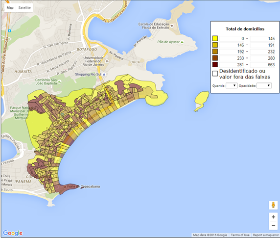
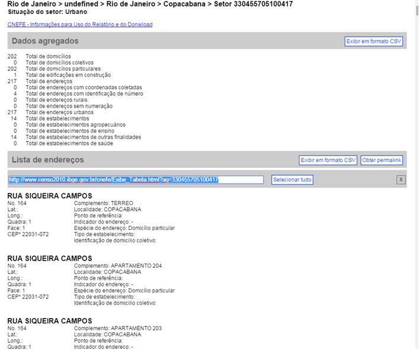
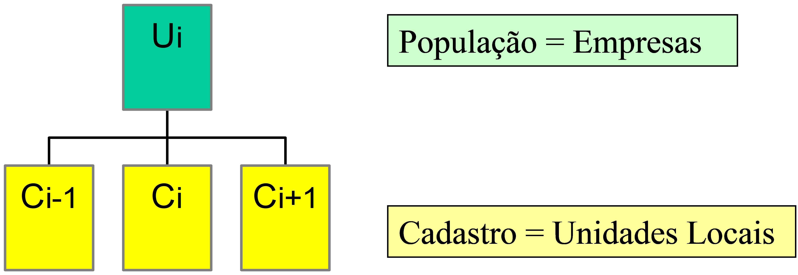
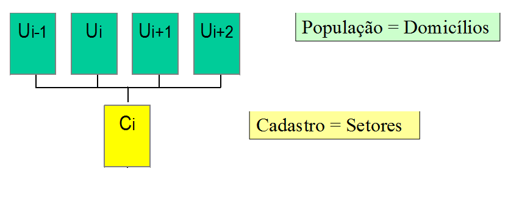

# Conceitos e Cadastros {#conceitos}

## Fontes de dados e tipos de pesquisas

Uma importante decisão em qualquer estudo ou projeto de pesquisa diz respeito ao levantamento das *fontes de dados* com potencial para atender às necessidades de informações de interesse. Um primeiro critério de classificação distingue as *fontes primárias*, cujos dados ainda não foram coletados, das *fontes secundárias*, cujos dados já foram coletados, possivelmente com outro(s) propósito(s), e estão disponíveis ou poderiam ser obtidos para uso imediato.  

No caso da *fonte primária*, a obtenção dos dados pode ser feita através de um *estudo de caso*, de uma *pesquisa* (*survey*) ou de um *experimento*. Para uma discussão mais extensa a esse respeito, ver, por exemplo, o excelente Capítulo 1 de @Wild2004. Neste livro, nosso foco será sobre fontes primárias do tipo *pesquisa*.

Por definição, *pesquisa* é uma *operação estatística* de coleta de informações sobre características de interesse de unidades de uma população, usando conceitos, métodos e procedimentos bem definidos, de modo que permita a compilação dessas informações numa forma resumida útil.

Dependendo da amplitude da coleta dos dados, há dois tipos de *pesquisa*: censos e pesquisas amostrais. Um *censo* é uma pesquisa baseada numa enumeração exaustiva das unidades componentes de uma população, realizada com o propósito de coletar informações sobre aspectos relevantes dessa população. Num *censo*, a intenção é ter dados referentes a todas as unidades da população. Alternativamente, quando as informações vão ser coletadas somente para um subconjunto selecionado das unidades da população, se diz então que a *pesquisa* é *por amostragem* ou *amostral*.

De acordo com @Thompson2012 tem-se a seguinte definição: "*Amostragem* consiste em selecionar parte de uma população para observar, de modo que seja possível estimar alguma coisa sobre toda a população.”

Neste livro, o principal tipo de pesquisa a ser considerado é a *Pesquisa Amostral*, que busca conhecer a população com base numa amostra. Mas algumas vezes fazemos referência a censos que poderiam, teoricamente, ser conduzidos nas mesmas populações das quais tratamos de tirar amostras para fazer inferência.

## Alguns conceitos fundamentais

Antes de avançar na apresentação da teoria relevante para *pesquisas por amostragem*, vamos introduzir vários conceitos relevantes e necessários para sustentar a discussão posterior.

*Unidade* é um único indivíduo, entidade ou objeto a ser medido ou observado na pesquisa.

*População* é o conjunto de todas as unidades para as quais se deseja fazer inferência.

*População alvo* é a parte da *População* para a qual se gostaria de obter informação. Seja um estudo sobre a fecundidade da *População* de uma determinada área geográfica. A *População Alvo* neste caso são apenas as mulheres em idade fértil.

*População de pesquisa* é a população a ser efetivamente coberta pela pesquisa. Algumas unidades ou grupos de unidades podem ser inacessíveis ou com custo-benefício que não se mostre interessante para a pesquisa. O Exemplo \@ref(exm:pnad) mostra as definições da *população alvo* e da *população de pesquisa* para a PNAD 2003, explicando suas diferenças.

Quando ocorrer diferença entre a *população alvo* e a *população de pesquisa*, o pesquisador responsável deve procurar medir essa diferença e tratar de revelar com clareza que partes da *população alvo* ficaram de fora da *população de pesquisa*, de modo a permitir que os usuários dos resultados da pesquisa possam avaliar a relevância e aderência dos resultados da pesquisa aos seus objetivos. A diferença entre a *população de pesquisa* e a *população alvo* dá origem aos chamados *erros de cobertura*. Pesquisas de boa qualidade adotam estratégias para eliminar ou minimizar tais erros.
 
*Amostra* é o conjunto de unidades que selecionamos da *população de pesquisa* para medir ou observar através da pesquisa.

*Amostra efetiva* é o conjunto de unidades que selecionamos da *população de pesquisa* e para as quais conseguimos de fato obter / medir / observar as variáveis de interesse através da pesquisa.

*Cadastro* é uma lista contendo a identificação das unidades que compõem a *população de pesquisa*, de onde a amostra é selecionada. Algumas pesquisas podem utilizar mais de um cadastro para selecionar a correspondente amostra. 

*Unidade de referência* ou *unidade de investigação* ou *unidade de observação* é uma unidade (componente da população) sobre a qual são obtidas as informações de interesse da pesquisa.

*Unidade informante* ou *unidade de informação* é uma unidade que fornece a informação de interesse sobre uma ou mais unidades de referência.

*Unidade de análise* é uma unidade à qual a análise e inferência são dirigidas.

*Unidade de amostragem* é uma unidade que pode ser selecionada para a amostra numa das etapas do processo de amostragem.

*Domínio de análise / interesse* é um conjunto de unidades de análise especificado como de interesse para fins de sumarização de dados, tabulação, inferência ou análise.

Para dar concretude aos vários conceitos aqui introduzidos, vamos considerar alguns exemplos de situações de pesquisa, buscando destacar, em cada uma delas, a aplicação de alguns dos conceitos apresentados.

**(#exm:pnadc)** Pesquisa Nacional por Amostra de Domicílios Contínua - PNAD Contínua 

A PNAD Contínua é hoje a principal pesquisa domiciliar realizada pelo IBGE para acompanhamento das condições de vida da população brasileira. Conforme o IBGE "O principal objetivo é produzir informações contínuas sobre a inserção da população no mercado de trabalho e de características tais como idade, sexo e nível de instrução, bem como permitir o estudo do desenvolvimento socioeconômico do País através da produção de dados anuais sobre outras formas de trabalho, trabalho infantil, migração, entre outros temas." Maiores informações sobre a pesquisa e seus métodos podem ser encontradas em @Freitas2014 e também no endereço: <https://www.ibge.gov.br/estatisticas-novoportal/sociais/populacao/9173-pesquisa-nacional-por-amostra-de-domicilios-continua-trimestral.html?edicao=20106&t=conceitos-e-metodos>.

A *população alvo* da pesquisa é "... constituída por todas as pessoas moradoras em domicílios particulares permanentes da área de abrangência da pesquisa." Segundo @Freitas2014, a área de abrangência geográfica da pesquisa é definida como "... todo o território nacional, dividido nos setores censitários da Base Operacional Geográfica de 2010, excluídas áreas com características especiais classificadas pelo IBGE como setores censitários de: aldeias indígenas, quartéis, bases militares, alojamentos, acampamentos, embarcações, penitenciárias, colônias penais, presídios, cadeias, asilos, orfanatos, conventos, hospitais e agrovilas de projetos de assentamentos rurais. ... também foram excluídos os setores censitários localizados em Terras Indígenas."

Não há na documentação da pesquisa indicação de que a *população de pesquisa* é distinta da *população alvo*. Nessa pesquisa, ficam de fora da *população alvo* moradores institucionalizados, isto é, moradores em instituições tais como hotéis e pensões, abrigos e asilos, instalações militares, hospitais, presídios, etc. Também ficam de fora moradores em domicílios improvisados (por exemplo, acampamentos ou áreas de ocupação precária) e pessoas em situação de rua, isto é, que não residem em domicílios de qualquer tipo ou em instituições. Fosse o conjunto da população residente no Brasil declarado como *população alvo*, a *população de pesquisa* da PNAD Contínua teria um déficit de cobertura devido à exclusão destas partes da população.

Nessa pesquisa, as pessoas são definidas como *unidades de referência*, *unidades informantes* e *unidades de análise*. Apesar disso, há duas perguntas no questionário da pesquisa que se referem à habitação (domicílio) - uma é a condição de ocupação do domicílio e, para os domicílios alugados, é levantado o valor do aluguel mensal pago. Logo seria correto identificar que os domicílios também são *unidades de referência*. Além disso, os domicílios são *unidades de amostragem* pois são objeto de sorteio na última etapa do plano amostral empregado na pesquisa e, também são *unidades de análise* pois são construídas variáveis em nível de domicílio que fazem parte da tabulação da pesquisa, tais como o rendimento domiciliar per capita. Seria também necessário definir uma *população de pesquisa* correspondente a esse conjunto de unidades adicionais, que poderia ser caracterizada como "o conjunto de todos os domicílios particulares permanentes da área de abrangência da pesquisa."

Os níveis de divulgação da pesquisa (*domínios de interesse*) incluem os seguintes grupos definidos em função da localização geográfica dos domicílios: Brasil (1); Grandes Regiões (5); Unidades da Federação (27); Regiões Metropolitanas que contêm Municípios das Capitais (20); Municípios das Capitais (27); e a Região Integrada de Desenvolvimento da Grande Teresina (1). Os números entre parênteses se referem à contagem de domínios definidos em cada uma das situações. Como se pode verificar, ao todo há 81 domínios de interesse definidos com base na localização geográfica que precisam ser contemplados na apresentação de resultados da PNAD Contínua. Vale também notar que há domínios de interesse sobrepostos, tais como as Capitais e as Regiões Metropolitanas que as contêm, para citar um exemplo.

A definição dos *domínios de interesse* foi uma das etapas cruciais para o planejamento da pesquisa, pois condicionou de forma importante a determinação do tamanho e também a alocação e a distribuição espacial da amostra, entre outros aspectos da metodologia. Conforme @IBGE2014, "o tamanho da amostra da PNAD Contínua foi calculado como o necessário para estimar o total de pessoas desocupadas de 14 anos ou mais de idade ... com um nível de precisão pré-determinado ... para cada uma das Unidades da Federação, por ciclo de acumulação trimestral". Ao final, a amostra total resultante deveria ser de cerca de 211.000 domicílios distribuídos em cerca de 15.100 setores censitários, a cada trimestre. Em cada trimestre, a amostra de setores é distribuída para coleta ao longo das 12 semanas, resultando na coleta de cerca de 1.258 setores por semana.

Verifica-se da descrição acima que a determinação dos tamanhos de amostra privilegiou os domínios de interesse definidos pelas *Unidades da Federação*, não tendo sido estabelecidos tamanhos de amostra capazes de dar precisão controlada para indicadores dos domínios que correspondem a áreas menores (as capitais ou as regiões metropolitanas, quando consideradas individualmente, por exemplo).

**(#exm:pof)** Pesquisa de Orçamentos Familiares - POF 2008/2009

Segundo o IBGE, a *população alvo* da pesquisa é composta por "Domicílios particulares permanentes ocupados e seus moradores, na área de abrangência da pesquisa nas situações urbana e rural. Foram excuídas as áreas definidas pelo IBGE como sendo quartéis, bases militares, alojamentos, acampamentos, embarcações, penitenciárias, colônias penais, presídios, cadeias, asilos, orfanatos, conventos e hospitais." Ver detalhes no link: <https://www.ibge.gov.br/estatisticas/sociais/rendimento-despesa-e-consumo/9050-pesquisa-de-orcamentos-familiares.html?=&t=conceitos-e-metodos>

Essa definição da *população alvo* estaria melhor caracterizada como *população de pesquisa*. Ao explicitar exclusões como as citadas, fica implícita a ideia de que a população alvo seria a população definida pela condição afirmativa "Domicílios particulares permanentes ocupados e seus moradores, na área de abrangência da pesquisa nas situações urbana e rural." As exclusões são feitas para explicitar que parte dessa população não será coberta pela pesquisa, por razões tipicamente operacionais e associadas aos custos e prazos.

Ainda segundo o IBGE, "A Pesquisa de Orçamentos Familiares 2008-2009 teve por objetivo fornecer informações sobre a composição dos orçamentos domésticos, a partir da investigação dos hábitos de consumo, da alocação de gastos e da distribuição dos rendimentos, segundo as características dos domicílios e das pessoas. A POF investigou, também, a autopercepção da qualidade de vida e as características do perfil nutricional da população brasileira."

O plano amostral empregado na pesquisa é descrito como "... conglomerado em dois estágios de seleção, com estratificação geográfica e estatística das unidades de primeiro estágio. Os setores correspondem às unidades do primeiro estágio de seleção e os domicílios particulares permanentes, às unidades do segundo estágio." Sendo assim, a pesquisa identificou duas *unidades de amostragem*: setores censitários (selecionados no primeiro estágio de amostragem), e domicílios (selecionados no segundo estágio de amostragem). Uma vez que um domicílio era selecionado para a amostra no segundo estágio, todos os moradores do mesmo deviam ser pesquisados. Note então que as pessoas moradoras não são *unidades de amostragem*, pois não participam de qualquer etapa de sorteio. 

Para fins do dimensionamento da amostra, "Foram fixados diferentes coeficientes de variação para estimar com a precisão desejada o total da renda dos responsáveis pelos domicílios, segundo os diferentes domínios de estimação."
"Para estimar o total nas Unidades da Federação da Região Norte, foram fixados coeficientes de variação que variaram de 10% a 15%."... Ver detalhes em:
<https://www.ibge.gov.br/estatisticas/sociais/rendimento-despesa-e-consumo/9050-pesquisa-de-orcamentos-familiares.html?=&t=notas-tecnicas>.

**(#exm:canlfs)** *Canadian Labour Force Survey* 

Conforme o *Statistics Canada*, agência responsável pela pesquisa: "The target population is the non-institutionalised population 15 years of age and over. The survey is conducted nationwide, in both the provinces and the territories. Excluded from the survey's coverage are: persons living on reserves and other Aboriginal settlements in the provinces; full-time members of the Canadian Armed Forces, the institutionalized population, and households in extremely remote areas with very low population density. These groups together represent an exclusion of less than 2% of the Canadian population aged 15 and over." Mais detalhes disponíveis em: <http://www23.statcan.gc.ca/imdb/p2SV.pl?Function=getSurvey&SDDS=3701&lang=en&db=imdb&adm=8&dis=2#a3>.

Nesse exemplo também aparece a ideia de uma *população alvo* que seria maior que a *população de pesquisa* de fato considerada na pesquisa e inclusive há uma estimativa do déficit de cobertura representado pelas exclusões indicadas: 2% da população canadense de 15 anos e mais. Também é interessante notar que a pesquisa foca apenas na população de 15 anos e mais.

A citação a esta pesquisa é útil também porque contém uma explicitação mais complexa dos objetivos que devem ser cumpridos em termos da qualidade com que certas estimativas deveriam ser produzidas. O motivo é que há conjuntos de *domínios de interesse* mais variados. A publicação @StatisticsCanada2020 explicita os seguintes objetivos quanto à precisão de estimativas para diferentes domínios:

"For monthly estimates of unemployment at the Canada level:

 + a CV lower than 2%.
 
For monthly estimates of unemployment at the provincial level:

 + a CV lower than 7% if the unemployment rate is higher than 5%, or a fixed confidence interval width for the unemployment estimates equivalent to that of an unemployment rate of 5% with a CV of 7%.
 
For three-month moving average estimates at the sub-provincial level:

 + a CV lower than 25% for the unemployment estimate at the Economic Region - ER level.
 + a CV lower than 15% for the unemployment rate estimate at the Employment Insurance Economic Regions - EIER level if the unemployment rate is higher than 5%, or a fixed confidence interval width equivalent to that of an unemployment rate of 5% with a CV of 15%."

Assim os objetivos especificados para guiar o dimensionamento da amostra incluíram não só níveis diferenciados de precisão para domínios de diferentes tamanhos, como também envolveram a consideração de períodos de acumulação de amostras (a pesquisa é repetida mensalmente) necessários para permitir obter estimativas para os domínios mais detalhados ou desagregados.

**(#exm:pnad)** Pesquisa Nacional por Amostra de Domicílios - PNAD 2003

*População alvo* - População residente no Brasil numa data de referência especificada.

*População de pesquisa* - População residente no Brasil numa data de referência especificada, excluídos os habitantes de setores rurais da região Norte (menos os do estado do Tocantins). 

Nessa pesquisa, conforme as definições acima, havia uma diferença entre a *população alvo* e a *população de pesquisa* consideradas nas PNADs anteriores ao ano de 2004. Nas pesquisas mais antigas, a população residente nos setores rurais da Região Norte (exceção do Tocantins) era excluída. O déficit de cobertura era modesto (estima-se que cerca de apenas 2% da população brasileira residia nos setores excluídos). Entretanto, analistas interessados em comparar resultados de PNADs anteriores a 2004 com os de PNADs mais recentes devem avaliar com cuidado se seria ou não necessário excluir das PNADs mais recentes os dados das partes que eram excluídas das PNADs mais antigas. 

Na série de pesquisas PNAD, encerrada em 2015, os *domínios de análise* (principais) eram as Unidades da Federação (27), as Regiões Metropolitanas (9) situadas em torno de capitais, o total do país (1), e os totais das áreas urbana e rural (2). Para detalhes, consulte, por exemplo, @IBGE2004.

**(#exm:ecinf)** População de pesquisa para a Pesquisa de Economia Informal Urbana - ECINF

Segundo @IBGE2003, trata-se de “Pesquisa por amostragem de domicílios situados em áreas urbanas, onde se busca identificar os trabalhadores por conta própria e empregadores com até 5 empregados que desenvolvam atividades não agrícolas.” Além disso, “... pertencem ao informal cada uma das unidades econômicas de propriedade de trabalhadores por conta própria e de empregadores com até 5 empregados, moradores de áreas urbanas, sejam elas a atividade principal de seus proprietários ou atividades secundárias.” Ver @IBGE2003, página 16.

Nesta pesquisa a caracterização da população de pesquisa é mais complexa, pois envolve aplicação de perguntas para identificar a situação ocupacional (só trabalhadores por conta própria e empregadores são elegíveis), bem como o porte e a atividade do estabelecimento onde o trabalho é exercido. Pesquisas assim costumam ter a missão de estimar também o tamanho da população de pesquisa.

**(#exm:popsex)** Definindo populações de pesquisa

Para melhor ilustrar o conceito da definição da *população de pesquisa*, a Tabela \@ref(tab:tabconc1) apresenta diversos exemplos de definição para populações de pesquisa com as seguintes especificações: as unidades a serem pesquisadas; características definidoras das unidades; localização espacial das unidades; e período de referência considerado. Esta separação de componentes da definição ajuda a identificar quais são os elementos essenciais que devem compor a definição de uma *população de pesquisa*.

<table>
<caption>(#tab:tabconc1)Exemplos de definições de populações de pesquisa</caption>
</table>
----------
Unidades                           Características  Definidoras                     Localização                         Período de referência
---------------------------------- ------------------------------------------------ ----------------------------------- ------------------------------------------- 
 Pessoas                            Habitando domicílios particulares permanentes	   Em Macaé	                           Durante a semana da pesquisa

 Empresas do comércio varejista	    Classificados como supermercados	               Em Recife                           Em 1996

 Pessoas	                          Maiores de 5 anos de idade	                     Que visitaram o Museu Nacional	     Entre 1 de junho e 30 de setembro de 1996

 Alunos	                            Do curso de mestrado da ENCE	                   No Rio de Janeiro	                 Primeiro semestre de 2002

 Estabelecimentos agropecuários	    Produtores de café	                             No Paraná	                         No ano de 1998
----------

Este conjunto de exemplos buscou ilustrar os conceitos mais importantes necessários à especificação de populações que serão objeto de pesquisas por amostragem. Como o alvo da inferência a partir da amostra é sempre uma população que não se vai conhecer por inteiro através da pesquisa, é importante que a definição da população de pesquisa seja a mais clara possível, para permitir análises corretas das estimativas que serão produzidas a partir da amostra. 

Uma rica fonte de informações sobre as definições conceituais de uma vasta coleção de pesquisas é a base de metadados das pesquisas do IBGE, acessível através de <https://metadados.ibge.gov.br/>. Outra boa fonte de exemplos de definições conceituais de pesquisas bem apresentadas são as pesquisas realizadas pelo NIC.br: <https://cetic.br/pesquisas/>.

## Abordagens alternativas para pesquisas por amostragem {#abordalt}

Pesquisas por amostragem dependem criticamente da qualidade da amostra selecionada para coleta ou obtenção dos dados. Para cumprir bem seu papel na pesquisa, são características desejáveis da amostra: 

a) Permitir generalizar estimativas dela derivadas para o conjunto da população de pesquisa.
b) 'Imparcialidade'.
c) Fornecer estimativas com o menor erro amostral possível, dados os recursos disponíveis (financeiros, tempo, pessoal e outros) e considerando as restrições operacionais.
d) Assegurar a capacidade de medir a precisão das estimativas dela provenientes.

A base para o processo de amostragem e de inferência que consideramos neste livro não é dada por um modelo que se utiliza para representar distribuições geradoras dos valores da população, mas sim por um *modelo de aleatorização* que decorre da imposição de um método imparcial (ao acaso, por sorteio) de escolha das unidades da amostra. Este modelo depende de três condições simples de satisfazer, em grande número de aplicações: 

1) Cada unidade da população de pesquisa deve ter uma probabilidade positiva, conhecida ou calculável, de ser incluída na amostra. 
2) A seleção da amostra deve ser feita por mecanismo aleatório que assegure a condição 1 e que permita conhecer ou calcular as probabilidades de inclusão de cada uma das unidades selecionadas.
3) As probabilidades de inclusão das unidades selecionadas devem ser levadas em consideração ao fazer inferência para os parâmetros da população, juntamente com outros aspectos da estrutura do método usado para seleção da amostra.

Procedimentos de amostragem que satisfazem as condições 1 a 3 formam a base da abordagem denominada de *Amostragem Probabilística*, que é a mais usada para a amostragem de populações finitas e para a elaboração de estatísticas oficiais e públicas ao redor do mundo. Essa abordagem fornece as condições para fazer inferências seguras para os parâmetros da população de pesquisa, com margem de erro conhecida e controlada. 

Até este ponto do livro, o termo *Amostragem* vinha sendo usado num sentido amplo. Deve ficar claro, porém, que é a *Amostragem Probabilística*, com suas regras objetivas e precisas para a escolha da amostra baseadas na teoria das probabilidades, que torna possível estimar os parâmetros desejados e avaliar a margem de erro dessas estimativas com base no *modelo de aleatorização*. Sob esse modelo, os valores de variáveis de interesse observados para unidades da população são considerados fixos embora desconhecidos, exceto para as unidades que forem selecionadas para a amostra. Toda a incerteza (fonte de variação estocástica) é introduzida pelo processo de seleção da amostra, usando um mecanismo probabilístico bem especificado. Fica entendido, então, que o termo *Amostragem* será doravante usado com o significado implícito de *Amostragem Probabilística*, exceto quando se explicitar outro significado num contexto ou exemplo específico.

Amostras que não satisfazem as condições 1 a 3 mencionadas acima podem não permitir generalizar a inferência para a população como um todo. Exemplos de métodos de amostragem que não satisfazem as condições indicadas incluem: amostras de conveniência, amostras de voluntários, amostras intencionais (de "corte"), amostras por quotas. Muitas pesquisas são realizadas usando amostras extraídas segundo métodos como esses, que não estão amparados pelos resultados teóricos que sustentam a *Amostragem Probabilística*. Uma dificuldade central para tais pesquisas é que não estão disponíveis métodos adequados para estimação pontual ou para a estimação da precisão quando as amostras não são probabilísticas. Algumas dessas pesquisas se valem dos métodos da *Amostragem Probabilística* para justificar a apresentação de 'margens de erro' de suas estimativas, mas essa prática não tem sustentação na teoria vigente, pois tais amostras não satisfazem as condições aqui explicitadas. Um exemplo conhecido é o das pesquisas de intenções de voto realizadas no Brasil a cada nova eleição que, frequentemente, não utilizam métodos de *Amostragem Probabilística*.

Há outras abordagens sólidas para fundamentar a realização de pesquisas por amostragem. Destaca-se, em particular, a abordagem dos *Modelos de Superpopulação* e da *Amostragem Baseada em Modelos*, muito bem descrita em livros tais como @Valliant2000 ou @Chambers2012. Nestes textos uma perspectiva clássica da inferência é adotada. Há também abordagens equivalentes que adotam uma perspectiva Bayesiana para a inferência. Nos dois casos, a inferência é governada não por um *mecanismo de aleatorização* introduzido pelo pesquisador para a extração da amostra, mas por modelos que especificam distribuições e estruturas de dependência para as observações da população (os chamados *Modelos de Superpopulação*). A liberdade do pesquisador quanto aos métodos para extração de amostras é maior, mas também é maior a dependência dos resultados da sua inferência quanto à validade e adequação das hipóteses feitas quanto aos *Modelos de Superpopulação* especificados.

Apesar da relevância do tema para um pesquisador interessado nos fundamentos da *Amostragem*, neste livro adotamos uma perspectiva mais restritiva: adotamos a abordagem da *Amostragem Probabilística* e não tratamos das suas alternativas mais bem fundamentadas acima mencionadas. Esta limitação tem explicação na origem de nossa prática profissional que é lastreada, em grande parte, pelas aplicações no IBGE e em suas pesquisas. Mundo afora, as instituições produtoras de estatísticas oficiais adotam esta abordagem como padrão e são ainda raras as instâncias em que pesquisas são planejadas e realizadas com suporte em outras abordagens como as citadas acima.

## Planejamento e execução de pesquisas por amostragem

Pesquisas por amostragem, para serem bem feitas, requerem cuidadoso planejamento, dedicada execução e rigorosa avaliação. Os métodos e processos de trabalho necessários para o sucesso da pesquisa já são bem conhecidos e descritos na literatura especializada - ver, por exemplo, o excelente livro de @Backstrom1981 ou o mais moderno de @Groves2009. 

Para uma visão de conjunto, o *Modelo Genérico do Processo de Produção Estatística - MGPPE* ou *Generic Statistical Business Process Model - GSBPM*, definido pela *United Nations Economic Commission for Europe* - UNECE, é um modelo que descreve de forma abrangente as atividades do processo de produção estatística. Este modelo tem sido utilizado como quadro de referência para nortear a modernização e a melhoria da qualidade da produção estatística em muitos institutos nacionais de estatística, entre eles o IBGE. Uma representação esquemática dessa abordagem é apresentada na Figura \@ref(fig:modpesq), adaptada do *Generic Statistical Business Process Model: GSBPM: version 5.0* (@GSBPM2013, página 9). 

(\#fig:modpesq)Modelo Genérico do Processo de Produção Estatística, adaptado

Conforme indicado neste modelo, o processo de produção de uma pesquisa por amostragem engloba atividades de supervisão e controle em todas as etapas. Como pode ser observado, a gestão da qualidade é transversal ao processo de produção, perpassando todas as etapas definidas no modelo. A seguir, é apresentada uma breve descrição de etapas fundamentais identificadas no processo de produção de uma pesquisa por amostragem.

### Especificação das necessidades da pesquisa 

Esta etapa envolve os subprocessos que definem os objetivos, os conceitos e a preparação de um plano de ação para a realização da pesquisa. 

Quando surge a necessidade de fazer uma pesquisa sobre um certo tema e há uma decisão de alocar recursos para a concretização da pesquisa, deve-se identificar e especificar com clareza e precisão os objetivos específicos da pesquisa. Tal especificação deve incluir a definição da população alvo e de pesquisa, que resultados a pesquisa deve fornecer ou que perguntas principais a pesquisa tem que ajudar a responder, em que prazos e com que recursos poderá ser efetivada. Juntamente com a definição dos recursos, deverá ser especificada a margem de erro tolerável nos principais resultados da pesquisa. O Exemplo \@ref(exm:pnadc) acima contém vários dos elementos aqui mencionados em relação à PNAD Contínua do IBGE.

O papel do estatístico ou amostrista nesta etapa é o de orientar a tomada de decisões quanto aos objetivos da pesquisa, esclarecendo os interessados quanto às limitações dos métodos estatísticos disponíveis, trabalhando para garantir a especificação de objetivos viáveis e compatíveis entre si e, também, coerentes com os recursos disponíveis. Cabe também ao estatístico estabelecer projetos ou contratos que garantam a disponibilidade dos recursos necessários para a realização bem sucedida da pesquisa, nos termos dos objetivos especificados.

Nesta etapa, o estatístico deve deixar claro que os resultados de uma pesquisa por amostragem só são aplicáveis à *população de pesquisa* quando a amostragem puder levar em conta todas as unidades pertencentes a essa população, e que quaisquer interesses quanto a resultados e margem de erro de estimativas da pesquisa, se não especificadas a priori, correm o risco de, mais tarde, não poderem ser contemplados. A explicitação de objetivos e recursos é uma das etapas cruciais que devem anteceder a elaboração do *plano amostral*, que vai ser objeto do trabalho do estatístico ou amostrista encarregado de planejar a pesquisa.

### Planejamento da pesquisa 

Esta etapa envolve a definição das variáveis, a obtenção e avaliação do cadastro, o planejamento da amostra, a metodologia de coleta, a definição do processamento e análise e o fluxo de produção da pesquisa. 
A questão do tipo de informação a ser coletada deve ser considerada num estágio inicial do planejamento da pesquisa. Somente os dados relevantes para os propósitos da pesquisa devem ser levantados. Se muitas perguntas forem propostas, os informantes perderão o interesse em respondê-las. Por outro lado, deve ser assegurado que nenhum item importante seja esquecido. 

Uma regra prática consiste em preparar os leiautes das tabelas que a pesquisa deverá produzir e só depois preparar os instrumentos de coleta dos dados (questionários). Isto ajuda a eliminar informações irrelevantes bem como garantir a inclusão de todos os itens importantes. Uma consideração importante é a possibilidade prática de obtenção da informação: os informantes escolhidos podem não ser capazes de responder a todas as perguntas formuladas. É interessante que essa possibilidade seja, pelo menos, minimizada na fase de planejamento da pesquisa. 

O *cadastro* ou *marco de referência* é o instrumento principal que será usado para localizar e identificar as unidades da população de pesquisa. É o cadastro que serve como base para a amostragem de unidades da população, para apoiar a coleta dos dados e também para auxiliar e controlar o processamento dos dados coletados pela pesquisa. Portanto, para poder acessar e cobrir a população de pesquisa definida, é necessário contar com listas das suas unidades, com listas de grupos de unidades populacionais, ou mesmo com mapas ou quaisquer outros materiais que sirvam de guia e permitam localizar e identificar as unidades da população a ser coberta.

Tais listas, mapas ou combinações destes que constituem o cadastro devem ser examinados para que seja assegurado que estejam livres de defeitos e, caso estejam desatualizados, deve-se considerar a possibilidade de proceder sua atualização. Em qualquer caso, é importante conhecer a origem do cadastro utilizado. A especificação e composição do cadastro são partes importantes das fases de planejamento do processo de produção de uma pesquisa e a atualidade e qualidade do cadastro têm grande influência nos resultados da pesquisa. Um bom *plano amostral* depende criticamente da qualidade do cadastro disponível e de seu conhecimento pelos responsáveis pela elaboração do plano.

Na etapa de planejamento da amostra, questões tais como a definição do tamanho da amostra, a maneira de selecionar as unidades que irão compor a amostra e a especificação de estimadores para os parâmetros populacionais de interesse, bem como para as respectivas margens de erro, são problemas técnicos que devem merecer a mais cuidadosa atenção. De fato, as ideias e técnicas para resolver estas questões formam o principal conteúdo deste livro. 

Os métodos a serem usados para a coleta das informações dependem de muitos fatores, e devem ser decididos tendo em mente os custos envolvidos, os tipos de unidades informantes, a precisão desejada das medidas e observações, bem como as condições particulares para execução da pesquisa em questão. Tais métodos são geralmente especificados durante a fase de planejamento da pesquisa, pois os métodos de coleta de dados influenciarão fortemente na elaboração do questionário da pesquisa e também podem afetar as opções disponíveis para o planejamento da amostra.

Há diferentes métodos de coleta, que podem ou não ser apoiados por computador e podem ou não necessitar da participação de entrevistadores ou observadores. Os principais métodos de coleta são: *Computer-Assisted Personal Interviewing* - CAPI,  *Computer-Assisted Self Interviewing* - CASI,  *Computer-Assisted Telephone Interviewing* - CATI, *Mail Assisted Self Interviewing* - MASI, *Paper-and-Pencil Interviewing* - PAPI e métodos de observação direta, em que não ocorre uma entrevista. Um exemplo de aplicação deste último método ocorre na coleta de dados de preços em pontos de venda, onde o responsável pela coleta de dados faz isso diretamente e não requer contato com uma unidade informante para a obtenção das informações de interesse. Na *Pesquisa Nacional de Saúde do Escolar* - PeNSE, realizada pelo IBGE, é utilizado o método CASI, onde cada um dos estudantes selecionados para a amostra recebe um *tablet* com o questionário e o responde sem interferência de um entrevistador. Em tempos mais recentes, também começaram a tornar-se disponíveis opções tais como *web-scraping*, que consiste na utilização de métodos automatizados de acesso a páginas da internet e de extração de dados ou informações dessas páginas, sem intervenção humana no processo.

### Elaboração dos instrumentos de coleta e dos sistemas  

Esta etapa envolve os subprocessos que definem os instrumentos de coleta, os sistemas de processamento, de disseminação e de produção da pesquisa. 

Os instrumentos de coleta (questionários e outros formulários) são parte importante de uma pesquisa por amostragem. Após decidir que dados devem ser coletados, a questão de como formular e apresentar as perguntas exige grande habilidade e prática. As perguntas devem ser claras, inambíguas e diretas. Perguntas vagas tendem a ter respostas vagas. A ordenação das perguntas deve ser estudada com cuidado. Um pré-teste dos instrumentos de coleta é sempre uma ajuda efetiva na preparação de um bom material.

Um protocolo de esforço de coleta deve ser especificado. Este protocolo deve incluir, por exemplo, instruções sobre o número mínimo de tentativas de contato que devem ser feitas para cada unidade da amostra selecionada, antes de dar uma unidade como perdida. Os procedimentos para lidar com recusas ou perdas de unidades da amostra selecionada também devem ser definidos previamente. Os motivos das perdas devem sempre ser registrados e o tratamento para as perdas e para a não resposta devem ser especificados.

Nesta etapa estão ainda incluídos a elaboração e os testes dos sistemas de apuração e de disseminação da pesquisa.

### Coleta dos dados 

Esta etapa inclui a implementação da pesquisa e a coleta dos dados, na qual se destacam as seguintes atividades: a preparação do cadastro, a seleção da amostra, o recrutamento e treinamento de equipes de coleta e supervisão de campo e a realização e o acompanhamento da coleta. 

Para os propósitos da seleção da amostra, a população deve poder ser subdividida no que se pode chamar de *unidades de amostragem*. É importante que tal divisão seja feita de forma que nenhuma unidade da população pertença a mais de uma unidade de amostragem ou fique de fora do conjunto de todas as unidades de amostragem. Um exemplo pode ser dado com as populações humanas, que podem ser vistas como formadas por agregações tais como setores censitários e domicílios ou por pessoas.

A seleção da amostra se dá de acordo com o plano (desenho) amostral especificado a partir do cadastro a ser usado e varia de uma amostra aleatória simples (ou sistemática), podendo ser estratificada, ao uso de amostragem com probabilidades proporcionais ao tamanho. Outras alternativas de planos amostrais contemplam a amostragem de conglomerados( agrupamentos de unidades populacionais) ou em múltiplos estágios, motivada pela necessidade de eficiência prática e econômica. Os principais métodos de amostragem são abordados nos capítulos subsequentes.

O processo de coleta de dados envolve as estratégias de contato e de monitoramento. O sucesso de qualquer pesquisa que adote o método de entrevista direta depende fortemente da capacidade dos entrevistadores de obter as respostas desejadas. Por isso, sua seleção e treinamento é muito importante. Instruções detalhadas devem ser fornecidas no treinamento sobre os métodos de mensuração e coleta. A observação por supervisores durante os trabalhos de entrevista é fundamental para manter os padrões e para estudar a obediência às regras e o tato dos entrevistadores ao fazer as entrevistas. É fundamental que todos os entrevistadores entendam os conceitos da pesquisa de maneira correta e uniforme.

### Processamento da pesquisa 

Esta etapa envolve os subprocessos que definem a integração/organização dos dados, classificação e codificação, crítica e tratamentos dos dados, derivação de variáveis, cálculo dos pesos ou fatores de expansão da amostra, cálculo dos resultados agregados (estimação das quantidades de interesse) e preparação dos arquivos de dados.

Ao final da fase de coleta de dados, as informações estão prontas para entrar na fase do processamento, quando os registros de dados são verificados, criticados e preparados para a análise. A maneira como as etapas a seguir são encadeadas e executadas depende de como a coleta de dados é organizada e do(s) modo(s) usado(s) para coletar as informações.

A codificação consiste em atribuir código numérico a respostas obtidas inicialmente em forma de texto, por meio de uma classificação predeterminada. É o caso, por exemplo, da ocupação da pessoa cuja descrição dada pelo informante é transformada num código que é estruturado por uma classificação. É mais fácil o informante responder fornecendo uma descrição registrada em texto (pergunta aberta) e, em seguida, interpretar essa resposta para alocação de um código ou classe com base na classificação adotada para o tema na pesquisa. Atualmente, a maior parte do trabalho de codificação é feita mediante a combinação de codificação automática, quando é possível associar um único código  às respostas textuais, com um sistema de codificação assistida por computador (acionado por operadores), para aqueles casos nos quais nenhum ou mais de um código foi encontrado pelo sistema automático para uma dada resposta. 

A crítica e tratamento dos dados coletados é uma etapa indispensável para permitir a eliminação de erros grosseiros na massa de dados coletados, os quais podem distorcer significativamente os resultados da pesquisa. É preciso ter formas de detectar inconsistências e definir o tratamento para a correção dos dados individuais. Um bom texto de referência sobre o tema é o livro de @DeWaal2011. 

Uma situação que quase sempre ocorre em pesquisas estatísticas é que os dados coletados são incompletos, em função da ocorrência de valores ausentes, seja por não resposta ou por terem sido descartados por inconsistências detectadas no processo de crítica. A obtenção de um conjunto de dados com registros completos antes da etapa de estimação se dá através de imputação, substituindo os valores ausentes ou descartados em registros incompletos por valores estimados com base nos dados disponíveis. Vários métodos estão disponíveis para imputar os valores ausentes em um conjunto de dados, dentre os quais podem ser citados: imputação dedutiva, imputação baseada em modelo (incluindo imputação por média, razão e regressão) e imputação por registro doador. Ver, a respeito, os excelentes livros de @DeWaal2011, @Little2002, @Rubin1987 e @Schafer1997.

Os métodos de estimação são usados para generalizar a informação recolhida de uma amostra para a população da qual foi extraída. A forma de selecionar a amostra determina como serão produzidas tais estimativas da população. De fato, o plano amostral determina os chamados *pesos amostrais* (fatores de expansão) *básicos* que serão usados para produzir estimativas. O *peso amostral* de uma unidade observada indica o número de unidades da população que são representadas por esta unidade da amostra. Um *peso amostral básico* é calculado como o inverso da probabilidade de incluir a unidade na amostra.

Os procedimentos de estimação das quantidades de interesse envolvem especificar: o cálculo dos pesos ou fatores de expansão; os estimadores para as quantidades de interesse; e o cálculo das medidas de precisão das estimativas.  

### Análise dos dados da pesquisa 

Esta etapa envolve a análise e interpretação dos dados. Usualmente, a apresentação de resultados é acompanhada de um exercício analítico inicial dos dados produzidos. A análise de dados é o processo pelo qual se dá ordem, estrutura, interpretação e significado aos dados. 

A análise permite diferentes abordagens e requer cuidado na interpretação, destacando-se que devem ser observadas as seguintes características: que seja apresentada de maneira simples, objetiva e compreensível, com significado claro; e que busque assegurar que as informações produzidas e analisadas sejam úteis para satisfazer aos objetivos enunciados da pesquisa. Uma boa forma de avaliar isso é verificar se os comentários da análise fornecem respostas às principais perguntas formuladas para justificar a realização da pesquisa.

A informação nunca é completamente útil se não for acompanhada de análise. Neste caso, o foco das atenções deve ser dado sobre as questões de coerência e interpretabilidade e em dar significado aos resultados em sua apresentação. A interpretabilidade das estatísticas também faz parte da noção de qualidade dos dados produzidos. Estatísticas definidas de maneira hermética ou complexa, cuja interpretação seja difícil, raramente conseguem estabelecer uma percepção de boa qualidade. 

Esta etapa também envolve a garantia de que os dados (e metadados) a serem disseminados não violem a confidencialidade de informações individualizadas, prevenindo a divulgação de informações que revelem direta ou indiretamente a identidade do informante (indivíduo, empresa ou instituição) com a associação de dados confidenciais. Devem ser usadas técnicas para limitação da revelação da identidade nas diversas formas de acesso aos dados. 

### Disseminação dos resultados da pesquisa 

Esta etapa envolve a produção dos resultados, a aplicação de métodos para assegurar a confidencialidade das informações individualizadas, a promoção dos produtos de disseminação e o atendimento aos usuários. Também envolve a preparação do material de divulgação - tabelas, textos, apresentações, publicações, arquivos de microdados e sua documentação (metadados), elaboração de releases e carga em sítios da internet. É das etapas menos discutidas do processo de pesquisa nos textos sobre métodos, mas isto não significa que é pouco importante. Na verdade, pode-se afirmar que sem adequada disseminação se perde muito do valor de uma pesquisa, já que os seus resultados ficarão subaproveitados.

### Arquivamento das informações da pesquisa 

Esta etapa envolve os subprocessos que definem as regras de arquivamento, o gerenciamento do repositório, a preservação dos dados, metadados e paradados e o plano de descarte de material. 

A busca e recuperação da informação apontam para a criação de metadados (que descreve os dados de forma estruturada) e a preservação das informações, permitindo que sejam acessíveis e com a  autenticidade resguardada. Neste sentido as regras de arquivamento e o gerenciamento do repositório têm um papel relevante na estruturação das informações de forma a localizá-las e torná-las de fácil recuperação e uso.   

### Avaliação da pesquisa  

Esta etapa encerra a execução de uma pesquisa e o produto final deve ser um conjunto de tabulações e relatórios de avaliação da pesquisa e de seus resultados. A avaliação e o monitoramento da qualidade das estimativas deve estar presente desde a concepção da pesquisa, a operacionalização dos processos, até a elaboração e disseminação do produto final, visando a compreensão das informações pelos usuários. 

Cabe registrar a ideia de que qualidade é 'multidimensional' e que há vários aspectos da produção dos dados que se deve considerar para avaliar a qualidade dos resultados. 

Começamos por distinguir dois níveis onde a discussão de qualidade é importante. Num primeiro nível, trata-se de qualidade do processo de produção das estatísticas, que está relacionada ao desempenho da organização produtora, à sua capacidade de adotar métodos e processos de trabalho eficientes e seguros, bem como de responder às demandas que lhe são apresentadas. Um segundo nível se refere à qualidade dos dados e resultados que fazem parte da produção das estatísticas. Neste momento, a qualidade que importa é a de cada resultado (produto) frente a um conjunto de usos previstos ou antecipados que o resultado terá. 

Cabe mencionar algumas das dimensões da qualidade associadas à qualidade do produto: relevância, exatidão e confiabilidade, oportunidade e pontualidade, facilidade de acesso e uso, interpretabilidade, coerência, dentre outras.    

A questão da relevância é colocada quando se avalia se o produto (resultado, informação estatística, estimativa, dado) satisfaz algum uso (ou conjunto de usos) declarado legítimo e importante pelos diversos atores interessados na produção das estatísticas. 

A questão da exatidão e confiabilidade coloca em evidência a qualidade das estatísticas de um ponto de vista mais familiar para quem faz e discute Estatística. Exatidão de uma estatística tem a ver com a ausência de viés (vício) na estimação da medida de interesse. Confiabilidade (precisão) tem a ver com o erro máximo provável cometido ao estimar a quantidade de interesse usando os dados disponíveis. 

A noção de qualidade como exatidão ou confiabilidade pode ser quantificada ou medida, para um produto ou resultado qualquer. Por esse motivo, muitas vezes este aspecto da qualidade costuma receber uma atenção maior na definição ou interpretação de qualidade que outros aspectos, o que nem sempre é justificável. Por exemplo, em pesquisas por amostragem bem planejadas e executadas, com amostras grandes, estimativas de muitos parâmetros obtidas para o conjunto da população estudada terão exatidão assegurada pelo planejamento e alta confiabilidade e, nesses casos, outras dimensões da qualidade talvez devessem assumir papel de maior destaque na análise.

Também é de grande importância a questão da oportunidade e pontualidade das informações. Estatísticas divulgadas com atraso geralmente suscitam desconfiança. Estatísticas referentes a períodos muito distantes no tempo podem ter utilidade limitada ou até levar a erro, pois a realidade a que se referiam pode já ter mudado substancialmente. Desta forma, é importante para as agências produtoras de estatísticas oficiais trabalhar com calendários de divulgação de resultados previamente divulgados e cumprir esses calendários, ao mesmo tempo em que se esforcem para disseminar os resultados de cada pesquisa o mais cedo possível após a coleta das informações. Estes dois objetivos devem ser perseguidos, entretanto, tendo como contraponto a ideia de que revelar de forma apressada estatísticas sujeitas a grandes revisões e correções posteriores não conduz a uma percepção de qualidade no trabalho da agência produtora de estatísticas.

Embora sem esquecer os demais aspectos de uma pesquisa por amostragem, enfatizamos neste livro as técnicas e métodos para: seleção da amostra; estimação dos parâmetros desejados; e avaliação dos erros de amostragem. O tratamento de erros ditos *não amostrais* não é objeto de atenção aqui. Aos leitores interessados, recomendamos a leitura do excelente livro de @Biemer2003.

## Cadastros 

O *Cadastro* ou *Sistema de Referência* da pesquisa é o conjunto de meios e instrumentos que fornece o acesso à população de pesquisa, constituindo uma lista identificadora das unidades que formam a população ou de grupos destas unidades e contendo informações auxiliares úteis para planejar e selecionar a amostra, monitorar a coleta de informações e empregar na estimação dos parâmetros.

A especificação do cadastro é uma das partes mais importantes da fase de planejamento do processo de produção da pesquisa. Nesta fase devem ser definidas as *unidades de referência* e o escopo da *população de pesquisa*, as *unidades informantes* e o processo que será usado para o acesso a estas unidades. O período de referência e as condições de seleção e atribuição das unidades do cadastro também precisam ser especificados. O cadastro deve conter os atributos das unidades demandadas pelas fases de amostragem, coleta e processamento dos dados.

Para a seleção da amostra, o cadastro fornece, além do contato com as unidades informantes, informações para estratificação da população. Além disso, ajuda a controlar e monitorar a fase de coleta de dados, a registrar e validar as respostas, a estimular a colaboração dos respondentes e a avaliar as eventuais não respostas. O cadastro também fornece informações para as fases de ponderação da amostra e análise dos resultados.

Assim, o cadastro utilizado afeta diretamente a definição da população de pesquisa, o método de coleta de dados, o método de seleção da amostra, a qualidade dos resultados e o custo da pesquisa. 

Há vários tipos de cadastros: *de unidades individuais*, constituído por uma lista física ou conceitual das unidades de referência individuais que formam a população; *de áreas*, com correspondentes mapas e descrições de áreas geográficas, das quais são selecionadas áreas para a amostra, cujas unidades de referência correspondentes são enumeradas e eventualmente amostradas para a pesquisa; *de conglomerados*, constituídos por listas de grupos de unidades individuais tais como escolas (agrupando alunos), hospitais (agrupando pacientes), etc.; e *cadastros múltiplos*, que combinam dois ou mais cadastros, de mesmo tipo ou não.

Uma pesquisa pode ter mais de um cadastro. Em pesquisas com seleção da amostra em múltiplos estágios, geralmente há um cadastro para cada estágio. Por exemplo, na Pesquisa Nacional por Amostra de Domicílios Contínua - PNAD Contínua, o cadastro do primeiro estágio é constituído pelos setores, enquanto o cadastro de segundo estágio é formado pelos domicílios enumerados em cada setor selecionado no primeiro estágio.  

Os registros administrativos também são fontes importantes, pois registram as unidades estatísticas e uma ampla gama de suas variáveis é usada para a criação do cadastro. Sua atualidade e qualidade têm grande influência na qualidade da pesquisa e nos produtos estatísticos.

Um bom cadastro deve conter informação suficiente sobre cada unidade da população para identificá-la com certeza (identificação) e para permitir localizá-la (localização); ser completo e sem redundâncias (duplicatas), preciso e atual (qualidade); estar disponível em um lugar central, com acesso fácil e rápido (disponibilidade); estar arranjado numa forma adequada à amostragem; e conter informação auxiliar sobre cada unidade que permita elaborar um planejamento amostral e estratégias de estimação eficientes. 

### Cadastros importantes no IBGE {#cadIBGE}

O *Cadastro Central de Empresas - CEMPRE* é formado por empresas e outras organizações e suas respectivas unidades locais formalmente constituídas, registradas no CNPJ - Cadastro Nacional da Pessoa Jurídica. Sua atualização ocorre anualmente, a partir das pesquisas econômicas anuais do IBGE, nas áreas de Construção, Indústria, Comércio e Serviços, e de registros administrativos tais como a Relação Anual de Informações Sociais - RAIS e o Cadastro Geral de Empregados e Desempregados - CAGED, ambos do Ministério do Trabalho.

As informações disponíveis referem-se às empresas e às unidades locais que no ano de referência estavam ativas no Cadastro. Estão disponíveis as variáveis identificadoras de empresas e de suas unidades locais, o pessoal ocupado total, o pessoal assalariado, os salários e outras remunerações pagas e o salário médio mensal, além da Classificação Nacional de Atividades Econômicas - CNAE e da localização de cada unidade.

A cada ano, é extraído do CEMPRE um *Cadastro Básico de Seleção* usado na seleção das amostras das pesquisas econômicas anuais, tais como a Pesquisa Anual da Indústria da Construção - PAIC, a Pesquisa Industrial Anual - PIA, a Pesquisa Anual do Comércio - PAC e a Pesquisa Anual de Serviços - PAS. Além destas pesquisas econômicas anuais, o CEMPRE também serve de base para a extração de amostras das pesquisas conjunturais do IBGE, tais como a Pesquisa Industrial Mensal de Produção Física - PIM-PF, a Pesquisa Mensal do Comércio - PMC e a Pesquisa Mensal dos Serviços - PMS. 

Algumas outras pesquisas feitas por outras organizações também se valem do CEMPRE para seleção de suas amostras. Este é o caso da Pesquisa TIC-Empresas do NIC.br - ver detalhes em <https://cetic.br/pesquisa/empresas/publicacoes>.

A *Base Operacional Geográfica - BOG* é um cadastro de áreas que tem como suas menores unidades os  setores  censitários e compreende uma hierarquia de unidades geoestatísticas, aqui listadas da menor para a maior: setores censitários, subdistritos, distritos, municípios, unidades da federação, macrorregiões. Foi construída e é mantida para dar organização e sustentação espacial às atividades de planejamento, coleta, apuração e divulgação dos resultados do Censo Demográfico e do Censo Agropecuário, bem como para o planejamento e execução das pesquisas domiciliares (Pesquisa Nacional por Amostra de Domicílios Contínua, Pesquisa de Orçamentos Familiares, etc.) - ver @IBGE2016. 

O *setor censitário* é a unidade territorial de controle cadastral da coleta, constituída por áreas  contíguas, respeitando os limites da divisão político-administrativa, do quadro urbano e rural legal e de outras estruturas territoriais de interesse, além dos parâmetros de dimensão mais adequados à operação de coleta do Censo Demográfico. Ver, a respeito, @IBGE2016.

A codificação (numeração única de cada setor censitário), a definição do tamanho, a classificação segundo a situação (urbana ou rural) e o tipo (comum ou não especial, aglomerado subnormal, quartel ou base militar, etc.), a genealogia e a descrição dos limites dos setores estão registrados na BOG, que através destas informações fornece os instrumentos essenciais para o controle das operações de coleta do Censo e de pesquisas domiciliares. Para detalhes sobre os tipos de setores censitários, ver @IBGE2019, página 169.

A malha digital de setores censitários do Brasil é um conjunto de arquivos contendo os polígonos definidores de estados, municípios, distritos, subdistritos, bairros e setores censitários. Está disponível juntamente com os dados agregados do Censo Demográfico 2010, por setor censitário.

A Figura \@ref(fig:cadset) apresenta uma ilustração da subdivisão em setores censitários do IBGE para Copacabana no município do Rio de Janeiro, conforme a malha setorial vigente para o Censo Demográfico 2010.

(\#fig:cadset)Cadastro de setores do IBGE - Copacabana - RJ

O *Cadastro Nacional de Endereços para Fins Estatísticos - CNEFE* é uma lista com cerca de 78 milhões de endereços urbanos e rurais, associados às unidades (domicílios e unidades não residenciais) registradas pelos recenseadores durante a coleta das informações do Censo Demográfico 2010, e aos setores censitários. Foi compilado para apoiar a realização das pesquisas domiciliares do IBGE.

As Figuras \@ref(fig:cnefe1) e \@ref(fig:cnefe2) ilustram informações disponíveis no CNEFE para um determinado setor censitário. Ver detalhes no link <https://censo2010.ibge.gov.br/cnefe/Exibe_Tabela.html?ag=330455705100417>. 

(\#fig:cnefe1)Informações do CNEFE para um setor de Copacabana - RJ

(\#fig:cnefe2)Ilustração de dados do CNEFE

A seguir, os cadastros associados à BOG do IBGE que estão disponíveis para uso público são listados  juntamente com seus endereços de acesso via internet.

**Arquivo Agregado de Setores (Censo 2010)**

<https://www.ibge.gov.br/estatisticas-novoportal/downloads-estatisticas.html> »» Censos »» Censo_Demográfico_2010 »» Resultados_do_Universo »»  Agregados_por_Setores_Censitarios

**Malha Digital de Setores Censitários (Censo 2010)**

<https://www.ibge.gov.br/estatisticas-novoportal/downloads-estatisticas.html> »» Geociências »» Organização_do_território malhas_territoriais »» malhas_de_setores_censitarios_divisoes_intramunicipais »» censo_2010 »» setores_censitarios_shp

**Cadastro Nacional de Endereços para Fins Estatísticos - CNEFE**

<https://www.ibge.gov.br/estatisticas-novoportal/downloads-estatisticas.html> »» Censos  »» Censo_Demográfico_2010 »» Cadastro_Nacional_de_Enderecos_Fins_Estatisticos

### Defeitos de cadastros 

Para determinadas populações, a lista de elementos pode estar disponível, mas pode apresentar alguns defeitos: falta de unidades (omissão ou falha de cobertura), presença de unidades estranhas à população alvo (unidades inelegíveis ou fora do escopo da pesquisa), duplicação de unidades, informações desatualizadas, informações faltando ou incorretas (por exemplo, unidades com os dados de contato incorreto ou incompleto).

As inadequações do cadastro podem levar a problemas operacionais na coleta e no processamento dos dados da pesquisa, aumento dos erros alheios à amostragem e interpretações enganosas dos resultados da pesquisa.

Diante das inadequações do cadastro, dentre as soluções possíveis destacam-se: o descarte do cadastro e a criação ou uso de outro cadastro; o ajuste/correção do cadastro mediante atualização ou ligação com outros; o uso do cadastro existente e adoção de precauções contra seus defeitos; e uso de cadastros múltiplos. Um tratamento detalhado das providências disponíveis está fora do escopo deste livro, mas como já indicado, recomendamos dar grande atenção à questão da seleção e preparação do cadastro que vai apoiar as atividades de pesquisa por amostragem, dado seu papel central na obtenção de resultados de boa qualidade.

### Regras de associação das unidades da população à unidade cadastral 

O cadastro deve ser estruturado de tal forma que seja possível determinar como as unidades listadas no cadastro estão associadas às *unidades de referência* na população de pesquisa a ser amostrada. Na sequência, apresentamos as várias formas de associação entre *unidades do cadastro* e *unidades de referência* da população de pesquisa. Cada uma das situações leva à adoção de métodos de amostragem que considerem as diferentes formas de associação entre cadastro e população.

**Regra de associação um para um**

Nesta situação cada unidade $C_i$ do cadastro corresponde a uma e somente uma unidade de referência $U_i$ da população de pesquisa, conforme ilustração na Figura \@ref(fig:umparaum). 

(\#fig:umparaum)Ilustração da regra de associação um para um

Neste caso, a seleção da amostra de unidades elementares pode ser feita diretamente do cadastro. Os planos amostrais podem selecionar diretamente *unidades de referência* elementares e não há conglomeração. Portanto, a *unidade de referência* é também a *unidade de amostragem*. A seleção da amostra fica bem simplificada, porém a manutenção do cadastro costuma ser mais cara quando comparada a outros tipos de situações e a cobertura é mais díficil de ser mantida. 

**(#exm:cad11)** Cadastro com regra de associação um para um

Um exemplo clássico de cadastro com esse tipo de associação é o *Cadastro Básico de Seleção* extraído do CEMPRE e usado pelo IBGE para seleção das amostras de suas pesquisas econômicas estruturais (PAIC, PIA, PAC e PAS). Nesse tipo de cadastro, a unidade elementar é uma empresa, que corresponde também à unidade de referência das pesquisas citadas. Os planos amostrais adotados nestas pesquisas tomam a empresa como unidade de amostragem. 

**Regra de associação um para vários**

Nesta situação, cada unidade de referência da população de pesquisa corresponde a uma ou mais unidades do cadastro, conforme ilustração na Figura \@ref(fig:umparavar). Consideramos aqui apenas os casos em que cada unidade elementar no cadastro tenha vínculo com no máximo uma unidade elementar na população.

(\#fig:umparavar)Ilustração da regra de associação um para vários

Neste caso, a *unidade de amostragem* é a unidade elementar do cadastro e a seleção da amostra é feita diretamente do cadastro. As probabilidades de seleção das unidades de referência da população de pesquisa variam com o número de unidades elementares correspondentes no cadastro. A manutenção do cadastro e dos vínculos é geralmente trabalhosa e o conhecimento exaustivo e preciso dos vínculos é essencial. Note que também não se aplica aqui a ideia de amostragem conglomerada, já que as unidades de referência da população são incluídas (ou não) na amostra uma a uma, dependendo do sorteio de unidades do cadastro com que estão vinculadas.

**(#exm:cad1v)** Cadastro com regra de associação um para vários

Outro bom exemplo deste tipo de situação seria um cadastro de veículos (automóveis) particulares de pessoas físicas, onde estão registrados os veículos e seus proprietários podem ser identificados através do Cadastro de Pessoas Físicas - CPF. Imagine que há interesse em selecionar uma amostra de proprietários de veículos, que deve ser extraída usando o cadastro de veículos. Estamos diante de uma situação em que a cada proprietário de veículo que pertence à população de pesquisa estão associados um ou mais veículos. Então fica configurada a situação em que o veículo é a unidade de amostragem, que não coincide com a unidade de referência de interesse da pesquisa, que é o proprietário de veículo. Caso seja feita amostragem simples (com igual probabilidade) dos veículos, os proprietários terão probabilidades de seleção para a amostra proporcionais ao número de veículos que tenham registrados no cadastro de veículos.

**Regra de associação de vários para um**

Nesta situação, uma ou mais unidades de referência da população de pesquisa são vinculadas a cada unidade elementar do cadastro, conforme ilustrações nas Figuras \@ref(fig:varparaum1) e \@ref(fig:varparaum2). A unidade de amostragem  é um *conglomerado* de unidades da população. Neste caso, se adotam os planos amostrais conglomerados, onde a seleção é de uma amostra de unidades conglomeradas do cadastro. Os vínculos são geralmente conhecidos só para os conglomerados da amostra. O cadastro é mais barato de construir e manter, porém a amostragem é na maioria das vezes menos eficiente do que se poderia fazer tendo cadastros do tipo um para um.

(\#fig:varparaum1)Ilustração da regra de associação vários para um

(\#fig:varparaum2)Ilustração da regra de associação vários para um

**Regras de Associação - Hierarquia com vários níveis**

Neste caso se adotam os planos de amostragem conglomerada em múltiplos estágios (ou etapas). Envolve uma hierarquia de diferentes tipos de unidades (unidades primárias de amostragem, unidades secundárias, terciárias, etc.). É necessário um bom cadastro em cada estágio para a seleção das unidades do estágio seguinte. Os cadastros para as unidades dos primeiros estágios são geralmente mais estáveis e fáceis de construir e manter que aqueles para os estágios subsequentes. A Figura \@ref(fig:hierarquia) apresenta uma ilustração dessa situação.

(\#fig:hierarquia)Ilustração de regras de associação - hierarquia para vários níveis

## Exercícios {#exerc2}

**(#exr:execonc1)** Toda pesquisa deve procurar registrar com clareza seus conceitos básicos. Dessa clareza depende a capacidade dos usuários de interpretar os resultados e avaliar sua qualidade e adequação. Para perceber a importância dessa questão, nada melhor do que praticar e se colocar “na pele” de um usuário que procura identificar, na documentação disponível de uma dada pesquisa, seus principais conceitos e definições.    
Visite a página do CETIC.br na internet (<https://cetic.br/>) e identifique a publicação de resultados da Pesquisa TIC Domicílios 2017. Nesta publicação, localize a seção do ‘relatório metodológico’ e usando somente essa documentação, procure responder às perguntas abaixo.

a)	Qual é o *objetivo* da pesquisa?     
b)	Qual é a *população alvo*? Qual é a *população de pesquisa*?    
c)	Qual é o principal *cadastro* utilizado?    
d)	Quais são as *unidades de referência*?    
e)	Quais são as *unidades informantes*?    
f)	Quais são as *unidades de análise*?    
g)	Quais são as *unidades de amostragem*?    
h)	Qual é o *tipo* de pesquisa? *Censo*, *amostra*, compilação de *registro administrativo*?     
i)	Como a pesquisa se desenvolve no *tempo*? Uma só ocasião? Pesquisa Repetida? Se a pesquisa é repetida, qual é a periodicidade com que isso ocorre?    
j)	Como são *coletados* os dados? Entrevistas, correio, observação, etc.?    
k)	Para que tipos de *quantidades resumo* são publicadas estimativas? Totais, médias, proporções, razões, taxas, índices? Exemplifique alguns que encontrar.    
l)	Foi possível responder todas as perguntas acima só com a documentação da pesquisa disponível na internet? Comente sobre suas dificuldades. O que ficou faltando?    

**(#exr:execonc2)** Um pesquisador está planejando a realização de uma pesquisa por amostragem junto a estudantes do ensino fundamental regular - EFR matriculados em *escolas públicas municipais* no município do Rio de Janeiro. A coleta dos dados estava prevista para ser realizada entre *setembro e outubro de 2019*. Ele começou a investigar opções de cadastros que poderia utilizar para realizar a seleção da amostra. De imediato, localizou os seguintes cadastros:

a)	*Cadastro* derivado do *Censo Escolar do MEC*, referente ao ano calendário *2018*, que pode ser acessado no endereço: <http://portal.inep.gov.br/web/guest/microdados>.    
b) *Lista* de todas as *escolas públicas municipais* que oferecem turmas do ensino fundamental regular fornecida pela Prefeitura municipal, atualizada até Agosto de 2019, contendo nome e endereço da escola, nome e dados de contato do diretor da escola, e séries que a escola oferece no ano de 2019.

Tratar das seguintes questões:

1)	Para cada um dos cadastros disponíveis para o pesquisador, indique o tipo de associação entre as unidades do cadastro e as unidades de referência da pesquisa (estudantes do ensino fundamental regular matriculados em escolas públicas municipais em setembro de 2019).     
2)	Discuta as vantagens e desvantagens de utilizar cada um dos cadastros disponíveis para o pesquisador.     
3)	Caso o pesquisador opte pelo uso do cadastro listado no item a, que cuidados deveria adotar para mitigar ou eliminar possíveis erros de cobertura?    
4)	Caso o pesquisador opte pelo uso do cadastro listado no item b, que procedimento(s) precisa adotar para assegurar a cobertura da população de interesse?    
5)	Se você fosse o pesquisador, como usaria um ou mais dos cadastros citados?
