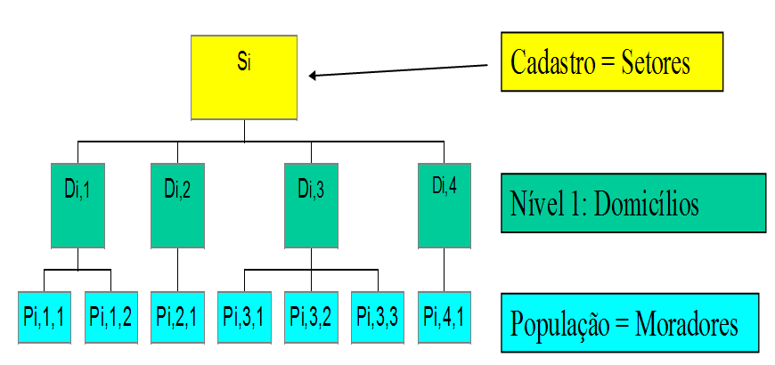
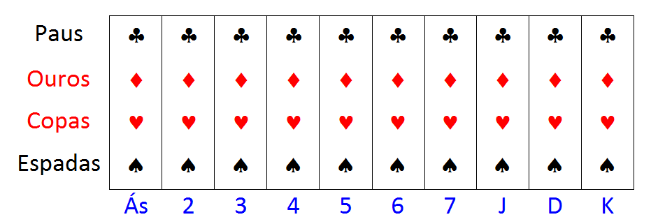
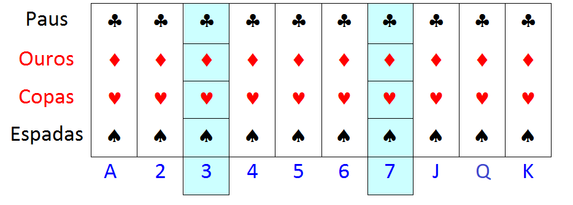
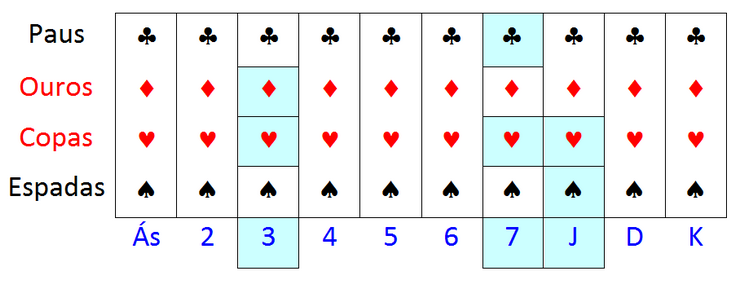

# Amostragem Conglomerada {#cong}

## Conceituação básica 

Todos os métodos de amostragem já apresentados nos Capítulos \@ref(aas) até \@ref(estrat) têm alguns aspectos em comum: requerem cadastros de unidades elementares para permitir selecionar a amostra; a seleção da amostra é feita num único estágio ou etapa; as unidades de referência são iguais às unidades de amostragem; e o tamanho total da população é conhecido com base no cadastro.

Se tal cadastro não existir ou não puder ser construído, ou se o custo de construí-lo ou atualizá-lo for muito elevado, a solução pode ser através do uso de *amostragem conglomerada*, onde grupos de unidades chamados de *conglomerados* são selecionados com probabilidades conhecidas, utilizando um dos métodos de seleção anteriormente apresentados. Este tipo de plano amostral é requerido também sempre que a regra de associação do cadastro for dos tipos vários para um ou hierarquia com vários níveis (ver Capítulo \@ref(conceitos)).

A *amostragem conglomerada* consiste num esquema de amostragem em estágios, sendo que em cada estágio a unidade amostral é formada por grupos ou subconjuntos (*conglomerados*) de unidades populacionais. A formação de conglomerados pode ser:

 - Natural (exemplos: turma de alunos, edifício de apartamentos, quarteirão, município).
 - Planejada, quando os grupos são definidos pelo estatístico de acordo com o objetivo da pesquisa (exemplos: grupos de seis alunos que sentam na mesma fileira numa sala de aula, grupos de dez peças industriais do mesmo tipo saindo de uma linha de produção, grupos de cinco endereços residenciais no mesmo setor censitário, etc.).
 
A unidade populacional depende da análise que está sendo feita e é determinada pelo propósito da pesquisa e não pelo plano amostral. Pode acontecer de mais de uma unidade populacional estar envolvida na pesquisa quando, por exemplo, características de domicílios e de pessoas são investigadas no mesmo levantamento. 

Não há uma definição fixa para grupos que podem ou não ser considerados como conglomerados. Por exemplo, turmas de alunos tanto podem ser unidades populacionais de referência (se estivermos interessados em investigar o número de alunos por turma como variável resposta), como podem ser conglomerados de alunos (se estivermos interessados em investigar o aproveitamento individual dos alunos). Para exemplificar, a Tabela \@ref(tab:tabcong1) apresenta algumas ilustrações de possíveis conglomerados associados com a população, a variável de interesse e a unidade de referência para análise. 

<table>
<caption>(#tab:tabcong1)Exemplos de possíveis conglomerados</caption>
</table>
---------- 
População                         Variáveis de interesse         Unidade de Referência  Conglomerados
--------------------------------- ------------------------------ ---------------------- --------------
Turmas de alunos	                Alunos por turma	             Turma	                Escolas

Estudantes de escolas de 2º grau	Aproveitamento dos estudantes	 Estudante	            Turmas

Visitantes de parques nacionais	  Facilidades do parque	         Visitante             	Veículos de visitantes

Passageiros de avião	            Propósito da viagem	           Passageiro            	Lotação do voo

Domicílios	                      Características de domicílio	 Domicílio	            Setores censitários

Moradores em favelas do Rio	      Características de pessoas	   Morador                Domicílios de favelas do Rio
----------

Conforme ilustrado na Figura \@ref(fig:hierar1), temos regras de associação com a hieraquia com vários níveis (vários para um), considerando o cadastro de setores, os domicílios como nível 1 e a população de moradores.  

(\#fig:hierar1)Ilustração da hierarquia com vários níveis (vários para um)

Cabe registrar que os vários métodos de amostragem discutidos anteriormente podem ser aplicados para implementar a amostragem conglomerada, onde os conglomerados passam a ser as unidades amostrais a serem objeto de seleção pelos diferentes métodos. 

 
## Amostragem de áreas

O cadastro ou sistema de referência da pesquisa é a fonte que serve de guia e permite identificar a população a ser coberta para a seleção de amostras. Os métodos probabilísticos propostos para seleção de amostras pressupõem a existência de uma lista completa das unidades da população a ser pesquisada. Porém, como já foi dito, tais listas podem não estar disponíveis, ou estar desatualizadas, ou o custo de preparar uma lista atualizada pode ser proibitivo. Além disso, uma amostra selecionada de uma população dispersa geograficamente provavelmente será também muito dispersa.

Para reduzir custos, é muito frequente o uso de amostragem conglomerada, onde os conglomerados são áreas geográficas com limites naturais ou artificiais bem definidos. Neste caso, a amostra resultante pode ser concentrada dentro de um número limitado de áreas geográficas. 

A utilização de amostragem de áreas se dá quando não existe um cadastro de boa qualidade disponível e/ou quando a população for muito dispersa e o fator custo de deslocamento for preponderante. Neste caso, a necessidade de uma lista atualizada das unidades para as quais se requer a informação é restrita às áreas (*conglomerados*) que forem selecionadas para a amostra. Portanto, a grande vantagem da amostragem conglomerada é a sua conveniência operacional vinculada a possíveis reduções de custo. 

Num levantamento de uma população humana, por exemplo, é operacionalmente mais conveniente pesquisar todas as pessoas numa amostra de domicílios do que selecionar o mesmo número de pessoas espalhadas por toda a população. Também é mais conveniente pesquisar todos os domicílios numa amostra de áreas (por exemplo, setores censitários) do que selecionar aleatoriamente uma amostra do mesmo número de domicílios numa lista de todos os domicílios da região de interesse da pesquisa. Por um lado, tal lista nem sempre está disponível e, por outro, seu preparo tornaria a pesquisa bem mais cara. 

Suponha que uma AAS de $n=400$ domicílios deva ser selecionada de uma população de $N=10.000$ domicílios de uma cidade. Como não dispomos de uma lista atualizada com todos os domicílios, optamos por uma amostra de domicílios localizados dentro de uma amostra de quarteirões. Isto pode ser feito dividindo a área da cidade em quarteirões e selecionando 1/25 dos quarteirões. A probabilidade de selecionar um domicílio na cidade é a probabilidade de selecionar um quarteirão, ou seja, $1/25 = 400/10.000$. Neste caso, o tamanho da amostra de domicílios será uma variável aleatória que depende dos quarteirões selecionados para a amostra, sendo o seu valor esperado igual ao $n$ desejado.

Nesse exemplo, as unidades amostrais são os quarteirões da cidade, que poderiam ser listados para formar o cadastro de seleção. A seleção da amostra de quarteirões determina a seleção dos domicílios que estão localizados nos quarteirões. Se todos os domicílios de cada quarteirão são pesquisados, então a amostra é conglomerada em um estágio.

Mesmo que a lista de todos os domicílios esteja disponível, reduções do custo podem ser observadas na amostra conglomerada, pois a localização e identificação dos 400 domicílios espalhados aumenta o custo de transporte, bem como demanda maior tempo para a coleta, em comparação com a localização dos quarteirões selecionados e visita a todos os domicílios destes quarteirões. Por outro lado, para um dado tamanho de amostra, a amostragem direta dos domicílios dá resultados mais precisos do que a amostragem conglomerada de domicílios. 

Se comparamos uma amostra conglomerada com uma amostra de unidades elementares do mesmo número de unidades elementares, em geral, na amostra conglomerada espera-se que:

- O custo por unidade elementar seja mais baixo, devido ao mais baixo custo de listagem, de localização das unidades ou de ambos.     
- A variância de estimativas amostrais seja maior, dependendo do grau de homogeneidade das unidades agrupadas em conglomerados. 

Então verifica-se que a amostragem conglomerada impõe vantagens (menor custo) e desvantagens (menor precisão). Levando em conta os aspectos operacionais e a redução de custos que a amostragem conglomerada proporciona, em muitas situações práticas, a perda de eficiência amostral é mais que compensada por essa vantagem. Além disso, a redução de custos proporcionada pode permitir selecionar amostras maiores, compensando assim a perda de precisão em relação a amostras não conglomeradas. 

Uma aplicação importante de amostragem (conglomerada) de áreas se dá nas pesquisas domiciliares do IBGE, através da utilização da *Base Operacional Geográfica - BOG* que tem como suas menores áreas os setores censitários, conforme descrito na Seção \@ref(cadIBGE).   

## Definições básicas e notação

A população de unidades $U$ é particionada em $M$ grupos *mutuamente exclusivos e exaustivos*, chamados *conglomerados*, denotados $C_1, ..., C_i, ..., C_M$, de modo que: 

$$
U = C_1\cup C_2\cup \dots \cup C_M = \displaystyle \bigcup_{i=1}^{M}C_i \quad\text{  e }\quad C_i\cap C_k=\phi, \,\,i\ne k
$$

Aqui é necessário indexar as unidades populacionais dentro de cada conglomerado e, portanto, as unidades passam a ser identificadas por dois índices $i,j$, onde $i$ designa o conglomerado e $j$ designa o rótulo da unidade dentro do conglomerado. Então $C_i = \{ (i,1), (i,2), \dots, (i,j), \dots, (i,N_i) \}$, para $i=1,2,...,M$, onde $N_i$ é o tamanho do conglomerado $C_i$. Então $N = N_1 + N_2 + \dots + N_M$ é o tamanho total da população. 

Selecione uma amostra $a=\{i_1,\dots,i_m\}$ de tamanho $m\,\, (m>0)$, entre os rótulos de $C = \{1, ..., M\}$ para selecionar os conglomerados, segundo um plano amostral $p(a)$.

Observe que, de um ponto de vista matemático, a definição da partição da população em conglomerados apresentada é muito semelhante à definição da partição em estratos, vista no Capítulo \@ref(estrat). A diferença fundamental entre amostragem *estratificada* e *conglomerada* é que, na primeira, selecionamos diretamente amostras de unidades elementares dentro de cada um dos $H$ grupos (estratos) formados, enquanto que, na segunda, selecionamos uma amostra de grupos (conglomerados) entre os $M$ grupos formados, tratando então os grupos como unidades de amostragem, e investigamos unidades elementares, apenas, dentro dos conglomerados selecionados. 

Outra diferença importante se dá no processo da formação dos grupos. Para alcançar eficiência, quando estamos definindo grupos para servirem como estratos, o ideal é que estes sejam internamente homogêneos, cada um formado por unidades parecidas entre si. Já quando vamos usar os grupos como unidades de amostragem (conglomerados), então idealmente devem ser internamente heterogêneos, cada um formado por unidades que representem o melhor possível a diversidade da população. Em termos de variabilidade, uma boa estratificação é aquela onde a variância *dentro* dos estratos é pequena e a variância *entre* os estratos é grande, enquanto que na amostragem conglomerada busca-se o contrário, com a variância *dentro* dos conglomerados *grande* e a variância *entre* eles pequena. 

**(#exm:exmcon0)** Os setores censitários da Base Operacional Geográfica do IBGE

Um exemplo que ilustra bem a diferenciação do papel que estruturas de grupos de unidades populacionais podem ter no planejamento amostral é dado pelos setores censitários da Base Operacional Geográfica do IBGE. Estes setores são formados por áreas delimitadas no mapa do território brasileiro e podem ser vistos como grupos de domicílios e seus moradores. Na maioria das pesquisas amostrais do IBGE, tais como a PNAD Contínua - ver, por exemplo, @Freitas2014 - ou a POF - ver mais informações no link -  <https://www.ibge.gov.br/estatisticas/sociais/rendimento-despesa-e-consumo/9050-pesquisa-de-orcamentos-familiares.html?=&t=conceitos-e-metodos> - os setores censitários são usados como conglomerados para seleção da amostra de domicílios e pessoas que serão alvo da pesquisa. 

Essa mesma estrutura de grupos serve como estratos no caso da seleção de domicílios do Censo Demográfico que vão responder ao questionário mais longo, denominado de questionário da amostra. Nessa operação, em cada setor censitário, uma amostra de domicílios é selecionada dentro de cada um dos setores censitários, dando a eles então este papel de estratos, e não de conglomerados - ver @IBGE2016 para detalhes. 

## Amostragem conglomerada em um estágio  

Num plano de *Amostragem Conglomerada em em estágio - AC1*, são incluídas na amostra da pesquisa todas as unidades de $U$ encontradas nos conglomerados selecionados em $a$. A amostra $s$ de unidades da população $U$ que serão pesquisadas é dada por:

$$
s = C_{i_1} \cup C_{i_2} \cup \dots \cup C_{i_m} = \bigcup_{k=1}^{m}C_{i_k}
$$

Portanto, a amostragem do tipo AC1 é caracterizada pelos seguintes aspectos: 

- As unidades populacionais são reunidas em *grupos* denominados *conglomerados*.      
- Uma amostra de unidades é obtida selecionando uma *amostra de conglomerados* e *incluindo na amostra todas as unidades* pertencentes aos conglomerados selecionados.

Segue ilustração utilizando um baralho que pode ser observado na Figura \@ref(fig:baralho). Cada grupo de um mesmo número ou letra (A, 2, ..., 7, J, Q, K) representa um conglomerado de cartas dos quatro diferentes naipes (paus, ouros, copas e espadas).

(\#fig:baralho)Ilustração de unidades elementares “naturalmente” agrupadas

Na ilustração da Figura \@ref(fig:baralhoAC1) temos uma amostra selecionada por amostragem do tipo AC1, onde os conglomerados foram formados com as quatro cartas de cada número ou letra.

(\#fig:baralhoAC1)Ilustração da seleção de amostragem conglomerada em um estágio

Na ilustração foram selecionados, utilizando um dos métodos de seleção vistos anteriormente, dois conglomerados, no caso os de número 3 e 7, resultando numa amostra de 8 cartas do baralho: 3 de paus, 3 de ouros, 3 de copas, 3 de espadas, 7 de paus, 7 de ouros, 7 de copas e 7 de espadas. 

## Amostragem conglomerada em vários estágios 

A *amostragem conglomerada em vários estágios* é caracterizada por unidades populacionais arranjadas em grupos conforme uma hierarquia, com seleção de grupos nos vários níveis da hierarquia até chegar às unidades elementares (de referência) da pesquisa que serão investigadas.

Na amostragem conglomerada em três estágios, por exemplo, adota-se a seguinte terminologia, onde cada estágio da amostragem considera um tipo de unidade: Unidades Primárias de Amostragem - UPAs; Unidades Secundárias de Amostragem - USAs; e unidades elementares. 

Tal estratégia consiste no arranjo da população em UPAs, as quais são divididas em USAs, que contêm as unidades elementares, formando os 3 estágios sucessivos.

Para selecionar uma amostra de unidades elementares que serão investigadas, deve-se proceder da seguinte forma:

- **Estágio 1**: selecionar uma amostra de UPAs.
- **Estágio 2**: selecionar uma amostra de USAs em cada uma das UPAs selecionadas no primeiro estágio.
- **Estágio 3**: selecionar uma amostra de unidades elementares em cada uma das USAs selecionadas no segundo estágio, que irão compor a amostra, $s$, de unidades elementares a serem investigadas. 

**(#exm:exmcon1)** Considere o caso em que é preciso selecionar uma amostra de domicílios para uma pesquisa numa determinada região. Não há uma listagem atualizada e disponível dos domicílios existentes na região, mas é possível obter a lista dos municípios que a formam, e o IBGE disponibiliza um cadastro dos setores censitários existentes em cada um desses municípios. É possivel, então, selecionar uma amostra conglomerada em 3 estágios de domicílios mediante as seguintes etapas:

- **Estágio 1**: selecionar uma amostra de municípios, que neste caso serão as UPAs.
- **Estágio 2**: selecionar uma amostra de setores censitários - USAs - em cada um dos municípios selecionados no primeiro estágio.
- **Estágio 3**: selecionar uma amostra de domicílios em cada um dos setores selecionados. 

A amostra de domicílios a serem investigados na região será formada pela união das amostras de domicílios selecionadas em cada um dos setores selecionados. Provavelmente será necessário fazer uma atualização da lista dos domicílios para cada um dos setores selecionados no segundo estágio antes de selecionar os domicílios, porém essa atualização só será necessária para os setores selecionados, e não para todos os setores da região, como seria necessário se a amostra fosse selecionada diretamente na região sem considerar os estágios referentes aos municípios e setores.

Fica como exercício para o leitor definir o tipo de seleção que poderia ser utilizado em cada um dos estágios.

**Notas:**

1) Sem USAs, o esquema acima se torna amostragem conglomerada em dois estágios, ou amostragem conglomerada com subamostragem.     
2) O processo acima pode ser estendido para quatro ou mais estágios.     
3) Na prática, é raro ver planos com mais de três ou quatro estágios de seleção. 

Segue ilustração na Figura \@ref(fig:baralhoAC2) de amostragem conglomerada em dois estágios - AC2, utilizando o baralho com os grupamentos definidos anteriormente.  

(\#fig:baralhoAC2)Ilustração da seleção de amostragem conglomerada em 2 estágios 

Foram selecionados os conglomerados - UPAs, 3, 7 e J (Valete) e, em cada um destes três conglomerados, selecionadas duas cartas, resultando numa amostra de seis cartas do baralho: 3 de ouros, 3 de copas, 7 de paus, 7 de copas, Valete de copas e Valete de espadas. 

Populações humanas em geral são organizadas segundo uma hierarquia definida por regiões, estados, municípios, bairros, endereços, domicílios, famílias e pessoas. Além disso, existem hierarquias que podem ser utilizadas em amostragem conglomerada para investigação de unidades institucionais, nas áreas de agricultura, educação, negócios, saúde, cultura, etc.

**(#exm:exmcon2)** Como outros exemplos de estruturas com hierarquia, considere:

a) Conglomerados = áreas num mapa; e unidades elementares = estabelecimentos agropecuários.   
b) UPAs = hospitais; USAs = enfermarias; e unidades elementares = pacientes.     
c) UPAs = escolas; USAs = turmas; e unidades elementares = crianças/estudantes.    
d) Conglomerados = veículos cruzando um posto de pedágio; e unidades elementares = passageiros nos veículos.     
e) UPAs = empresas industriais; e unidades elementares = unidades locais. 

**(#exm:exmcon3)** Plano amostral da *Pesquisa Mensal de Emprego - PME* - na Região Metropolitana de São Paulo realizada pelo IBGE

O plano amostral empregado na PME da RM de São Paulo era amostragem conglomerada em dois estágios, onde os setores censitários da Região Metroplitana de São Paulo eram as UPAs, e os domícilios particulares eram as USAs. Em cada domicílio selecionado para a pesquisa, as unidades elementares eram os moradores. Todos os moradores dos domicílios selecionados eram pesquisados, sendo que somente os que tinham 10 anos ou mais de idade preenchiam a parte referente às características de ocupação e rendimento. O plano é dito em dois estágios porque não havia sorteio de moradores dentro dos domicílios selecionados.

A amostra era de cerca de 430 setores por mês, com média de aproximadamente 18 domicílios selecionados em cada setor da amostra, resultando em aproximadamente 7.800 domicílios na amostra por mês.

A PME foi encerrada em março de 2016, com a divulgação dos resultados referentes ao mês de fevereiro de 2016, tendo sido substituída, com metodologia atualizada, pela Pesquisa Nacional por Amostra de Domicílios Contínua - PNAD Contínua, que abrange todo o País. Detalhes sobre a PME podem ser vistos em <https://www.ibge.gov.br/estatisticas/sociais/trabalho/9180-pesquisa-mensal-de-emprego.html?=&t=o-que-e>.

**(#exm:exmcon4)** Amostra da *Pesquisa Nacional de Saúde do Escolar - PeNSE*

Outra pesquisa, por amostra conglomerada, realizada pelo IBGE, em conjunto com o Ministério da Saúde, é a PeNSE que busca estudar aspectos como "a maior exposição a fatores de risco para a saúde, como uso de tabaco, consumo de álcool, alimentação inadequada e sedentarismo" em uma amostra de adolescentes que frequentam aulas em escolas públicas e privadas no território nacional. Trata-se de um plano amostral complexo que envolve estratificação, conglomeração, seleção de amostras com probabilidades desiguais, que pode ser visto com mais detalhes em @IBGE2016b. Em relação à amostragem conglomerada, são utilizados três estágios de seleção em cada um dos estratos definidos:

  - **Estágio 1**: UPAs - Municípios em cada um dos estratos.
  - **Estágio 2**: USAs - Escolas com turmas de alunos nas etapas de ensino de interesse em cada município selecionado.
  - **Estágio 3**: UTAs - Turmas de alunos nas etapas de ensino de interesse em cada escola selecionada.
  
Seria possível implementar um quarto estágio selecionando apenas uma parte dos alunos de cada turma selecionada para responderem ao questionário da pesquisa, porém por facilidades operacionais foi decidido pela inclusão de todos os alunos, de cada turma selecionada, na amostra final.

A amostragem conglomerada em um ou mais estágios deve ser adotada sempre que: 

1. *Não existe cadastro* de unidades elementares, mas existe (ou se pode construir) um cadastro de UPAs e, sendo necessário, cadastros de USAs, etc.    
2. *Concentrar a coleta* de dados em umas poucas localidades ou grupos de unidades reduz o custo de deslocamento entre unidades elementares.    
3. O *acesso* às unidades elementares pode depender de pontos de passagem controlados nalgum nível da hierarquia.     
4. A maior capacidade de supervisão do trabalho em grupos de unidades pode resultar em melhor qualidade dos dados a serem coletados.

## Notação na amostragem conglomerada em um estágio

A Tabela \@ref(tab:tabcong2) apresenta a notação para os tamanhos populacionais e da amostra na AC1 para uma dada população. 

<table>
<caption>(#tab:tabcong2)Tamanhos da população e da amostra na AC1</caption>
</table>

---------
Definição                      População                               Amostra 
------------------------------ --------------------------------------- -------------------------------------
Conglomerados                   $M$                                     $m$

Unidades no conglomerado $i$    $N_i$                                   $N_i$

Tamanho da população/amostra    $N = \displaystyle\sum_{i\in C}N_i$     $n = \displaystyle \sum_{i \in a} N_i$
---------

A Tabela \@ref(tab:tabcong3) apresenta os parâmetros populacionais total e média por conglomerado e na população como um todo.

<table>
<caption>(#tab:tabcong3)Parâmetros populacionais nos conglomerados e na população</caption>
</table>

---------
Definição                                                           Parâmetro                              
------------------------------------------------------------------- --------------------------------------------------------- 
Valor da variável de pesquisa para unidade $j$ do conglomerado $i$   $y_{ij}$                

Total no conglomerado $i$                                            $Y_i = \displaystyle \sum_{j \in C_i} y_{ij}$

Média no conglomerado $i$                                            $\overline {Y_i} = {Y_i}/{N_i} = \displaystyle \frac 1 N_i \sum_{j \in C_i} y_{ij}$

Total populacional                                                   $Y = \displaystyle \sum_{i=1}^{M} Y_i = \sum_{i \in C} Y_i$

Média populacional por conglomerado                                  $\overline {Y_C} = Y / M =  \displaystyle \frac 1 M \sum_{i \in C} Y_i$ 

Média populacional por unidade                                       $\overline Y = Y / N = \displaystyle \frac 1 N \sum_{i \in C} Y_i$
---------

## Amostragem conglomerada em um estágio simples 

O método de seleção de uma amostra por *Amostragem Conglomerada em um estágio simples - AC1S* consiste nos seguintes passos: 

1. Selecione uma amostra $a$ de $m$ conglomerados dentre os $M$ existentes na população $C$ de UPAs por AAS.    
2. Pesquise cada uma das unidades elementares presentes nos conglomerados selecionados da amostra $a$.

A amostra desejada é formada por todas as unidades elementares existentes nos $m$ conglomerados selecionados.

A Tabela \@ref(tab:tabcong4) apresenta as informações amostrais nos conglomerados selecionados e em toda amostra.

<table>
<caption>(#tab:tabcong4)Descrição das informações amostrais na AC1S</caption>
</table>

---------
Descrição                                                                       Valores amostrais                              
------------------------------------------------------------------------------- -------------------------------------------------
Valor da variável de pesquisa para unidade $j$ do conglomerado selecionado $i$   $y_{ij} \,\,\,\, \forall\, j=1, \dots, N_i$, \
                                                                                              $i \in a = \{ i_1,\dots,i_m \}$
                                                                                 

Total no conglomerado $i$ da amostra $i \in a = \{ i_1, \dots, i_m \}$             $Y_i = \displaystyle \sum_{j \in C_i} y_{ij}$

Média no conglomerado $i$ da amostra $i \in a = \{ i_1, \dots, i_m \}$                                    $\overline {Y_i} = {Y_i}/{N_i}$

Total amostral                                                                                            $t = \displaystyle \sum_{i \in a} Y_i$

Média por conglomerado                                                           $\displaystyle \overline y_C = t/m = \displaystyle \frac 1 m \sum_{i \in a} Y_i$ 

Média por unidade                                                                $\displaystyle \overline y = t/n = \displaystyle \sum_{i \in a} Y_i \Big/ \displaystyle \sum_{i \in a} N_i$

Probabilidade de inclusão de cada um dos conglomerados                           $m/M$

Probabilidade de inclusão de cada uma das unidades elementares                   $m/M$
---------

### Estimação do total sob AC1S 

O estimador natural (de Horvitz-Thompson) do total populacional sob plano amostral AC1S é dado por: 

$$
\displaystyle \widehat Y_{AC1S/HT} = \frac{M}{m} \displaystyle \sum_{i \in a} Y_i = M \overline y_C = \displaystyle \sum_{i \in a} \sum_{j \in C_i} d_{ij} y_{ij}\,\,(\#eq:eqcong1)
$$

onde $d_{ij} = M/m$ são os pesos individuais básicos sob AC1S.

A variância do estimador natural do total populacional é dada por: 

$$
\displaystyle V_{AC1S} \left( \widehat Y_{AC1S/HT} \right) = M^2 \frac {1-f} {m} S_e^2=M^2 \left(\frac1m-\frac1M\right)S_e^2 (\#eq:eqcong2)
$$ 

onde $f = m/M$ e $\displaystyle S_e^2 = \frac {1} {M-1} \displaystyle \sum_{i \in C} \left(Y_i - \overline {Y_C} \right)^2$ é a *variância entre* os totais dos conglomerados.

Um estimador não viciado para a variância do estimador natural do total populacional é dado por:

$$
\displaystyle \widehat V_{AC1S} \left( \widehat Y_{AC1S/HT} \right) = M^2 \frac {1-f} {m} \widehat S_e^2 \,\, (\#eq:eqcong3)
$$

onde $\widehat S_e^2 = \displaystyle \frac {1} {m-1} \displaystyle \sum_{i \in a} \left(Y_i - \overline y_C \right)^2$.

Quando todos os conglomerados têm tamanhos iguais, isto é, $N_i = \overline N, \, \, \forall\, i \in C$, o estimador natural é a única opção de estimador simples para o total. Quando os tamanhos dos conglomerados variam, este estimador pode ser pouco eficiente. Nesse caso, um estimador que ajuda a reduzir o efeito da variação dos tamanhos dos conglomerados na precisão é um estimador tipo razão baseado no tamanho dos conglomerados. Este estimador é dado por: 

$$
\displaystyle \widehat Y_{AC1S}^R = \frac {N} {n} \displaystyle \sum_{i \in a} Y_i = N \overline y = \displaystyle \sum_{i \in a} \sum_{j \in C_i} w_{ij}^R y_{ij} \,\, (\#eq:eqcong4)
$$

onde $w_{ij}^R = N/n$ são pesos amostrais ajustados ou ‘calibrados’, no sentido de que seu uso aplicado a uma variável de contagem $(y_{ij}=1, \, \,\forall\, i,j)$ levaria a obter uma estimativa para o tamanho da população igual ao tamanho total $N$.

Note que este estimador requer que o tamanho total da população $(N)$ seja conhecido. Portanto, em muitas situações este estimador não é viável.

A variância aproximada do estimador tipo razão do total é dada por:

$$
\displaystyle V_{AC1S} \left( \widehat Y_{AC1S}^R \right) \doteq M^2 \left( \frac 1 m - \frac 1 M \right) \frac {1} {M-1} \displaystyle \sum_{i \in C} N_i^2 \left( \overline {Y_i} - \overline Y \right)^2 \,\, (\#eq:eqcong5)
$$ 

Esta aproximação requer que o número de conglomerados na amostra $(m)$ seja grande.

O estimador da variância do estimador tipo razão do total pode ser obtido por: 

$$
\displaystyle \widehat V_{AC1S} \left( \widehat Y_{AC1S}^R \right) = M^2 \left( \frac 1 m - \frac 1 M \right) \frac {1} {m-1} \displaystyle \sum_{i \in a} N_i^2 \left( \overline {Y_i} - \overline y \right)^2 \,\,(\#eq:eqcong6)
$$

Comparando os estimadores natural e tipo razão para o total populacional, sob o plano amostral AC1S, tem-se:  

1. Se os conglomerados tiverem todos o mesmo tamanho, ou seja:    
$$
N_i=N/M=\overline N,\;\;\forall \,i=1,\dots,M
$$
então:    
$$
\widehat Y_{AC1S}^R = \widehat Y_{AC1S/HT}
$$
2. Somente o estimador natural, $\widehat Y_{AC1S/HT}$, pode ser utilizado quando $N$ for desconhecido.    
3. O estimador $\widehat Y_{AC1S/HT}$ é exatamente não viciado.    
4. O estimador $\widehat Y_{AC1S}^R$ é apenas aproximadamente não viciado, para grandes amostras.    
5. O estimador tipo razão, $\widehat Y_{AC1S}^R$, pode ser muito mais preciso que $\widehat Y_{AC1S/HT}$ em certos casos, pois se:
 $$
 \overline {Y_i} \doteq \overline Y, \,\, \forall \,i
 $$  
 então: 
 $$
 V_{AC1S} \left( \widehat Y_{AC1S}^R \right) \doteq 0
 $$ 
 enquanto que: 
 $$
 V_{AC1S} \left( \widehat Y_{AC1S/HT} \right) \propto \displaystyle \sum_{i \in C} \left( Y_i - \overline Y_C \right)^2 = \displaystyle \sum_{i \in C} \left( N_i \overline {Y_i} - \overline N \overline Y \right)^2 \doteq \overline Y^2 \displaystyle \sum_{i \in C} \left( N_i - \overline N \right)^2
 $$

    Isto é, a variância do estimador natural incorpora parcela devida à variação dos tamanhos dos conglomerados e, portanto, a ocorrência de variabilidade nos tamanhos dos conglomerados causa acentuada perda de precisão nesse estimador sob amostragem conglomerada em um estágio simples. Essa perda será maior quando maior for a variabilidade dos tamanhos dos conglomerados. 

    Na prática, as médias $\overline {Y_i}$ são menos variáveis entre conglomerados que os totais $Y_i$, e portanto: 

$$
V_{AC1S} \left( \widehat Y_{AC1S}^R \right) < V_{AC1S} \left( \widehat Y_{AC1S/HT} \right)
$$

Os ganhos de precisão do estimador tipo razão podem ser grandes quando:

* For grande a variação dos tamanhos $N_i$.    
* For pequena a variação entre as médias $\overline {Y_i}$ dos conglomerados.

Na prática, a formação de conglomerados com tamanhos iguais para controlar a variação de tamanho na variância do estimador e, também, na variação do tamanho final da amostra, nem sempre é possível, sendo a ocorrência de conglomerados com tamanhos iguais pouco comum. 

Assim, ao invés de tentar construir artificialmente conglomerados de tamanhos iguais, é possível manter os conglomerados com tamanhos desiguais e utilizar métodos de seleção de amostra e estimadores adequados na expectativa de redução da variância e de menor perda de precisão com o uso da amostragem conglomerada.

Os métodos usuais para reduzir o efeito da variabilidade dos tamanhos dos conglomerados são: 

a) Selecionar os conglomerados com probabilidades proporcionais ao tamanho.     
b) Estratificar os conglomerados, utilizando o tamanho como variável de estratificação.      
c) Usar estimadores tipo razão, com a variável auxiliar sendo o tamanho do conglomerado. 

**Recomendações:**

* Em geral, prefira $\widehat Y_{AC1S}^R$ a menos que $N$ seja desconhecido.    
* Se $\widehat Y_{AC1S/HT}$ tiver que ser usado: *estratifique os conglomerados* por tamanho ou *use amostragem conglomerada com PPT*. Em termos de eficiência não parece haver vantagem nítida de qualquer das duas alternativas, sendo bastante semelhantes os resultados obtidos com ambas as técnicas em termos da precisão final das estimativas. 

### Estimação da média sob AC1S

O estimador de Horvitz-Thompson da média por unidade, $\overline Y$, sob plano amostral AC1S é dado por: 

$$
\displaystyle \overline y_{AC1S/HT} = \frac {\widehat Y_{AC1S/HT}} {N} = \frac {M} {N} \frac {1} {m} \displaystyle \sum_{i\in a} Y_i = \overline y_C / \overline N \,\, (\#eq:eqcong7)
$$ 

 A variância do estimador HT da média é dada por:

$$
\displaystyle V_{AC1S} \left( \overline y_{AC1/HT} \right) = \frac {M^2} {N^2} \left( \frac 1 m - \frac 1 M \right) S_e^2 = \frac {1} {\overline N^2} \left( \frac 1 m - \frac 1 M \right) S_e^2 \,\, (\#eq:eqcong8)
$$

O estimador da variância do estimador HT da média é dado por: 

$$
\displaystyle \widehat V_{AC1S} \left( \overline y_{AC1S/HT} \right) = \frac {M^2} {N^2} \left( \frac 1 m - \frac 1 M \right) \widehat S_e^2 = \frac {1} {\overline N^2} \left( \frac 1 m - \frac 1 M \right) \widehat S_e^2 \,\, (\#eq:eqcong9)
$$

Um estimador tipo razão da média por unidade $\overline Y$ sob o plano amostral AC1S é dado por:  

$$
\displaystyle \overline y_{AC1S}^R = \frac {\widehat Y_{AC1S}^R} {N} = \frac {1} {n} \displaystyle \sum_{i \in a} Y_i = \overline y_C / \overline n = \overline y \,\, (\#eq:eqcong10)
$$ 

onde $\displaystyle \overline n = \frac {1} {m} \displaystyle \sum_{i \in a} N_i = \frac {n} {m}$.

A variância aproximada do estimador de razão da média é dado por: 

$$
\displaystyle V_{AC1S} \left( \overline y_{AC1S}^R \right) \doteq \frac {1} {\overline N^2} \left( \frac 1 m - \frac 1 M \right) \frac {1} {M-1} \displaystyle \sum_{i \in C} N_i^2 \left( \overline {Y_i} - \overline Y \right)^2 \,\, (\#eq:eqcong11)
$$

Esta aproximação é válida somente para amostras grandes, isto é, com $m$ grande.

O estimador da variância do estimador tipo razão da média é dado por: 

$$
\displaystyle \widehat V_{AC1S} \left( \overline y_{AC1S}^R \right) = \frac {1} {\overline n^2} \left( \frac 1 m - \frac 1 M \right) \frac {1} {m-1} \displaystyle \sum_{i \in a} N_i^2 \left( \overline {Y_i} - \overline y \right)^2  \,\, (\#eq:eqcong12)
$$ 

com $\overline n$ em lugar de $\overline N$ quando este for desconhecido.

**Notas:**

1. Se $N$ (ou  $\overline N$) for desconhecido, só podemos usar $\overline y_{AC1S}^R$.    
2. As comparações de vício e variância feitas para o caso dos estimadores de total seguem válidas para os estimadores da média.     
3. Quase sempre é preferível usar $\overline y_{AC1S}^R = \overline y$, a média simples por unidade elementar.       

A Tabela \@ref(tab:tabcong5) apresenta um resumo de estimadores do total, média e respectivas variâncias sob AC1S. 

<table>
<caption>(#tab:tabcong5)Estimadores do total, média e respectivas variâncias sob AC1S</caption>
</table>

---------
Estimador                             
-----------------------------
$\displaystyle \widehat Y_{AC1S/HT} = \frac {M}{m} \displaystyle \sum_{i \in a} Y_i = M \overline y_C = \displaystyle \sum_{i \in a} \sum_{j \in C_i} d_{ij} y_{ij}$                                                        

$\displaystyle \widehat Y_{AC1S}^R = \frac {N} {n} \displaystyle \sum_{i \in a} Y_i = N \overline y = \displaystyle \sum_{i \in a} \sum_{j\in C_i} w_{ij}^R y_{ij}$

$\displaystyle \overline y_{AC1S/HT} = \frac {\widehat Y_{AC1S/HT}}{N} = \frac {M} {N} \frac {1} {m} \displaystyle \sum_{i \in a} Y_i = \overline y_C / \overline N$                                                        
$\displaystyle\overline y_{AC1S}^R=\frac{\widehat Y_{AC1S}^R} {N}=\displaystyle\frac{1}{n}\sum_{i\in a}Y_i=\overline y_C/\overline n=\overline y$

$\displaystyle \widehat V_{AC1S} \left( \widehat Y_{AC1S/HT}\right)= M^2 \left( \frac 1 m - \frac 1 M \right) \widehat S_e^2$

$\widehat V_{AC1S}\left(\widehat Y_{AC1S}^R\right) = M^2\left(\displaystyle\frac 1 m-\frac 1 M \right)\displaystyle\frac {1} {m-1}\displaystyle\sum_{i\in a} N_i^2(\overline {Y_i}-\overline y)^2$

$\displaystyle \widehat V_{AC1S} \left( \overline y_{AC1S/HT} \right) = \frac {1} {\overline N^2} \left( \frac 1 m - \frac 1 M \right) \widehat S_e^2$

$\widehat V_{AC1S}\left(\overline y_{AC1S}^R\right)=\displaystyle\frac{1}{\overline n^2}\left(\frac1 m -\frac 1 M\right)\frac{1}{m-1}\displaystyle\sum_{i\in a}N_i^2\left(\overline {Y_i} -\overline y\right)^2$ 

---------

Aqui não foi tratado explicitamente do problema da estimação de proporções. Porém, lembrando que proporção é equivalente à média de uma variável do tipo indicadora, que só pode assumir valores $0$ (não possui a característica de interesse) ou $1$ (possui a característica de interesse) e, recorrendo ao exposto no Capítulo \@ref(proporc), é fácil derivar as expressões para estimar proporções e avaliar a precisão das estimativas a partir das expressões para estimação de média fornecidas aqui. 

## Efeito do plano amostral

O *Efeito do Plano Amostral - EPA* é uma medida para comparar a *eficiência* de duas estratégias, $E_1$ e $E_2,$ formadas pelas combinações de *plano amostral e estimador*, para um mesmo tamanho de amostra.

$$
EPA(E_1;\,E_2) = V_{E_1} (\widehat \theta_1) / V_{E_2} (\widehat \theta_2) \,\,(\#eq:eqcong13)
$$ 

O termo original em inglês é *Design Effect - DEFF* e foi sugerido por @Kish1965.

Outra medida que dá uma indicação semelhante ao EPA é o *Fator do Plano Amostral - FPA*, que vem do inglês *Design Factor*, definido como: 

$$
FPA(E_1;\,E_2)  = \sqrt{EPA(E_1;\,E_2) } = DP_{E_1} (\widehat \theta_1) / DP_{E_2} (\widehat \theta_2)
$$

O $FPA$ compara diretamente o *desvio padrão* dos estimadores sob duas estratégias diferentes de amostragem. É mais comum o uso do EPA que do FPA, sendo o FPA mais diretamente relacionado com a margem de erro das estimativas, enquanto o uso do EPA é mais conveniente quando se trata de planejar e dimensionar amostras. 

**(#exm:con4)** Efeito do plano amostral ao estimar a média populacional por unidade elementar, através do estimador HT com amostragem conglomerada simples em um estágio, em relação ao uso de uma AAS de igual tamanho.

Neste caso, as duas estratégias cuja eficiência se quer comparar são:

- *Estratégia 1*: Amostragem conglomerada em um estágio simples - AC1S, com o estimador natural $\overline y_{AC1S/HT}$.       
- *Estratégia 2*: Amostragem aleatória simples - AAS de mesmo tamanho total $(n)$, com o estimador usual de média $\displaystyle \overline y = \frac 1 n \sum_{i \in s} y_i$.

O efeito do plano amostral (neste caso, conglomeração) ao estimar a média populacional por unidade elementar é:

$$
EPA(AC1S/HT;\,AAS) = \frac {V_{AC1S} (\overline y_{AC1S/HT})} {V_{AAS} (\overline y)} \,\, (\#eq:eqcong14) 
$$

O EPA mede o quanto a variância do estimador é maior (ou menor) por usar, neste caso, AC1S em lugar de AAS.

- $EPA < 1 \Rightarrow$ *ganho de precisão*, devido ao uso de amostragem conglomerada. 
- $EPA = 1 \Rightarrow$ *mesma precisão*, não há diferença de precisão, pode-se optar pelo plano operacionalmente mais vantajoso.
- $EPA > 1 \Rightarrow$ *perda de precisão*, devido ao uso de amostragem conglomerada.

Um valor de $EPA=5$, por exemplo, indicaria que a variância sob amostragem conglomerada seria cinco vezes maior que a variância de uma AAS de igual tamanho total.

**(#exm:exmcon5)** Efeito do plano amostral ao estimar a média populacional por unidade elementar, através do estimador tipo razão com AC1S em relação ao uso da AAS.

- *Estratégia 1*: Amostragem conglomerada em um estágio simples - AC1S, com estimador tipo razão $\overline y_{AC1S}^R =\displaystyle \frac {1} {n} \sum_{i \in a} Y_i$ para a média.    
- *Estratégia 2*: Amostragem aleatória simples - AAS de mesmo tamanho total $(n)$, com o estimador usual de média $\overline y = \displaystyle \frac 1 n \sum_{i \in s} y_i$.

O efeito do plano amostral (neste caso, conglomeração) ao estimar a média populacional por unidade elementar é:

$$
EPA({AC1S}^R;\,AAS) = \frac {V_{AC1S} (\overline y_{AC1S}^R)} {V_{AAS} (\overline y)} \,\,(\#eq:eqcong15) 
$$

**Nota:** Os estimadores pontuais são idênticos; somente os planos amostrais (e as variâncias) são diferentes. 

Se os tamanhos dos conglomerados forem todos *iguais*, isto é, se $N_i = \overline N, \,\, \forall\, i = 1, \dots, M$, então, de acordo com @Cochran1977, página 242, tem-se:

$$
EPA({AC1S}^R;\,AAS) \doteq 1 + (\overline N - 1) \rho \,\, (\#eq:eqcong16) 
$$

onde:

$$\displaystyle \rho = \frac {\displaystyle \sum_{i \in C} \sum_{j \in C_i} \sum_{k \ne j \in C_i} \left( y_{ij} - \overline Y \right) \left( y_{ik} - \overline Y \right)} {\left( \overline N - 1 \right) \left( M \overline N - 1 \right) S_y^2} \doteq 1 - \displaystyle \frac {S_d^2} {S_y^2}
$$ 

é o coeficiente de correlação intraconglomerado ou intraclasse; e $S_d^2$ é a medida da variância *dentro* dos conglomerados, dada por: 

$$
\displaystyle S_d^2 = \frac {1} {M} \displaystyle \sum_{i \in C} \frac {1} {\overline N - 1} \sum_{j \in C_i} \left (y_{ij} - \overline {Y_i} \right)^2 = \frac {1} {M} \sum_{i \in C} S_i^2
$$ 
com:  
$$
\displaystyle S_i^2 = \frac {1} {\overline N - 1} \sum_{j \in C_i} \left( y_{ij} - \overline {Y_i} \right)^2
$$ 

$S_y^2$ é a variância *total*, dada por: 

$$
\displaystyle S_y^2 = \frac {1} {N - 1} \sum_{i \in C} \sum_{j \in C_i} \left( y_{ij} - \overline Y \right)^2
$$

A variância *total* também pode ser expressa em função das variâncias *entre* conglomerados, $S_e^2$, e *dentro* dos conglomerados, $S_d^2$, através da expressão:

$$
S_y^2 = \displaystyle \frac {(\overline N - 1) M S_d^2 + \overline N (M-1) \overline S_e^2} {M \overline N - 1}
$$
onde, $\displaystyle \overline S_e^2 = \frac {S_e^2} {\overline N}$.

A expressão para o $EPA({AC1S}^R;\,AAS)$ resulta do uso das expressões de acordo com @Cochran1977, página 241:

$$
\displaystyle V_{AC1S} (\overline y_{AC1S}^R) \doteq \left( \frac 1 {m \overline N} - \frac 1 {M \overline N} \right) S_y^2[1 + (\overline N - 1) \rho] \,\,(\#eq:eqcong17) 
$$

$$
V_{AAS} (\overline y) = \displaystyle \left( \frac 1 {m \overline N} - \frac 1 {M \overline N} \right)S_y^2 \,\, (\#eq:eqcong18) 
$$

Cabem algumas considerações relacionadas com a variação do $EPA$ para AC1S: 

1. Se os conglomerados tiverem variância dentro grande, isto é, se $\displaystyle S_d^2 \doteq S_y^2$, então $\rho \doteq 0$ e portanto, $EPA({AC1S}^R;\,AAS) \doteq 1 + (\overline N - 1) \times 0 = 1$.    
    Nesse caso, não ocorreria perda de precisão devido ao uso de amostragem conglomerada.    
2. Pode ser demonstrado que $\displaystyle \left [ - \left( \frac {M-1} {N-M} \right)\right] \le \rho \le 1$, ou ainda, de forma aproximada, que $\displaystyle \frac {-1} {\overline N - 1} \le \rho \le1$.    
    Em muitas aplicações práticas, $\rho > 0$, porque os conglomerados tendem a ser mais homogêneos internamente do que a população em geral.    
    “Birds of a feather flock together!”    
    Consequência: $EPA(AC1S^R;\,AAS) > 1$ na maioria das vezes.     
3. Raramente $\rho<  0$, caso em que AC1S seria mais eficiente que AAS.     
4. Num caso extremo, $\rho = 1$ e portanto $EPA(AC1S^R;\,AAS) = \overline N$ e     
    $\displaystyle V_{AC1S} (\overline y_{AC1S}^R) = EPA(AC1S^R;\,AAS)\, V_{AAS} (\overline y) \doteq \overline N \frac {S_y^2} {m \overline N} = \frac{S_y^2}{m}$    
    Nesse caso, a precisão da amostra conglomerada de tamanho total igual a $m \overline N$ é equivalente apenas àquela obtida com uma amostra aleatória simples de tamanho $m$!!! 

A Tabela \@ref(tab:tabcong6) apresenta efeitos do plano amostral sob AC1S de acordo com valores selecionados dos tamanhos dos conglomerados e do coeficiente de correlação intraclasse. 

<table>
<caption>(#tab:tabcong6)Efeitos do plano amostral sob AC1S por tamanho do conglomerado e valor do coeficiente de correlação intraclasse</caption>
</table>

---------
 Tamanho   $\rho=0,01$   $\rho=0,05$   $\rho=0,1$   $\rho=0,2$   $\rho=0,3$   $\rho=0,5$
--------- ------------- ------------- ------------ ------------ ------------ ------------
     2               1           1            1           1           1           2

     5               1           1            1           2           2           3

     11              1           2            2           3           4           6

     21              1           2            3           5           7          11

     31              1           3            4           7          10          16

     51              2           4            6          11          16          26

     101             2           6           11          21          31          51

     201             3          11           21          41          61         101

     301             4          16           31          61          91         151

     501             6          26           51         101         151         251
---------

Observe que quando aumenta o tamanho do conglomerado, aumenta a perda de precisão da AC1S em relação à AAS. Note também que à medida que aumenta o coeficiente de correlação intraclasse diminui a eficiência da AC1S em comparação com a AAS.  

## Amostragem conglomerada com PPT em um estágio

A ocorrência de variabilidade nos tamanhos dos conglomerados causa acentuada perda de precisão nos estimadores naturais com amostragem conglomerada em um estágio simples.

*Amostragem Conglomerada com Probabilidades Proporcionais ao Tamanho em um estágio - AC1P* se caracteriza por: 

1. Ser útil para controlar os efeitos da variação nos tamanhos dos conglomerados.    
2. Poder ser adotada na etapa de seleção da amostra, enquanto que estimadores tipo razão somente podem ser considerados na etapa de estimação.    
3. Selecionar conglomerados com probabilidades proporcionais ao seu tamanho (número de unidades subordinadas ou outra medida de tamanho). 

A seguir, o estimador não viciado do total $Y$ com AC1P, no caso de usar amostragem PPT com reposição para a seleção dos conglomerados. 

$$
\widehat Y_{AC1PC} = \displaystyle \frac {1} {m} \sum_{i \in a} f_i \frac {Y_i} {p_i} \,\, (\#eq:eqcong19) 
$$

onde $f_i$ é o número de vezes que o conglomerado $i$ foi incluído na amostra $a$; e

$p_i =  N_i / N$ é a probabilidade de seleção do conglomerado $i$ num único sorteio. 

Um estimador HT não viciado do total $Y$ com AC1P, no caso de emprego de amostragem PPT sem reposição para sorteio dos conglomerados, é dado por:  

$$
\widehat Y_{AC1P}= \displaystyle \sum_{i \in a} \frac {Y_i} {\pi_i} \,\, (\#eq:eqcong20) 
$$

onde $\pi_i$ a probabilidade de inclusão do conglomerado $i$ na amostra $a$. 

As respectivas variâncias de $\widehat Y_{AC1PC}$ e $\widehat Y_{AC1P}$ são dadas por: 

$$
V_{AC1PC} (\widehat Y_{AC1PC}) = \displaystyle \frac {1} {m} \sum_{i \in C} \left( \frac {Y_i} {p_i} - {Y} \right)^2 p_i \,\, (\#eq:eqcong21) 
$$

$$
V_{AC1P} (\widehat Y_{AC1P}) = \displaystyle \sum_{i \in C} \sum_{k \in C} \left( \frac {d_i d_k} {d_{ik}} - 1 \right) Y_i Y_k \,\, (\#eq:eqcong22) 
$$

Os respectivos estimadores das variâncias de $\widehat Y_{AC1PC}$ e $\widehat Y_{AC1P}$ são dados por: 

$$
\widehat V_{AC1PC} (\widehat Y_{AC1PC}) = \displaystyle \frac {1} {m (m-1)} \sum_{i \in a} f_i \left( \frac {Y_i} {p_i} - {\widehat Y_{AC1PC}} \right)^2 \,\, (\#eq:eqcong23) 
$$

$$
\widehat V_{AC1P} (\widehat Y_{AC1P}) = \displaystyle \sum_{i \in a} \sum_{k \in a} \left( {d_i d_k} - {d_{ik}} \right) Y_i Y_k \,\, (\#eq:eqcong24) 
$$

**Notas:**

a) $\widehat Y_{AC1PC}$ é *mais preciso* que o estimador não viciado do total $\widehat Y$ com AC1S, quando as médias dos conglomerados não são relacionadas com os tamanhos dos conglomerados.    
b) $\widehat Y_{AC1PC}$ *não se beneficia* do fator de correção de população finita.    
c) Métodos para amostragem conglomerada com *PPT sem reposição* estão disponíveis e podem ser usados em lugar de PPTC.     
d) Para planos AC1P ou AC1PC, os tamanhos precisam ser conhecidos para cada conglomerado da população, antes de selecionar a amostra. Caso contrário, podem ser usadas medidas aproximadas de tamanho.     
e) $\widehat Y_{AC1PC}$ tem desempenho similar ao estimador de razão do total sob AC1S, $\widehat Y_{AC1S}^R$. Quando não for feita amostragem PPT de conglomerados, usar $\widehat Y_{AC1S}^R$ sempre que possível.      
f) $\widehat Y_{AC1PC}$ possui propriedades exatas (é não viciado, possui expressão exata para a variância e estimador não viciado para a variância) que valem também para amostras pequenas.

## Amostragem conglomerada em dois estágios 

A *Amostragem Conglomerada em dois estágios - AC2* se caracteriza pela seleção de uma amostra de conglomerados com subamostragem, assim definida: 

- **Estágio 1**: selecione uma amostra $a$ de $m$ UPAs (conglomerados).
- **Estágio 2**: para cada UPA $C_i$ da amostra de primeiro estágio, selecione amostra $s_i$ de $n_i$ unidades secundárias das $N_i$ unidades existentes nessa UPA.

A amostra completa de unidades selecionadas é dada por: $s = s_{i_1}\cup s_{i_2} \cup \dots \cup s_{i_m}= \bigcup_{k=1}^{m} s_{i_k}$

O tamanho total da amostra é $n = \displaystyle \sum_{i \in a} n_i$.

As principais razões para adotar amostragem conglomerada em dois estágios são as seguintes:

1) Geralmente não é prático pesquisar todas as unidades nos conglomerados selecionados: *conglomerados* muito *grandes*, *carga de trabalho variável* por entrevistador, etc.     
2) Constatou-se que a perda de precisão da AC1S em relação à AAS para amostras de mesmo tamanho é tanto maior quanto maior for o tamanho do conglomerado. A adoção de AC2 vem reduzir a influência do tamanho dos conglomerados na eficiência da amostragem conglomerada, permitindo ao amostrista controlar melhor a precisão do estimador resultante, ao manejar o número de unidades que são selecionadas em cada conglomerado. Na AC1 isso não está sob controle do amostrista, pois uma vez selecionado um conglomerado, todas as suas unidades devem ser pesquisadas.     
3) Se a variância dentro dos conglomerados for pequena, as médias por conglomerados $\overline {Y_i}$ podem ser bem estimadas por amostragem.     
4) *Amostragem em dois estágios* é mais complexa, porém *mais flexível*.     

Na estimação sob AC2, cujo plano amostral compreende *dois estágios de seleção*, para encontrar médias e variâncias de estimadores, devem ser calculadas médias considerando todas as possíveis amostras sob o plano amostral.

Isto requer considerar todas as possíveis amostras no primeiro estágio e, todas as possíveis amostras no segundo estágio, dentro de cada amostra de UPAs do primeiro estágio.

Tudo fica mais fácil se usarmos os resultados de @Cochran1977, Expressão 10.1 da página 275 e Expressão 10.2 da página 276, respectivamente: 

$$
E[\widehat \theta] = E_1[ E_2( \widehat \theta)] \,\,(\#eq:eqcong25) 
$$

$$
V[\widehat \theta] = V_1[ E_2(\widehat \theta)] + E_1[ V_2(\widehat \theta)] \,\,(\#eq:eqcong26) 
$$

$E_2$, $V_2$ denotam, respectivamente, valor esperado e variância considerando todas as possíveis amostras de unidades dentro de um conjunto fixado de UPAs (estágio 2).

$E_1$, $V_1$ denotam, respectivamente, valor esperado e variância considerando todas as possíveis amostras de UPAs (estágio 1).

$\widehat \theta$ é algum estimador para um parâmetro $\theta$. 

Resultados similares podem ser estendidos para planos em três ou mais estágios (ver @Cochran1977, Seção 10.8).

O estimador não viciado de Horvitz-Thompson do total $Y$ sob AC2 é dado por:

$$
\widehat Y_{AC2/HT} = \displaystyle \sum_{i\in a} \frac{\widehat Y_i}{\pi_i} = \sum_{i \in a} \frac {1} {\pi_i} \sum_{j \in s_i} \frac {y_{ij}} {\pi_{j|i}} = \sum_{i \in a} \sum_{j \in s_i}d_{ij} y_{ij} \,\,(\#eq:eqcong27) 
$$

onde:

$\pi_i$ é a probabilidade de inclusão da UPA $i$;

$s_i$ é a amostra de unidades selecionadas dentro da UPA $i$;

$\widehat Y_i = \displaystyle \sum_{j \in s_i} \frac {y_{ij}} {\pi_{j|i}}$ é um estimador HT do total $Y_i$ da UPA $i$;

$\pi_{j|i} = P(j \in s_i \, | \, i \in a)$ é a probabilidade de inclusão da unidade $j$ dado que a UPA $i$ está na amostra $a$; e

$d_{ij} = \pi_{ij}^{-1} = \pi_i^{-1} \pi_{j|i}^{-1}$ é o peso associado à unidade $j$ da UPA $i$.

A variância de $\widehat Y_{AC2/HT}$ sob AC2 é dada por: 

$$
\begin{eqnarray}\hspace{-1.5cm}
V_{AC2} \left( \widehat Y_{AC2/HT} \right) & = & V_1 \left[E_2 \left( \displaystyle \sum_{i \in a} \frac {\widehat Y_i} {\pi_i} \right) \right] + E_1 \left[ V_2 \left(\sum_{i \in a} \frac {\widehat Y_i} {\pi_i} \right) \right] \\ & = & V_1 \left[ \displaystyle \sum_{i \in U} \delta_i E_2 \left( \widehat Y_i \right) \big/ \pi_i \right] + E_1 \left[ \sum_{i \in U} \delta_i V_2 \left( {\widehat Y_i} \right) \big/ {\pi_i}^2 \right] \\ & = & V_1 \left( \displaystyle \sum_{i \in a} {Y_i} \big/ \pi_i \right) + \sum_{i \in U} V_2 \left( \widehat Y_i \right) \big/ \pi_i \\
& = & V_{UPA} + V_{USA} 
\end{eqnarray}(\#eq:eqcong28) 
$$

onde:

$\delta_i$ é a variável indicadora da presença da unidade $i$ na amostra; 

$V_{UPA}$ é a componente de variância de $\widehat Y_{AC2/HT}$ proveniente da amostragem de UPAs (estágio 1), isto é, variância caso amostragem conglomerada em um estágio fosse usada (sem fazer subamostragem); e

$V_{USA}$ é a componente de variância de $\widehat Y_{AC2/HT}$ proveniente da amostragem de USAs (amostragem no estágio 2).

Um estimador não viciado (de Horvitz-Thompson) da média por unidade $\overline Y$ é dado por:

$$
\overline y_{AC2/HT} = \frac {\widehat Y_{AC2/HT}} N = \frac 1 N \left( \displaystyle \sum_{i \in a} \frac {\widehat Y_i} {\pi_i} \right) \,\, (\#eq:eqcong29) 
$$

Se $N$ for conhecido, um estimador tipo razão para estimar o total $Y$ é dado por:

$$
\widehat Y_{AC2}^R = N \left( \displaystyle \sum_{i \in a} \frac {\widehat Y_i} {\pi_i} \right) \Big/ \left( \displaystyle \sum_{i \in a} \frac {N_i} {\pi_i} \right) \,\,(\#eq:eqcong30) 
$$

Um estimador tipo razão da média por unidade é dado por: 

$$
\overline y_{AC2}^R = \left( \displaystyle \sum_{i \in a} \frac {\widehat Y_i} {\pi_i} \right) \Big/ \left( \displaystyle \sum_{i \in a} \frac {N_i} {\pi_i} \right) \,\,(\#eq:eqcong31) 
$$

Este estimador de razão da média pode ser calculado mesmo quando $N$ for desconhecido. 

### AC2 com AAS nos 2 estágios

Tratamos agora do plano amostral *AC2 com AAS nos 2 estágios - AC2S*, ou seja:   

- **Estágio 1**: selecione amostra de $m$ UPAs usando AAS.
- **Estágio 2**: para cada UPA $i$ da amostra de primeiro estágio, selecione $n_i$ unidades secundárias das $N_i$ unidades existentes usando AAS.

Para esse plano, a probabilidade de inclusão da unidade $j$ da UPA $i$ é dada por:

$$
\pi_{ij} = P(i \in a \, , \, j \in s) = P(i \in a) P(j \in s \, | \, i\in a) = \frac {m} {M} \frac {n_i} {N_i} \,\, (\#eq:eqcong32) 
$$

Planos amostrais são mais simples quando as probabilidades de inclusão são constantes, isto é, $\pi_{ij} = n / N, \,\, \forall\,\,i\,\,\text{e}\,\, \forall j$. Nestas condições, o plano amostral é dito *equiponderado* ou *autoponderado*.

Com o plano amostral AC2S, isto pode ser conseguido tomando $n_i \propto N_i$.

Uma desvantagem importante desse tipo de plano seria a geração de *cargas de trabalho desiguais* por UPA ou por entrevistador, caso cada UPA seja alocada a um só entrevistador.

De acordo com @Cochran1977, Expressão (11.21), o  estimador não viciado do total sob o plano amostral AC2S é dado por: 

$$
\widehat Y_{AC2S} = \displaystyle \frac {M} {m} \sum_{i \in a} \widehat Y_i \,\,(\#eq:eqcong33) 
$$ 

com $\widehat Y_i = \displaystyle \frac {N_i} {n_i} \sum_{j \in s_i} y_{ij}$ para toda UPA $i$. 

De acordo com @Cochran1977, Expressão (11.22), a variância do estimador não viciado do total sob o plano amostral AC2S é dada por: 

$$
\begin{eqnarray}
V_{AC2S} \left( \widehat Y_{AC2S} \right) & = & \displaystyle M^2 \left( \frac {1} {m} - \frac {1} {M} \right) \frac {1} {M-1} \sum_{i \in C} \left( Y_i - \overline {Y_C} \right)^2 \\&  & + \frac{M} {m} \sum_{i \in C} N_i^2 \left( \frac {1} {n_i} - \frac {1} {N_i} \right) S_i^2 
\end{eqnarray}(\#eq:eqcong34)
$$

onde as parcelas do segundo membro representam as componentes da variância devidas ao 1º e ao 2º estágios de seleção, respectivamente, sendo: 
$$
S_i^2 = \displaystyle \frac {1} {N_i - 1} \sum_{j \in C_i} \left( y_{ij} - \overline {Y_i} \right)^2
$$ 
a variância dentro da UPA $i$.

Note que:

i) Se $m = M$ então, a 1ª componente da variância é nula, ou seja:      
    $V_{AC2S} \left( \widehat Y_{AC2S} \right) = \displaystyle\sum_{i \in C} N_i^2 \left( \frac {1} {n_i} - \frac {1} {N_i} \right) S_i^2 = V_{AES} \left( \widehat Y_{AES} \right)$     
    e este plano amostral equivaleria ao de uma amostra estratificada, em que os conglomerados se tornaram estratos!      
ii) Se $n_i = N_i \,\, (\forall\, i = 1, 2, \dots, n)$ então, a 2ª componente da variância é nula, ou seja:    
$V_{AC2S} \left( \widehat Y_{AC2S} \right) = \displaystyle M^2 \left( \frac {1} {m} - \frac {1} {M} \right) \frac {1} {M-1} \sum_{i \in C} \left( Y_i - \overline {Y_C} \right)^2 = V_{AC1S} \left( \widehat Y \right)$    
    e este plano amostral equivaleria ao de uma amostra de conglomerados em um estágio simples.

De acordo com @Cochran1977, Expressão (11.24), um estimador não viciado da variância do estimador HT do total sob o plano amostral AC2S é dado por: 

$$
\begin{eqnarray}\hspace{-2.0cm}
\widehat V_{AC2S} \left( \widehat Y_{AC2S} \right) & = & \displaystyle M^2 \left( \frac {1} {m} - \frac {1} {M} \right) \frac {1} {m-1} \sum_{i \in a} \left( \widehat Y_i - \overline y_C \right)^2 +\\& & + \frac {M} {m} \sum_{i \in a} N_i^2 \left( \frac {1} {n_i} - \frac {1} {N_i} \right) \widehat S_i^2 \\ \hfill (\#eq:eqcong35) 
\end{eqnarray} 
$$

onde: 

$\overline y_C = \displaystyle \frac {1} {m} \sum_{i \in a} \widehat Y_i$ estima a média por conglomerado $\overline {Y_C}$; e

$\widehat S_i^2 = \displaystyle \frac {1} {n_i-1} \sum_{j \in s_i} \left( y_{ij} - \overline {Y_i} \right)^2$ estima a variância dentro da UPA $i$.

Um estimador não viciado da média por unidade sob o plano amostral AC2S é dado por:

$$
\overline y_{AC2S} = \frac {\widehat Y_{AC2S}} {N} = \displaystyle \frac {M} {mN} \sum_{i \in a} \widehat Y_i = \displaystyle \frac {M} {mN} \sum_{i \in a} \displaystyle \frac {N_i} {n_i} \sum_{j \in s_i} y_{ij} \,\, (\#eq:eqcong36) 
$$ 

A variância do estimador não viciado da média por unidade sob o plano amostral AC2S é dada por: 

$$
V_{AC2S} \left( \overline y_{AC2S} \right) = \frac {1} {N^2} V_{AC2S} \left( \widehat Y_{AC2S} \right) \,\, (\#eq:eqcong37) 
$$

Um estimador não viciado da variância do estimador HT da média por unidade sob o plano amostral AC2S é dado por: 

$$
\widehat V_{AC2S} \left( \overline y_{AC2S} \right) = \frac {1} {N^2} \widehat V_{AC2S} \left( \widehat Y_{AC2S} \right) \,\, (\#eq:eqcong38) 
$$ 

### AC2 com PPT com reposição no primeiro estágio e AAS no segundo estágio

Tratamos agora do plano amostral *AC2 com seleção PPT com reposição no primeiro estágio e seleção por AAS no segundo estágio - AC2PC*.

- **Estágio 1**: selecione amostra de $m$ UPAs com reposição, usando probabilidades proporcionais a uma medida de tamanho $x_i$.
- **Estágio 2**: para cada UPA $i$ da amostra de primeiro estágio, selecione $n_i$ unidades secundárias das $N_i$ unidades existentes usando AAS. 

Para o plano amostral AC2PC, a probabilidade de inclusão da unidade $j$ da UPA $i$ é dada por:

$$ \hspace{-1.0cm}
\pi_{ij}=P(i\in a, j\in s)=P(i\in a) P(j\in s\,| \,i\in a)=\left[1 - \left(1 - p_i\right)^m \right] \frac {n_i} {N_i} (\#eq:eqcong39) 
$$

onde $p_i = \displaystyle\frac {x_i} {X}$ é a probabilidade de seleção da UPA $i$ num único sorteio.

De acordo com @Cochran1977, Expressão (11.31), um  estimador não viciado do total sob o plano amostral AC2PC é dado por: 

$$
\widehat Y_{AC2PC} = \displaystyle \frac {1} {m} \sum_{i \in a} f_i \frac {\widehat Y_i} {p_i}  \,\, (\#eq:eqcong40) 
$$

onde $f_i$ é a frequência com que a UPA $i$ foi selecionada na amostra $a$. 

A variância de $\widehat Y_{AC2PC}$, conforme @Cochran1977, Expressão (11.33), é dada por: 

$$
\begin{eqnarray}\hspace{-2.2cm}
V_{AC2PC} \left( \widehat Y_{AC2PC} \right) & = & V_1 \left[ E_2 \left( \widehat Y_{AC2PC} \right) \right] + E_1 \left[ V_2 \left( \widehat Y_{AC2PC} \right) \right] \\
& = & \frac{1} {m} \displaystyle \sum_{i \in C} \left( \frac {Y_i} {p_i} - Y \right)^2 p_i + \frac {1} {m} \sum_{i \in C} \frac {1} {p_i} N_i^2 \left( \frac {1} {n_i} - \frac {1} {N_i} \right) S_i^2 
\end{eqnarray}(\#eq:eqcong41) 
$$

Um estimador não viciado da variância de $\widehat Y_{AC2PC}$, de acordo com @Cochran1977, Expressão (11.35), é dado por: 
 
$$
\hspace{-0.5cm}\widehat V_{AC2PC} \left( \widehat Y_{AC2PC} \right) = \frac {1} {m(m-1)} \displaystyle \sum_{i \in a} f_i \left( \frac {\widehat Y_i} {p_i} - \widehat Y_{AC2PC} \right)^2 (\#eq:eqcong42) 
$$

O estimador da média populacional é obtido dividindo o estimador do total por $N$ e, o estimador da variância do estimador da média dividindo o estimador da variância do total por $N^2$.

### AC2 com PPT de Poisson sequencial no primeiro estágio e AAS no segundo estágio

Este é um plano de *Amostragem Conglomerada com PPT Poisson Sequencial no primeiro estágio e AAS no segundo estágio - AC2PS*, com $n_i$ USAs nas UPAs selecionadas.

Um estimador não viciado do total $Y$ sob o plano amostral AC2PS é dado por: 

$$ 
\widehat Y_{AC2PS} = \displaystyle \frac 1 m \sum_{i \in a} \frac {\widehat Y_i} {p_i} \,\, (\#eq:eqcong51) 
$$

A variância de $\widehat Y_{AC2PS}$ é dada por: 

$$
\begin{eqnarray}\hspace{-1.8cm}
V_{AC2PS} \left( \widehat Y_{AC2PS} \right) & = & V_1 \left[ E_2 \left( \widehat Y_{AC2PS} \right) \right] + E_1 \left[ V_2 \left( \widehat Y_{AC2PS} \right) \right] \\ & = & \frac {1} {m} \frac {M} {M-1} \displaystyle \sum_{i \in C} \left( \frac {Y_i} {p_i} - Y \right)^2 (1 - m p_i) p_i +\\&&+ \sum_{i \in C} \frac {1} {m p_i} N_i^2 \left( \frac {1} {n_i} - \frac {1} {N_i} \right) S_i^2 
\end{eqnarray}(\#eq:eqcong52) 
$$ 

Um estimador da variância de $\widehat Y_{AC2PS}$ é dado por: 
 
$$
\begin{eqnarray}\hspace{-2.2cm}
\widehat V_{AC2PS} \left( \widehat Y_{AC2PS} \right) & = &  \frac {1} {m} \frac {M} {M-1} \displaystyle \sum_{i \in a} \left( \frac {\widehat Y_i} {p_i} - \widehat Y_{AC2PS} \right)^2 (1 - m p_i) p_i+ \\ 
& & + \displaystyle \sum_{i \in a} \frac {1} {m p_i} N_i^2 \left( \frac {1} {n_i} - \frac {1} {N_i} \right) \widehat S_i^2
\end{eqnarray}(\#eq:eqcong53) 
$$ 

A Tabela \@ref(tab:tabcong7) apresenta um resumo de estimadores do total e respectivas variâncias sob os planos amostrais AC2S, AC2PC e AC2PS. 

<table>
<caption>(#tab:tabcong7)Estimadores do total e respectivas variâncias sob AC2S, AC2PC e AC2PS</caption>
</table>

---------
Estimador                  
---------------------------
$\small\widehat Y_{AC2S} = \displaystyle \frac {M} {m} \sum_{i \in a} \widehat Y_i$  

$\small\widehat Y_{AC2PC} = \displaystyle \frac {1} {m} \displaystyle \sum_{i \in a} f_i \frac {\widehat Y_i} {p_i}$                                                                                                              

$\small\widehat Y_{AC2PS} = \displaystyle \frac {1} {m} \displaystyle \sum_{i \in a} \frac {\widehat Y_i} {p_i}$         

$\small\widehat V_{AC2S} \left( \widehat Y_{AC2S} \right) = M^2 \left( \displaystyle \frac {1} {m} - \frac {1} {M} \right)\displaystyle \frac {1} {m-1} \displaystyle \sum_{i \in a} \left( \widehat Y_i - \overline y_C \right)^2 + \displaystyle\frac{M} {m} \displaystyle \sum_{i \in a} N_i^2 \left( \frac {1} {n_i} - \frac {1} {N_i} \right) \widehat S_i^2$
                                                                                       
$\small\widehat V_{AC2PC} \left( \widehat Y_{AC2PC} \right) = \displaystyle \frac {1} {m(m-1)} \displaystyle \sum_{i \in a} f_i\left( \frac {\widehat Y_i} {p_i} - \widehat Y_{AC2PC} \right)^2$

$\small\widehat V_{AC2PS} \left( \widehat Y_{AC2PS} \right) = \displaystyle\frac {1} {m}\frac {M}{M-1} \displaystyle\sum_{i\in a}\left(\frac{\widehat Y_i}{p_i}-\widehat Y_{AC2PS}\right)^2(1 -m p_i)p_i+\displaystyle\sum_{i \in a} \frac {N_i^2} {m p_i}  \left( \frac {1} {n_i} - \frac {1} {N_i} \right) \widehat S_i^2$ 
---------

Para obtenção dos estimadores da média populacional basta dividir os estimadores do total por $N$ e, para estimar a variância do estimador da média, dividir os estimadores da variância do total por $N^2$.

### Tamanho de amostra a amostragem conglomerada em dois estágios

Nesta seção tratamos da determinação do tamanho de amostra para o plano amostral AC2 com seleção PPT com reposição no primeiro estágio e seleção por AAS no segundo estágio - AC2PC. O método aqui utilizado, no entanto, pode ser usado para a dedução do tamanho da amostra para outros planos em dois estágios. 

Considere que o número de unidades a serem investigadas no segundo estágio é constante para qualquer conglomerado com $n_i=\overline n,\,\forall\, i$:

*Passo 1*: Determine o tamanho amostral requerido para estimar a média populacional $\overline Y$ por uma AAS com a margem de erro aceitável $D$ especificada de comum acordo com o cliente:

$$ 
n_{AAS} = \frac {N z_{\alpha/2}^2 S_y^2} {N D^2 + z_{\alpha/2}^2 S_y^2} \,\,(\#eq:eqcong43) 
$$

Note que $n_{AAS}$ é solução da seguinte expressão:

$$
V_{AAS} (\overline y) = \left( \frac {1} {n} - \frac {1} {N} \right) S_y^2 = \left( \frac {D} {z_{\alpha/2}} \right)^2 \,\,(\#eq:eqcong44) 
$$

*Passo 2*: Note que, de acordo com @Silva1990, página 31, se $n_i=\overline n,\,\forall\, i$ tem-se: 

$$\hspace{-1.0cm}
EPA(AC2PC; \, AAS) = \displaystyle \frac {V_{AC2PC} (\overline y_{AC2PC})} {V_{AAS} (\overline y)} \doteq 1 + (\overline n - 1) \rho_c (\#eq:eqcong45) 
$$
onde: $\rho_c$ é uma medida  de  correlação  intraclasse, no caso em que os conglomerados  possuem  tamanhos diferentes, dada por:

$$\rho_c= 1-\frac{\displaystyle\sum_{i\in C}N_iS_i^2}{S_y^2(N-1)}$$
Da Expressão \@ref(eq:eqcong45) segue-se que:

$$ 
V_{AAS} (\overline y) = \frac{V_{AC2PC}(\overline y_{AC2PC})}{EPA(AC2PC; \, AAS)}
$$

Então pode-se escrever:

$$ 
\displaystyle \frac {V_{AC2PC} (\overline y_{AC2PC})} {EPA(AC2PC; \, AAS)} = \left( \frac {1} {n} - \frac {1} {N} \right) S_y^2=\frac1n{S^2_y}-\frac1N{S^2_y}\,\, (\#eq:eqcong46) 
$$

Daí segue-se que:

$$
\frac 1 n S_y^2 = \displaystyle \frac {V_{AC2PC} (\overline y_{AC2PC})} {EPA(AC2PC; \, AAS)} +\frac {1} {N} S_y^2 \,\,\Longrightarrow 
$$

$$
\frac 1 n  =  \displaystyle \frac {V_{AC2PC} (\overline y_{AC2PC})} { S_y^2EPA(AC2PC; \, AAS)} +\frac {1} {N} \,\,\Longrightarrow
$$

$$
n = \frac{ NS_y^2EPA(AC2PC; \, AAS)}{NV_{AC2PC} (\overline y_{AC2PC})+S_y^2EPA(AC2PC; \, AAS)}(\#eq:eqcong47)
$$

Mas deseja-se com o plano amostral AC2PC obter a mesma margem de erro admissível $D$ da AAS, logo segue que:

$$
V_{AC2PC} (\overline y_{AC2PC}) = \left( \frac {D} {z_{\alpha/2}} \right)^2 \,\, (\#eq:eqcong48)
$$

Levando a Expressão \@ref(eq:eqcong48) na Expressão \@ref(eq:eqcong47), segue-se que:

$$
n_{AC2PC} = \frac{NS_y^2EPA(AC2PC; \, AAS)} {N\left(\frac D{z_{\alpha/2}}\right)^2+S_y^2EPA(AC2PC; \, AAS)}
$$

Que leva à seguinte solução:

$$
n_{AC2PC} = \displaystyle \frac {EPA(AC2PC; \, AAS) N z_{\alpha/2}^2 S_y^2} {N D^2 + EPA(AC2PC; \, AAS) z_{\alpha/2}^2 S_y^2}\Longrightarrow 
$$

$$
n_{AC2PC}\doteq \displaystyle \frac { N z_{\alpha/2}^2 S_y^2} {N D^2 + z_{\alpha/2}^2 S_y^2}EPA(AC2PC; \, AAS)
$$

$$ 
n_{AC2PC} \doteq n_{AAS}\, EPA(AC2PC; AAS) \,\, (\#eq:eqcong49)
$$

Ou alternativamente: 

$$
n_{AC2PC} \doteq n_{AAS} \,\, [1 + (\overline n - 1) \rho_c] \,\,(\#eq:eqcong50)
$$

A relação mostrada na Expressão \@ref(eq:eqcong49) pode ser utilizada como referência para determinação do tamanho desejado de amostra para outros planos que utilizem amostragem conglomerada.

## Ideias básicas na escolha de unidades compostas 

A seguir, são apresentadas algumas ideias básicas a serem adotadas na escolha de unidades compostas em termos da definição das unidades e do plano amostral, das medidas de tamanho e informação auxiliar, da escolha dos tamanhos das UPAs e do número de unidades a serem selecionadas em cada estágio. 

Definição das unidades e do plano amostral no caso de pesquisas domiciliares:

a) Usar unidades claramente definidas, com mapeamento preciso, para evitar omissões e dupla contagem.    
b) Garantir que o cadastro tenha boa cobertura em relação ao objetivo da pesquisa, para evitar omissão de unidades.     
c) Definir procedimentos precisos para operações de listagem ou cadastramento de unidades, quando necessário.    
d) Definir um plano amostral simples de implementar.    
e) Preferir cadastros ou listas disponíveis em computador.

Em termos de medidas de tamanho e informação auxiliar: 

f) Medidas de tamanho devem ser tão precisas quanto possível.    
g) Informações auxiliares são necessárias para estratificar UPAs, para selecionar unidades com PPT, para usar na estimação, etc.

Em termos da escolha dos tamanhos das UPAs, considerar que:  

h) UPAs menores geralmente apresentam menores custos de listagem e de deslocamento entre unidades; porém UPAs menores são mais homogêneas e podem aumentar a variância.    
i) Geralmente adotam-se UPAs do maior tamanho possível, tal que uma UPA possa ser coberta por apenas um entrevistador durante a operação de coleta.    
j) UPAs de tamanhos parecidos reduzem a variância.

Em termos da escolha de $m$ e $n_i$, considerar que:

k) Geralmente, utiliza-se uma das opções equiponderadas dos Planos AC2S e AC2PS, para manter a simplicidade. 
   - Sob o plano amostral AC2S, escolher: $f_1 = m / M$, a fração amostral do primeiro estágio; e $f_{2i} = n_i / N_i = \overline n / \overline N$, as frações amostrais do segundo estágio iguais para todos os conglomerados da amostra;    
   - Sob o plano amostral AC2PS, escolher: $f_1 = m / M$ e $\overline n$ (tamanho amostral fixo no segundo estágio, quando as probabilidades de sorteio no primeiro estágio são $p_i \propto N_i$).

l) Em cada caso, há duas quantidades de interesse a especificar para definir completamente o plano amostral. Restrições orçamentárias geralmente permitem reduzir a escolha a apenas uma dessas quantidades.                                               
    Algumas vezes, para o plano amostral AC2PS, determinamos primeiro o valor para $\overline n$, que define a carga de trabalho por entrevistador em cada UPA.           
   Em geral, para tamanhos totais de amostra fixados, pode-se escolher entre:
   - Aumentar $m$ e reduzir $\overline n$, o que aumenta a precisão mas aumenta o custo.    
   - Reduzir $m$ e aumentar $\overline n$, o que reduz a precisão mas também reduz o custo.
   
   Um compromisso é necessário! Um guia importante é considerar:
   
   $$
   \begin{eqnarray}
   EPA(AC2S;\;AAS)\doteq 1+({\overline{n}}-1)\rho 
   \end{eqnarray}
   (\#eq:eqcong54)
   $$
  
   Da Expressão \@ref(eq:eqcong54), segue-se de imediato que:

   i)  Se $\rho > 0 \Rightarrow [1 + (\overline n - 1) \rho] << [1 + (\overline N - 1) \rho]$, que é o efeito de conglomeração na AC1S. Logo, do ponto de vista de melhoria da precisão das estimativas, é interessante manter $\overline n$ pequeno, o que implica ter mais UPAs na amostra, mas com subamostras menores em cada UPA.      
   ii)  Se $\rho < 0 \Rightarrow [1 + (\overline n - 1) \rho] > [1 + (\overline N - 1) \rho]$. Logo, nesse caso, a melhor alternativa é fazer $\overline n = \overline N$, isto é fazer AC1, selecionando menos UPAs. Destaque-se que, na prática, são muito raras situações como essa. 
  
   Vale registrar que, se a fração amostral do primeiro estágio cresce, como em geral o custo de adicionar uma unidade primária é maior que o de adicionar uma unidade secundária, então o fator custo não deve ser ignorado na determinação dos tamanhos da amostra dos diferentes estágios.  

## Exercícios {#exerc12}

**(#exr:execong1)** Considere uma população de $M=100$ conglomerados de mesmo tamanho $\overline N$, cada um formado por 4 pessoas, em que a proporção de pessoas com um determinado atributo é $p=0,5$. Em uma amostra de 5 conglomerados tipo AC1S foram obtidos os resultados da Tabela \@ref(tab:tabcong8):

<table>
<caption>(#tab:tabcong8)Resultados obtidos para a amostra</caption>
</table>
----------
Conglomerado $i$         1   2   3   4   5
----------------------- --- --- --- --- --- 
Pessoas com o atributo   2   3   1   2   1
----------

  
Estime a eficiência da amostragem conglomerada em relação à de uma amostra aleatória simples de igual tamanho, para estimar a proporção.

**(#exr:execong2)** Seja uma população de $N=20$ unidades, cujos valores associados a certa característica $y$ são relacionados na Tabela \@ref(tab:tabcong9):

<table>
<caption>(#tab:tabcong9)Valores populacionais</caption>
</table>
----------
 $U_i$    $y_i$               $U_i$    $y_i$
------- ------- ------------ ------- -------  
 1       60                    11      94
 
 2       70                    12      51
 
 3       37                    13      85
 
 4       56                    14      65
 
 5       61                    15      92
 
 6       38                    16      94
 
 7       55                    17      10
 
 8        5                    18      87
 
 9       23                    19      31
    
 10      47                    20       2
----------
 

 
As unidades foram agrupadas em 4 conglomerados como descrito na Tabela \@ref(tab:tabcong10):

<table>
<caption>(#tab:tabcong10)Conglomerados e respectivas unidades formadoras</caption>
</table>
----------
 Conglomerado                Unidades 
-------------- --------------------------
  $C_1$        $U_1$, $U_{6}$, $U_{11}$, $U_{16}$ e $U_{20}$
  
  $C_2$        $U_2$, $U_3$, $U_7$, $U_8$ e $U_{19}$
  
  $C_3$        $U_4$, $U_5$, $U_{14}$, $U_{15}$ e $U_{18}$
  
  $C_4$        $U_9$, $U_{10}$, $U_{12}$, $U_{13}$ e $U_{17}$
----------

Calcule o coeficiente de correlação intraclasse, $\rho$. Com base no resultado, comente sobre a eficiência da amostragem conglomerada AC1S em comparação com uma AAS com tamanho total igual a 5 unidades.

**(#exr:execong3)** A Tabela \@ref(tab:tabcong11) contém os dados de uma amostra de $m=20$ quarteirões selecionados aleatoriamente e sem reposição, entre os 270 quarteirões de uma localidade que tem, no total, 6.786 domicílios. A unidade de investigação da pesquisa foi o domicílio.
  

<table>
<caption>(#tab:tabcong11)Número de domicílios e domicílios alugados na amostra de 20 quarteirões</caption>
</table>
----------
 Quarteirão    Número  Domicílios        Quarteirão    Número  Domicílios
              de dom.    alugados                     de dom.    alugados
------------ -------- ----------- ----- ------------ -------- -----------
 1	                5 	        3	     	       11	    29	           17 
						
 2	                9 	        5           	 12	    31	           14 
						
 3 	               18 	        5      	       13	     5	            0
						
 4 	               68 	       52      	       14	     2              0 
						
 5 	               32 	       21      	       15	     4              2
						
 6 	               48 	       34      	       16 	  102            54
						
 7 	               11 	        3      	       17	     20            11
						
 8 	                1 	        0      	       18	     15            11 
						  
 9 	                1 	        0      	       19	      1             0 
						
 10	                4 	        0      	       20      29            23
----------

a) Estime a proporção de domicílios alugados na localidade, utilizando o estimador natural, e construa um $IC_{95\%}$ para essa proporção.
b) Repita o item a, utilizando o estimador tipo razão, tendo como variável auxiliar o tamanho dos conglomerados.
c) Qual dos dois estimadores você escolheria? Por quê?

**(#exr:execong4)** É dada uma população com $N$ unidades distribuídas em $M$ conglomerados de tamanhos desiguais. Deseja-se selecionar uma amostra de $m$ conglomerados para estimar o total de uma determinada característica. Quais as medidas que devem ser tomadas na definição do plano amostral para controlar a variação do tamanho dos conglomerados:

a) Se o tamanho de cada conglomerado for conhecido? 
b) Se o tamanho de cada conglomerado não for conhecido?
  
**(#exr:execong5)** Os habitantes de um bairro estão distribuídos em 170 quarteirões, onde se sabe que há um total de 8.500 domicílios. Uma amostra aleatória simples de 500 domicílios foi selecionada e forneceu uma precisão de cerca de 10% (em termos do coeficiente de variação) para estimar o total de domicílios alugados e o coeficiente de correlação intraclasse, estimado na mesma amostra, é de aproximadamente 0,30. Usando a fórmula aproximada que relaciona a variância da amostra aleatória simples e da amostra de conglomerados em 1 estágio simples, supondo conglomerados de igual tamanho:
  
a) Estime a precisão que seria obtida para estimar o total de domicílios alugados se fosse selecionada uma amostra de quarteirões correspondente ao mesmo número de domicílios que a amostra aleatória simples.
b) Determine o tamanho de amostra de quarteirões necessário para estimar o total de domicílios alugados no bairro em questão, com a mesma precisão da amostra aleatória simples.

**(#exr:execong6)** Compare as 2 amostras seguintes, cada uma delas baseada em 3.600 unidades elementares selecionadas de uma população com 1.800.000 unidades.
  
1) Uma amostra aleatória simples de 3.600 unidades elementares resultando em $\overline y = 513$ e $\widehat V_{AAS} (\overline y) = 10,89$.
2) Uma amostra aleatória de 180 conglomerados selecionados dentre 90.000 conglomerados, com cada conglomerado contendo $N=20$ unidades elementares, com $\overline y_{AC1S/HT} = 524$ e $\widehat{V}_{AC1S} (\overline y_{AC1S/HT}) = 102,01$.
  
Note que a variância estimada para estimar a média da característica $y$ para a segunda amostra é quase 10 vezes maior que a da primeira amostra. 

Em cada uma das afirmativas abaixo, complete com (V) se a afirmativa for verdadeira e (F) se for falsa, justificando sua escolha em cada caso.

a) (  ) O coeficiente de correlação intraclasse dos 90.000 conglomerados é maior que zero.
b) (  ) Todos os elementos dentro de cada conglomerado são iguais $(y_{ij} = y_{ik},\,\forall\,\, j\,\,\text{e}\,\,k)$. 
c) (  ) A estimativa da variância da segunda amostra pode ser reduzida, para atingir o valor da variância estimada com a primeira amostra, aumentando em menos de 1.000 o número de conglomerados na segunda amostra.
d) (  ) Se a primeira amostra for reduzida para 1.200 unidades elementares, ela teria a mesma precisão estimada para a média da característica $y$ que a segunda amostra.

**(#exr:execong7)** De uma população com 10.000 conglomerados e 50.000 unidades elementares, uma amostra aleatória simples sem reposição de 10 conglomerados foi selecionada. Desses conglomerados, temos as informações mostradas na Tabela \@ref(tab:tabcong12):
  
  

<table>
<caption>(#tab:tabcong12)Valores observados para os conglomerados da amostra</caption>
</table>
----------
 Conglomerado $i$    $Y_i$   $N_i$ 
------------------ ------- ------- 
$C_1$                80      3

$C_2$               110      4 

$C_3$                95      5 

$C_4$                55      3 

$C_5$               150      5 

$C_6$               120      6 

$C_7$               175      7 

$C_8$                90      4 

$C_9$                50      3

$C_{10}$            100      5

Total              1.025     45
----------

  a) Dê duas estimativas da média por unidade elementar.
  b) Qual estimativa é, provavelmente, melhor? Justifique.
  
**(#exr:execong8)** Uma cadeia de supermercados tem lojas em 32 cidades. Um órgão de fiscalização deseja estimar a proporção das lojas da cadeia que não seguem determinados padrões especificados de higiene.  Amostra de conglomerados é desejável no caso, devido aos altos custos de locomoção entre as cidades; assim foi decidido por uma amostra de conglomerados em dois estágios, com equiprobabilidade nos dois estágios de seleção, contendo aproximadamente metade das lojas de 4 cidades amostradas. Os dados amostrais aparecem na Tabela \@ref(tab:tabcong13):

  

<table>
<caption>(#tab:tabcong13)Valores observados para a amostra</caption>
</table>
----------
 Cidade   Total      Lojas na   Não atendem critérios 
          de lojas   amostra          de higiene        $\widehat S^2_i$
-------- ---------- ---------- ----------------------- ---------
   1       25        13               3                  0,1923 
   
   2       10         5               1                  0,2000 
   
   3       18         9               4                  0,2778 
   
   4       16         8               2                  0,2143 
----------

a) Estime a proporção, na cadeia de supermercados, de lojas que não atendem aos critérios de higiene, levando em conta que os tamanhos dos conglomerados são diferentes.
b) Estime a margem de erro com nível de confiança de 95% e dê o intervalo de confiança correspondente.

**(#exr:execong9)** Uma população é composta de 100 conglomerados, cada um deles composto de 5 unidades elementares. Deseja-se selecionar uma amostra de 50 unidades dessa população. São conhecidos os seguintes parâmetros populacionais: $S^2_d = 100$ e $S^2_e = 1.500$.

a) Calcule a variância do estimador do total para o caso de uma AAS de 50 unidades elementares.
b) Calcule a variância do estimador do total caso seja utilizada uma AC1S que resulte em 50 unidades elementares.
c) Calcule a variância do estimador do total caso seja utilizada uma AC2S com fração amostral no segundo estágio igual a 2/5 em cada uma das UPAs selecionadas, de modo que se tenha uma amostra com 50 unidades elementares.
d) Qual dos três planos amostrais seria mais indicado? Justifique sua resposta.
e) Calcule o coeficiente de correlação intraclasse e comente se o resultado é coerente com o item d.

**(#exr:execong10)** Uma fábrica produz placas eletrônicas que possuem 12 microchips cada uma. Uma amostra de 10 placas é selecionada aleatoriamente para o controle de qualidade, de um determinado lote de placas fabricadas, e verifica-se o número de microchips defeituosos em cada uma: 2, 0, 1, 3, 2, 0, 0, 1, 3 e 4.

a) Supondo que o número total de placas é desconhecido, mas *“grande”*, estime o total de microchips defeituosos na população e o erro padrão dessa estimativa.
b) Supondo que o número total de placas é 50, estime o total de microchips defeituosos na população e seu erro padrão.
